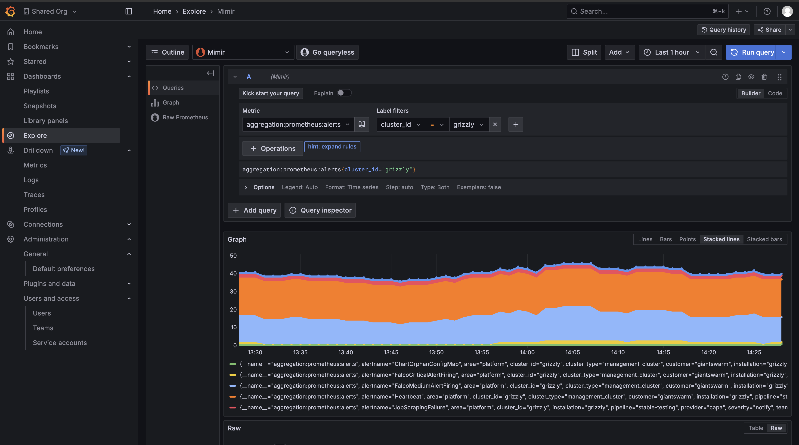
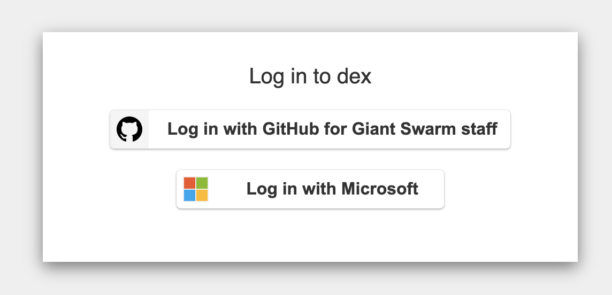
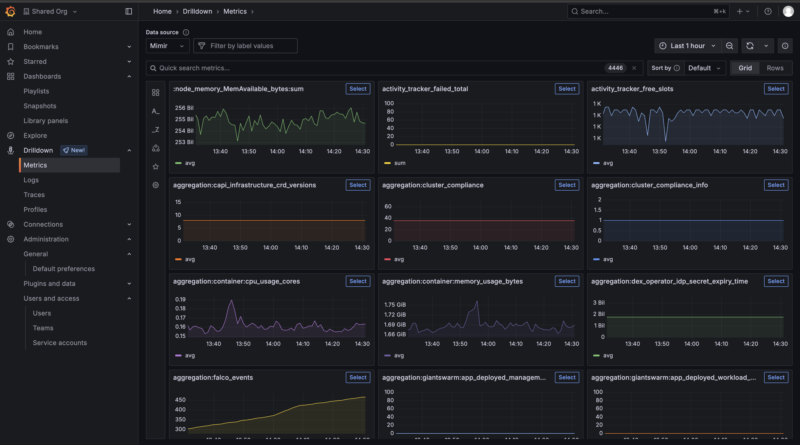

This guide shows you how to use the Explore and Drilldown features in Grafana to query and analyze the metrics and logs collected by the Giant Swarm Observability Platform. It also explains how to authenticate and access your Grafana instance securely.

Giant Swarm provides an Observability Platform in each installation, based on [Grafana Mimir](https://grafana.com/oss/mimir/) for metrics and [Grafana Loki](https://grafana.com/oss/loki/) for logs. The platform collects data from the system and apps managed by Giant Swarm, as well as any source of data you configure according to [the data ingestion tutorial]().

You can use the [Explore](https://grafana.com/docs/grafana/latest/explore/) and Drilldown features in your [Grafana](https://grafana.com/) instance to query, visualize, and analyze your data interactively.

## How to access and authenticate in Grafana

1. **Open Grafana:**
   - Go to your installation's Grafana instance (for example, `https://grafana.my-company.gigantic.io/.com`).
   - The address for your installation’s Grafana instance is composed of the base domain plus the `grafana` subdomain. If you don't know the address, ask your Giant Swarm support contact.

2. **Log in with single sign-on (SSO):**
   - Access to Grafana is controlled via SSO, using the same identity provider you use for the [platform API]().
   - To access Grafana as a customer, you must have an account in your companies connected identity provider. For further restrictions see the [multi-tenancy guide]().
   - **Note:** If you don't have SSO configured yet or have questions about the admin group, please contact your Account engineer.

3. **Authenticate and select your identity provider:**
   - When you open the Grafana address, you'll be able to log in via Giant Swarm SSO. The screenshot below shows an example.

- There is one identity provider configured for Giant Swarm staff and one for you as a customer admin. Depending on your identity provider, the label for the button to click may look slightly different.
- After selecting the right identity provider, you may go through an authentication workflow. If you're already authenticated in your browser, this step will be skipped and you'll see the Home dashboard.

## How to use Explore and Drilldown in Grafana

When you first log in, you'll see the `Shared Org` selected by default. This organization contains curated dashboards and system metrics that are accessible to everyone with Grafana access.
Learn more about these default organizations and how to create your own in our [multi-tenancy documentation]().

1. **Access the Explore tab:**
   - In the left-hand menu, click the compass icon labeled **Explore**. This opens the Explore view, where you can run ad-hoc queries on your data sources.
   - Learn more in the [Grafana Explore documentation](https://grafana.com/docs/grafana/latest/explore/).

2. **Select your data source:**
   - At the top of the Explore view, choose either **Mimir** (for metrics) or **Loki** (for logs) as your data source.

3. **Query your data:**
   - For metrics, use [PromQL](https://grafana.com/docs/grafana/latest/datasources/prometheus/querying/).
   - For logs, use [LogQL](https://grafana.com/docs/loki/latest/logql/).
   - Start typing in the query field. Grafana provides autocomplete and suggestions to help you build queries.
   - You can visualize results as graphs, tables, or logs directly in the Explore view.

4. **Access the Drilldown tab:**
   - In the left-hand menu, click the tab labeled **Drilldown** (next to Explore). This opens the Drilldown app, which lets you quickly investigate metrics and logs side by side.
   - The Drilldown app is designed for simplified exploration, making it easy to move between metrics and logs, filter by time ranges, and dig deeper into your data.
   - Learn more about [Drilldown in Grafana](https://grafana.com/docs/grafana/latest/explore/simplified-exploration/).

## Tips for exploring data

- Use filters and time range selectors to narrow down your results.
- Save useful queries as [library panels](https://grafana.com/docs/grafana/latest/panels/library-panels/) or bookmarks for quick access later.
- Check out the [Grafana documentation](https://grafana.com/docs/grafana/latest/) for more tips and advanced features.

---

**Next steps:**

- Try out the Explore and Drilldown features to get hands-on with your data.
- Learn more about exploring metrics in our [advanced PromQL guide]().
- Learn more about exploring logs and events in our [advanced LogQL guide]().
- For more on creating dashboards or ingesting new data, see our [data ingestion tutorial]() or [multi-tenancy guide]().
