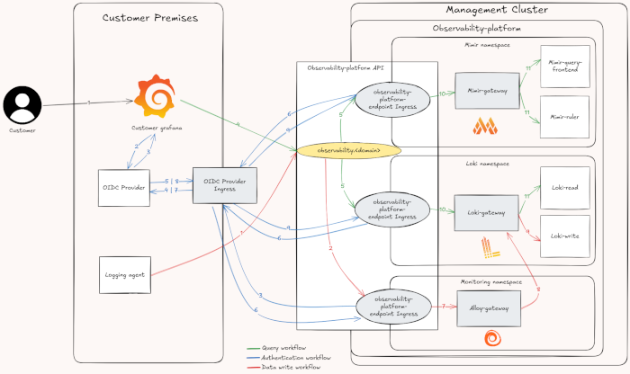
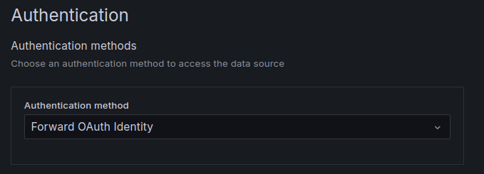
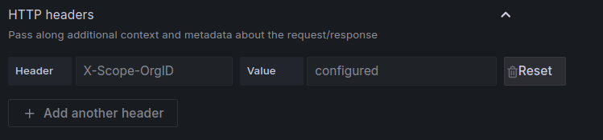

Data export enables you to access your observability data from external systems and tools, giving you the flexibility to integrate Giant Swarm's observability platform with your existing monitoring infrastructure or specialized analysis tools.

The Observability Platform API serves as the primary mechanism for data export, providing secure, authenticated access to your metrics, logs, and events from anywhere - not just from within Giant Swarm managed clusters.

## Why export data?

Exporting observability data opens up powerful integration possibilities:

- **External monitoring tools**: Connect your existing Grafana instances, monitoring dashboards, or business intelligence tools
- **Cross-platform correlation**: Combine Giant Swarm observability data with metrics from SaaS services, databases, or other infrastructure
- **Specialized analysis**: Use advanced analytics tools, machine learning platforms, or custom applications with your observability data
- **Backup and archival**: Create additional copies of your observability data for compliance or long-term analysis
- **Multi-cloud strategies**: Centralize observability data from multiple cloud providers and platforms

## How data export works

The Observability Platform API provides both **data ingestion** (sending data to the platform) and **data export** (retrieving data from the platform) capabilities through a unified, secure interface.

### Architecture overview

The API consists of different ingress components that use:

- **Shared host**: Based on your Giant Swarm installation's base domain (`https://observability.<domain_name>`)
- **OIDC authentication**: Secure access through your identity provider
- **Multi-tenant access control**: Tenant-scoped data access through HTTP headers
- **Planned protocols**: OpenTelemetry Protocol (OTLP) support is in development for standardized data exchange


[_Full size architecture diagram_](./observability-platform-api-graph-big.png)

### Authentication and access control

All data export requests require:

1. **Valid OIDC token**: Authentication through your organization's identity provider
2. **Tenant specification**: Include an `X-Scope-OrgId` HTTP header with an existing tenant name
3. **Proper authorization**: Your identity must have access to the specified tenant

⚠️ **Important**: Only data from tenants defined in [Grafana Organization]() resources can be accessed. Requests for non-existent tenants will be rejected.

## Available data types

The platform supports exporting different types of observability data:

### Logs and events ✅

Currently available for export:

- **Application logs**: Custom logs from your workloads
- **System logs**: Kubernetes events and infrastructure logs  
- **Audit logs**: Security and compliance-related events

### Metrics 🚧

Metrics export capabilities are in development:

- **Infrastructure metrics**: CPU, memory, disk, and network metrics
- **Application metrics**: Custom business and performance metrics
- **Platform metrics**: Kubernetes and Giant Swarm platform metrics

## Export methods

### Method 1: External Grafana integration

Connect your self-managed Grafana instance to access Giant Swarm observability data through familiar dashboards and queries.

#### Setting up Grafana data sources

1. **Configure the connection URL**:
   - For logs (Loki): `https://observability.<domain_name>`
   - For metrics (Mimir/Prometheus): `https://observability.<domain_name>/prometheus`

   Replace `<domain_name>` with your installation's base domain.

   

2. **Set up authentication**:
   - Select "Forward OAuth Identity" in the Authentication section
   - This passes your OIDC credentials to the API

   

3. **Configure tenant access**:
   - Add an `X-Scope-OrgID` custom header
   - Set the value to your target tenant (e.g., `giantswarm` for platform logs, `anonymous` for platform metrics)
   - For custom data, use the tenant you configured during ingestion

   

#### Tenant selection guide

Choose the appropriate tenant based on the data you want to access:

| Data Type | Tenant Value | Description |
|-----------|--------------|-------------|
| Platform logs | `giantswarm` | System and infrastructure logs |
| Platform metrics | `anonymous` | System and infrastructure metrics |
| Custom logs | Your tenant | Logs from your applications |
| Custom metrics | Your tenant | Metrics from your applications |

### Method 2: Programmatic API access

Access observability data programmatically through REST APIs for custom integrations and automated analysis.

#### API endpoints

The platform provides standard observability API endpoints:

- **Loki API**: Compatible with standard Loki query API for logs
- **Prometheus API**: Compatible with Prometheus query API for metrics (when available)
- **Future protocols**: OpenTelemetry Protocol (OTLP) endpoints are planned for comprehensive telemetry data exchange

#### Example: Querying logs programmatically

```bash
# Example LogQL query via API
curl -H "Authorization: Bearer $OIDC_TOKEN" \
     -H "X-Scope-OrgId: giantswarm" \
     "https://observability.<domain>/loki/api/v1/query_range?query={cluster_id=\"your-cluster\"}"
```

⚠️ **Prerequisites**: You must configure OIDC authentication with Giant Swarm before using the API. Contact your account engineer for setup assistance.

## Security and compliance

Data export maintains the same security standards as the internal platform:

- **End-to-end encryption**: All data transfer uses TLS encryption
- **Identity-based access**: Integration with your organization's OIDC provider
- **Tenant isolation**: Multi-tenant architecture ensures data separation
- **Audit trails**: All data access requests are logged for compliance

## Getting started with data export

### Prerequisites

Before you can export data, ensure you have:

1. **OIDC provider configured**: Work with Giant Swarm to set up identity provider integration
2. **Tenant access**: Confirm you have access to the tenants containing your data
3. **Network access**: Ensure your external systems can reach `https://observability.<domain_name>`

### Setup process

1. **Plan your integration**: Identify what data you need and which external tools will consume it
2. **Configure authentication**: Work with Giant Swarm to set up OIDC integration
3. **Test connectivity**: Verify you can authenticate and access your tenants
4. **Implement export**: Set up your external tools or custom integrations
5. **Monitor usage**: Track export volume and performance impact

## Performance considerations

Data export can impact platform resources:

- **Query complexity**: Complex queries (broad time ranges, intensive filters) consume more resources
- **Export volume**: Large data exports may affect platform performance
- **Concurrent access**: Multiple simultaneous export operations share platform capacity

### Best practices

- **Optimize queries**: Use specific time ranges and efficient filters
- **Implement caching**: Cache frequently accessed data in your external systems
- **Schedule intensive exports**: Run large data exports during off-peak hours
- **Monitor impact**: Track export performance and adjust patterns as needed

## Troubleshooting

### Common issues

**Authentication failures**:

- Verify OIDC token validity and refresh if expired
- Confirm your identity has access to the specified tenant
- Check that the tenant exists in a Grafana Organization

**Data access issues**:

- Verify the `X-Scope-OrgId` header matches an existing tenant
- Confirm the tenant contains the data you're trying to access
- Check that data ingestion is properly configured for your tenant

**Performance problems**:

- Reduce query time ranges or add more specific filters
- Verify network connectivity and latency to the API endpoints
- Check platform status and resource utilization

### Getting help

For data export setup and troubleshooting:

- **Documentation**: Review [multi-tenancy configuration]() for tenant management
- **Support**: Contact Giant Swarm support for authentication and API setup assistance
- **Community**: Join discussions about observability integrations and best practices

## Next steps

- **Set up data ingestion**: Learn how to send data to the platform in our [data ingestion guide]()
- **Configure multi-tenancy**: Understand tenant management in our [multi-tenancy documentation]()
- **Explore data**: Use Grafana's built-in tools with our [data exploration guide]()
- **Create dashboards**: Build custom visualizations with our [dashboard creation guide]()
