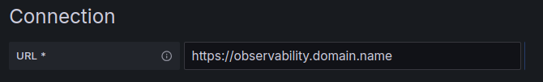
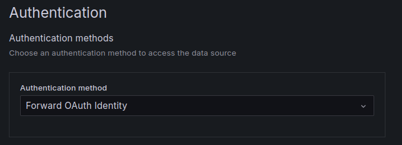
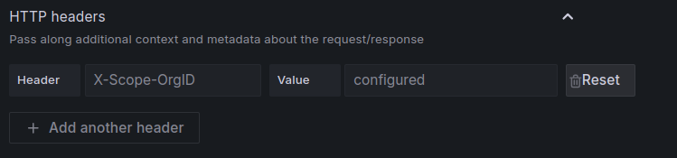

This guide shows you how to read metrics, logs, and traces out of the Giant Swarm observability platform from systems outside the platform. Use it to connect your own Grafana instance or to query data programmatically for custom integrations. For the concepts behind export, see [data import and export]().

## Prerequisites

Before you export data, make sure you have:

1. **OIDC provider configured**: work with Giant Swarm to set up identity provider integration.
2. **Tenant access**: confirm your identity has access to the tenants that hold your data.
3. **Network access**: your external systems must be able to reach `https://observability.<domain_name>`.

For the full list of query endpoints and the authentication headers they expect, see the [Observability Platform API reference]().

## Method 1: External Grafana integration

Connect your self-managed Grafana instance to explore Giant Swarm observability data through familiar dashboards and queries.

1. **Configure the connection URL** for each data source:

   - Logs (Loki): `https://observability.<domain_name>`
   - Metrics (Mimir/Prometheus): `https://observability.<domain_name>/prometheus`
   - Traces (Tempo): `https://observability.<domain_name>/tempo` (when tracing is enabled)

   Replace `<domain_name>` with your installation's base domain.

   

2. **Set up authentication**:

   - Select "Forward OAuth Identity" in the Authentication section.
   - This passes your OIDC credentials to the API.

   

3. **Configure tenant access**:

   - Add an `X-Scope-OrgID` custom header.
   - Set the value to your target tenant, for example `giantswarm` for platform logs or `anonymous` for platform metrics.
   - For custom data, use the tenant you configured during import.

   

For the full mapping of data type to tenant value, see the [tenant selection reference]().

## Method 2: Programmatic API access

Query observability data directly through REST APIs for custom integrations and automated analysis. Each request needs an OIDC bearer token and an `X-Scope-OrgID` header.

Query logs with LogQL:

```bash
# Example LogQL query via API
curl -H "Authorization: Bearer $OIDC_TOKEN" \
     -H "X-Scope-OrgId: giantswarm" \
     "https://observability.<domain>/loki/api/v1/query_range?query={cluster_id=\"your-cluster\"}"
```

Query traces with TraceQL (when tracing is enabled):

```bash
# Example TraceQL query via API
curl -H "Authorization: Bearer $OIDC_TOKEN" \
     -H "X-Scope-OrgId: your-tenant" \
     "https://observability.<domain>/tempo/api/search?q={service.name=\"your-service\"}"
```

The [Observability Platform API reference]() lists all query endpoints for Loki, Prometheus, and Tempo.

## Setup process

1. **Plan your integration**: identify what data you need and which external tools will consume it.
2. **Configure authentication**: work with Giant Swarm to set up OIDC integration.
3. **Test connectivity**: verify you can authenticate and reach your tenants.
4. **Implement export**: set up your external tools or custom integrations.
5. **Monitor usage**: track export volume and performance impact.

## Best practices

Keep export from straining the platform's query capacity:

- **Scope queries**: use specific time ranges and efficient filters.
- **Cache results**: cache frequently accessed data in your external systems.
- **Schedule heavy exports**: run large exports during off-peak hours.
- **Watch the impact**: track export performance and adjust patterns as needed.

## Next steps

- **[Import data]()**: send external data into the platform.
- **[Observability Platform API reference]()**: endpoints, authentication, and tenant values.
- **[Data exploration]()**: query data with Grafana's built-in tools.
