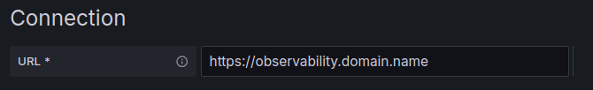

Data import and export capabilities enable you to both send observability data from external sources into the Giant Swarm platform and access your observability data from external systems and tools. This gives you the flexibility to integrate Giant Swarm's observability platform with your existing monitoring infrastructure, external data sources, and specialized analysis tools.

The Observability Platform API serves as the primary mechanism for both data import and export. It provides secure, authenticated access to send and receive metrics, logs, traces, and events from anywhere - not just from within Giant Swarm managed clusters.

## Why importing and exporting data

Data import and export capabilities open up powerful integration possibilities:

**Data Import Benefits:**

- **External data sources**: Send logs and events from SaaS applications, databases, or other infrastructure not managed by Giant Swarm
- **Cross-platform correlation**: Combine data from multiple environments and platforms in a single observability stack
- **Legacy system integration**: Import data from existing monitoring tools during migrations or for hybrid deployments
- **Third-party services**: Collect observability data from external services, APIs, or cloud providers

**Data Export Benefits:**

- **External monitoring tools**: Connect your existing Grafana instances, monitoring dashboards, or business intelligence tools
- **Specialized analysis**: Use advanced analytics tools, machine learning platforms, or custom applications with your observability data
- **Backup and archival**: Create additional copies of your observability data for compliance or long-term analysis
- **Multi-cloud strategies**: Centralize observability data from multiple cloud providers and platforms

## How data import and export works

The Observability Platform API provides both **data ingestion** (sending data to the platform) and **data export** (retrieving data from the platform) capabilities through a unified, secure interface.

### Architecture overview

The API consists of different ingress components that use:

- **Shared host**: Based on your Giant Swarm installation's base domain (`https://observability.<domain_name>`)
- **OIDC authentication**: Secure access through your identity provider
- **Multi-tenant access control**: Tenant-scoped data access through HTTP headers


graph TB
  subgraph ext ["External Systems"]
    A[External Alloy Instance]
    B[External Grafana]
    C[Custom Applications]
  end

  subgraph ing ["Observability Platform Ingresses"]
    D["nginx-ingress<br/>observability.domain"]
    E["oauth2-proxy<br/>Authentication Handler"]
  end

  subgraph backend ["Backend Services"]
    G["Grafana Mimir<br/>Metrics Storage"]
    H["Grafana Loki<br/>Log Storage"]
    I["Grafana Tempo<br/>Trace Storage"]
  end

  subgraph auth ["Authentication"]
    J["OIDC Provider<br/>Azure AD / Google / Okta"]
  end

  %% Data Import Flow
  A -->|"Metrics: Prometheus Remote Write<br/>Logs: Loki Push API<br/>Traces: OTLP HTTP"| D
  C -->|"Direct API Calls<br/>with OIDC Token"| D

  %% Data Export Flow  
  B -->|"Query APIs<br/>Forward OAuth Identity"| D

  %% Internal Flow
  D -->|"Route to auth handler"| E
  E -->|"Validate Token"| J
  E -->|"Authenticated + X-Scope-OrgID"| G
  E -->|"Authenticated + X-Scope-OrgID"| H
  E -->|"Authenticated + X-Scope-OrgID"| I

  %% Styling
  classDef external fill:#e1f5fe
  classDef ingress fill:#fff3e0
  classDef backend fill:#f3e5f5
  classDef auth fill:#e8f5e8

  class A,B,C external
  class D,E ingress
  class G,H,I backend
  class J auth


### Authentication and access control

All data import and export requests require:

1. **Valid OIDC token**: Authentication through your organization's identity provider
2. **Tenant specification**: Include an `X-Scope-OrgId` HTTP header with an existing tenant name

Please note that your identity must have access to the specified tenant.

⚠️ **Important**: Only data from tenants defined in [Grafana Organization]() resources can be accessed. Requests for non-existent tenants will be rejected.

## Available data types

The platform supports importing and exporting different types of observability data:

### Logs and events ✅

Currently available for both import and export:

- **Application logs**: Custom logs from your workloads and external applications
- **System logs**: Kubernetes events and infrastructure logs
- **Audit logs**: Security and compliance-related events
- **External service logs**: Logs from SaaS applications, databases, and third-party services

### Traces ✅

Available for both import and export (when tracing is enabled for your cluster):

- **Distributed traces**: End-to-end request flows across services
- **Application traces**: Custom spans from your instrumented applications
- **External service traces**: Traces from third-party services and APIs
- **Platform traces**: Kubernetes and infrastructure-level tracing data

### Metrics ✅

Available for both import and export:

- **Infrastructure metrics**: CPU, memory, disk, and network metrics from external systems
- **Application metrics**: Custom business and performance metrics from external services
- **Platform metrics**: Kubernetes and Giant Swarm platform metrics
- **External system metrics**: Metrics from SaaS applications, databases, and third-party services

## Data import methods

The platform provides HTTP APIs that accept observability data in standard formats. While you can send data directly via API calls, we recommend using Grafana Alloy as it provides a robust, configurable way to collect and forward data with built-in authentication and error handling.

### Available APIs

The platform exposes these standard observability APIs for data import:

- **Metrics**: Prometheus remote write API at `https://observability.<domain>/prometheus/api/v1/push`
- **Logs**: Loki push API at `https://observability.<domain>/loki/api/v1/push`
- **Traces**: OTLP HTTP endpoint at `https://observability.<domain>/tempo` (when tracing is enabled)

All APIs require:

- **Authentication**: Valid OIDC token in `Authorization: Bearer <token>` header
- **Tenant routing**: `X-Scope-OrgID: <tenant>` header to specify target tenant

### Grafana Alloy configuration (Recommended)

The recommended approach is using Grafana Alloy to collect and forward all observability data. Here's a complete configuration that handles metrics, logs, and traces:

```alloy
// ============================================================================
// OAuth2 Authentication (shared across all components)
// ============================================================================

// Shared OAuth2 configuration for metrics
prometheus.remote_write "to_observability_platform" {
  endpoint {
    url = "https://observability.<your-domain>/prometheus/api/v1/push"
    oauth2 {
      client_id     = "<client_id>"
      client_secret = "<client_secret>"
      scopes        = ["<required_scopes>"]
      token_url     = "<oidc_provider_token_url>"
    }
    headers = {
      "X-Scope-OrgID" = "<tenant_id>"
    }
  }
}

// Shared OAuth2 configuration for logs
loki.write "to_observability_platform" {
  endpoint {
    url = "https://observability.<your-domain>/loki/api/v1/push"
    oauth2 {
      client_id     = "<client_id>"
      client_secret = "<client_secret>"
      scopes        = ["<required_scopes>"]
      token_url     = "<oidc_provider_token_url>"
    }
    headers = {
      "X-Scope-OrgID" = "<tenant_id>"
    }
  }
}

// Shared OAuth2 configuration for traces
otelcol.auth.oauth2 "observability_platform" {
  client_id     = "<client_id>"
  client_secret = "<client_secret>"
  token_url     = "<oidc_provider_token_url>"
  scopes        = ["<required_scopes>"]
}


// Export traces to observability platform
otelcol.exporter.otlphttp "observability_platform" {
  client {
    endpoint = "https://observability.<your-domain>/tempo"
    auth     = otelcol.auth.oauth2.observability_platform.handler
    headers = {
      "X-Scope-OrgID" = "<tenant_id>"
    }
  }
}
```

**Configuration placeholders:**

- `<your-domain>`: Your observability platform domain
- `<client_id>`, `<client_secret>`: OAuth2 credentials provided by your Account Engineer
- `<oidc_provider_token_url>`: Your OIDC provider's token endpoint URL  
- `<required_scopes>`: OAuth2 scopes required by your OIDC provider
- `<tenant_id>`: Target tenant for data routing (must exist in a Grafana Organization)

**Common OIDC provider examples:**

- **Azure AD**: `token_url = "https://login.microsoftonline.com/<tenant>/oauth2/v2.0/token"`, `scopes = ["<client_id>/.default", "openid", "email", "profile"]`
- **Google**: `token_url = "https://oauth2.googleapis.com/token"`, `scopes = ["openid", "email", "profile"]`
- **Okta**: `token_url = "https://<domain>.okta.com/oauth2/default/v1/token"`, `scopes = ["openid", "email", "profile"]`
- **Keycloak**: `token_url = "https://<keycloak-domain>/realms/<realm>/protocol/openid-connect/token"`, `scopes = ["openid", "email", "profile"]`

**Prerequisites**: The API must be enabled for your installation. Contact your Account Engineer to configure the necessary authentication endpoints.

## Data export methods

### Method 1: External Grafana integration

Connect your self-managed Grafana instance to access Giant Swarm observability data through familiar dashboards and queries.

#### Setting up Grafana data sources

1. **Configure the connection URL**:

   - For logs (Loki): `https://observability.<domain_name>`
   - For metrics (Mimir/Prometheus): `https://observability.<domain_name>/prometheus`
   - For traces (Tempo): `https://observability.<domain_name>/tempo` (when tracing is enabled)

   Replace `<domain_name>` with your installation's base domain.

   

2. **Set up authentication**:

   - Select "Forward OAuth Identity" in the Authentication section
   - This passes your OIDC credentials to the API

   

3. **Configure tenant access**:

   - Add an `X-Scope-OrgID` custom header
   - Set the value to your target tenant (for example, `giantswarm` for platform logs, `anonymous` for platform metrics)
   - For custom data, use the tenant you configured during ingestion

   

#### Tenant selection guide

Choose the appropriate tenant based on the data you want to access:

| Data Type | Tenant Value | Description |
|-----------|--------------|-------------|
| Platform logs | `giantswarm` | System and infrastructure logs |
| Platform metrics | `giantswarm` | System and infrastructure metrics |
| Platform traces | `giantswarm` | System and infrastructure traces |
| Custom logs | Your tenant | Logs from your applications |
| Custom metrics | Your tenant | Metrics from your applications |
| Custom traces | Your tenant | Traces from your applications |

### Method 2: Programmatic API access

Access observability data programmatically through REST APIs for custom integrations and automated analysis.

#### API endpoints

The platform provides standard observability API endpoints:

- **Loki API**: Compatible with standard Loki query API for logs
- **Prometheus API**: Compatible with Prometheus query API for metrics (when available)
- **Tempo API**: Compatible with Tempo query API for traces (when tracing is enabled)
- **OTLP endpoints**: OpenTelemetry Protocol endpoints for trace ingestion

#### Example: Querying logs programmatically

```bash
# Example LogQL query via API
curl -H "Authorization: Bearer $OIDC_TOKEN" \
     -H "X-Scope-OrgId: giantswarm" \
     "https://observability.<domain>/loki/api/v1/query_range?query={cluster_id=\"your-cluster\"}"
```

#### Example: Querying traces programmatically

```bash
# Example TraceQL query via API (when tracing is enabled)
curl -H "Authorization: Bearer $OIDC_TOKEN" \
     -H "X-Scope-OrgId: your-tenant" \
     "https://observability.<domain>/tempo/api/search?q={service.name=\"your-service\"}"
```

**Prerequisites**: The API must be enabled for your installation. Contact your Account Engineer to configure the necessary authentication endpoints.

## Security and compliance

Data import and export maintain the same security standards as the internal platform:

- **End-to-end encryption**: All data transfer uses TLS encryption
- **Identity-based access**: Integration with your organization's OIDC provider
- **Tenant isolation**: Multi-tenant architecture ensures data separation
- **Audit trails**: All data access requests are logged for compliance

## Getting started with data import

### Prerequisites for data import

Before you can import data, ensure you have:

1. **OIDC provider configured**: Work with Giant Swarm to set up identity provider integration
2. **Tenant setup**: Create or identify the tenant where your external data should be stored
3. **Data format**: Prepare your data in Loki's native log stream format
4. **Network access**: Ensure your external systems can reach `https://observability.<domain_name>`

### Setup process for data import

1. **Plan your data sources**: Identify which external systems will send data to the platform
2. **Configure authentication**: Work with Giant Swarm to set up OIDC integration for your data sources
3. (Optional) **Enable tracing**: For trace data import, ensure tracing is enabled for your cluster
4. **Set up tenants**: Create appropriate Grafana Organizations for your external data
5. **Test ingestion**: Send sample data to verify connectivity and formatting
6. **Implement production ingestion**: Deploy your chosen import method at scale
7. **Monitor ingestion**: Track data volume and verify data is being processed correctly

## Getting started with data export

### Prerequisites for data export

Before you can export data, ensure you have:

1. **OIDC provider configured**: Work with Giant Swarm to set up identity provider integration
2. **Tenant access**: Confirm you have access to the tenants containing your data
3. **Network access**: Ensure your external systems can reach `https://observability.<domain_name>`

### Setup process for data export

1. **Plan your integration**: Identify what data you need and which external tools will consume it
2. **Configure authentication**: Work with Giant Swarm to set up OIDC integration
3. **Test connectivity**: Verify you can authenticate and access your tenants
4. **Implement export**: Set up your external tools or custom integrations
5. **Monitor usage**: Track export volume and performance impact

## Performance considerations

Both data import and export can impact platform resources:

**Data Import Impact:**

- **Ingestion volume**: Large volumes of imported data increase storage and processing requirements
- **Data frequency**: High-frequency data streams consume more ingestion capacity
- **Payload size**: Large individual payloads affect processing time and memory usage
- **Tenant capacity**: Multiple tenants importing data share platform ingestion resources

**Data Export Impact:**

- **Query complexity**: Complex queries (broad time ranges, intensive filters) consume more resources
- **Export volume**: Large data exports may affect platform performance
- **Concurrent access**: Multiple simultaneous export operations share platform capacity

### Best practices

**For Data Import:**

- **Batch processing**: Send data in appropriately sized batches rather than individual events
- **Rate limiting**: Implement client-side rate limiting to avoid overwhelming the platform
- **Data filtering**: Only send relevant data; pre-filter unnecessary logs or events
- **Compression**: Use compressed payloads where supported to reduce transfer time

**For Data Export:**

- **Optimize queries**: Use specific time ranges and efficient filters
- **Implement caching**: Cache frequently accessed data in your external systems
- **Schedule intensive exports**: Run large data exports during off-peak hours
- **Monitor impact**: Track export performance and adjust patterns as needed

## Next steps

- **Set up data ingestion**: Learn how to send data to the platform in our [data ingestion guide]()
- **Configure multi-tenancy**: Understand tenant management in our [multi-tenancy documentation]()
- **Explore data**: Use Grafana's built-in tools with our [data exploration guide]()
- **Create dashboards**: Build custom visualizations with our [dashboard creation guide]()
