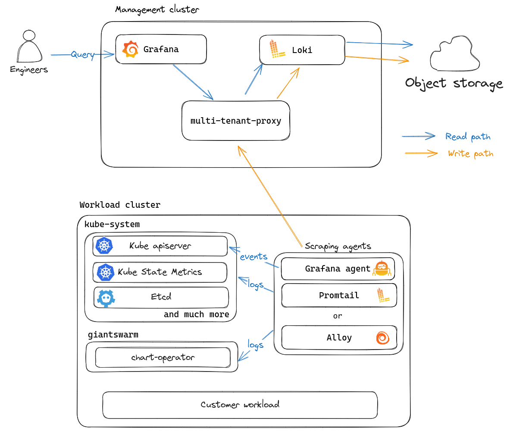

Logging is an important pillar of observability and it's thus only natural that Giant Swarm provides and manages a logging solution for operational purposes.

This document gives an overview of how logging is managed by Giant Swarm, including which logs are stored, which tools we use to ship and store them, as well as why we chose those tools in the first place.

## Overview of the logging platform

Here is an architecture diagram of our current logging platform:

<!-- Source: https://drive.google.com/file/d/1Gzl0mTdJcaui_zIC9QuHcgMX3QJygALo -->

In this diagram, you can see that we run the following tools in each management cluster as part of our logging platform:

- `Grafana Loki` that's accessible through our managed Grafana instance.
- `multi-tenant-proxy`, a proxy component used to handle multi-tenancy for Loki.
- A couple of scraping agents run on the management cluster and your workload clusters. There are different tools for different purposes:
    - Promtail is used in older Giant Swarm releases to retrieve the container and Kubernetes audit logs.
    - Alloy is used in newer Giant Swarm releases to retrieve the container and Kubernetes audit logs.
    - Grafana Agent is used to retrieve the `kubernetes` events.

### Release compatibility

Release|Alloy|Promtail|Grafana Agent|
-------|-----|--------|-------------|
CAPA from v29.2.0|<i class="fas fa-check"></i>|<i class="fas fa-times"></i>|<i class="fas fa-check"></i>|
CAPZ from v29.1.0|<i class="fas fa-check"></i>|<i class="fas fa-times"></i>|<i class="fas fa-check"></i>|
CAPA before v29.2.0|<i class="fas fa-times"></i>|<i class="fas fa-check"></i>|<i class="fas fa-check"></i>|
CAPZ before v29.1.0|<i class="fas fa-times"></i>|<i class="fas fa-check"></i>|<i class="fas fa-check"></i>|
vintage (all releases)|<i class="fas fa-times"></i>|<i class="fas fa-check"></i>|<i class="fas fa-check"></i>|

If you want to play with Loki, you should definitely check out our guides explaining [how to access Grafana]() and how to [explore logs with LogQL]().

## Logs stored by Giant Swarm

Kubernetes clusters produce a vast amount of machine and container logs.

The logging agents that we've deployed on management and workload clusters currently send the following logs to Loki:

- Kubernetes Pod logs from the `kube-system` and `giantswarm` namespaces.
- Kubernetes Events created in the `kube-system` and `giantswarm` namespaces.
- [Kubernetes audit logs]()

In the future, we will also store the following logs:

- [Machine (Node) audit logs]()
- Teleport audit logs, tracked in https://github.com/giantswarm/roadmap/issues/3250
- Giant Swarm customer workload logs as part of our observability platform, tracked in https://github.com/giantswarm/roadmap/issues/2771

## Why we prefer Loki over its competitors

There are numerous reasons to use Grafana Loki in favor of its competitors.

First, we're **strong believers in Open Source** so the full Elastic stack is obviously out of the question.

Second, we're used to the Grafana ecosystem, where the **individual tools are made to work with one another without requiring a closed ecosystem**. Alternative logging solutions are either intended to work in isolation (like OpenDistro) or need to use a full-fledged solution (for example being able to collect and correlate all observability data), which is open-source (coming back to the first point above).

Third, we're full-fledged users of Prometheus and PromQL. **LogQL, the Loki Query Language, is a natural extension to PromQL**, which makes it easy for our platform engineers to use and love.

The fourth reason is **cost and resource consumption.** Loki is cheaper to run than its competitors because it doesn't rely as on persistent storage and uses Object storage instead, which is always cheaper in the cloud. The storage of the index is also cheaper for Loki as it uses label-based indexing, which is smaller than any kind of text-based indexing solution used by full-text search engines.

Finally, the last reason comes down to the history of Giant Swarm and it mostly boils down to **operation and maintenance**. Before we decided to run Loki, we used to run `elasticsearch` as our logging solution. Elasticsearch in itself is really hard to operate, especially at scale, even more so on Kubernetes because it's by its nature a stateful application (and for good reasons). This was an especially important factor in our decision since we don't need the full capabilities of OpenDistro like full-text search.
