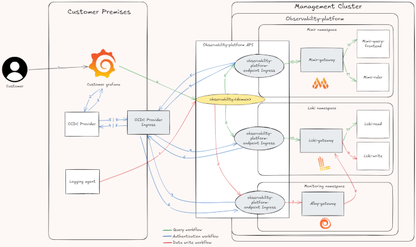

The observability platform ingests and allows to explore system and application observability data from inside Giant Swarm managed clusters by default.

The `observability platform API` opens up the observability platform to be used from the outside - which means any resource not managed by Giant Swarm. You can ingest observability data from any source by sending them to the `observability platform API`. Additionally the API allows to query observability data from wherever you want.

With this you can ingest observability data from, for example, a SaaS-Database that might be a dependency of one of your workloads on a Giant Swarm managed cluster. You could also explore the observability platform data from your own remote Grafana instance or any other observability tooling.

**Note:** At this point the `observability platform API` only allows the ingestion of logs and events. The ingestion of metrics will follow in a later release. Keep an eye on our [changes and releases]() and click in `Observability Platform`, or this document for updates.

The `observability platform API`s main objectives are to:

* enable you to securely ingest and access observability data in our observability platform from anywhere - also from outside of Giant Swarm managed clusters.
* sanitize (sampling, relabelling, etc.) observability data to align with our general data standards in the observability platform.
* support for the OpenTelemetry Protocol (OTLP).

## How it works - Global Overview

The `observability platform API` consists of different ingress components. They use a shared host based on your Giant Swarm Installation's base domain and an OIDC provider to allow secure read or write access to the observability platform.

Additionally, the write path of the API uses a specifically tuned [Grafana Alloy](https://grafana.com/docs/alloy/latest/) instance, ensuring the use of OLTP.

You can see the overall architecture of the API in the following diagram:

[_Full size architecture diagram_](./observability-platform-api-graph-big.png)

**Important:** As the `observability platform API` uses an OIDC provider to authenticate requests against it you first need to provide the details of an OIDC provider to use for the APIs authentication. We will then setup the `observability platform API` accordingly.

Any request against the API needs to include a **valid OIDC token**.  Additionally you need to add an **existing tenant** in the `X-Scope-OrgId` HTTP header.

**Warning:** Any data sent to the API with non-existent tenant IDs will be dropped and not ingested into the platform. These tenants are defined in the Grafana Organization resources. You can learn more about our tenant concept in [multi-tenancy in the observability platform.]()

## The observability platform API as Grafana data source

One use case for the `observability platform API` is to explore the observability platforms data in a self-managed Grafana. Our recommended way of connecting a Grafana instance to the `observability platform API` is to add a data source in the Grafana instance pointing towards the API.

Here is a step-by-step guide on how to do it:

1. In the `Connection` section, set the `observability-platform API` domain as the address. The API follows the pattern of adding the `observability`-subdomain to your installation base domain. This looks like `https://observability.<domain_name>`, while you need to replace the `<domain_name>` placeholder with the actual domain name of your installation. **Please note**: if you're adding a Mimir or Prometheus data source, you will have to add the `/prometheus` suffix to the address, making it: `https://observability.<domain_name>/prometheus`. Please note that if you're adding a Mimir or Prometheus data source, you will have to add the `/prometheus` suffix to the address (i.e the final address will be of the following form : `https://observability.<domain_name>/prometheus`).

  

1. In the `Authentication` section, select the `Forward OAuth Identity` option.

1. Fill in the `Authentication` section, add the required `X-Scope-OrgID`. Make sure the value of the `X-Scope-OrgID` header is an existing tenant that actually holds the data you're interested in. For example, to access Giant Swarm managed logs the value of this  header should be `giantswarm`, for metrics it should be `anynomous`. You can learn more about our tenant concept in [multi-tenancy in the observability platform.]()

The header will always be `X-Scope-OrgID` but the value will differ depending on whether you are adding a Loki or Mimir/Prometheus data source. The default value to access Giant Swarm managed logs should be `giantswarm` and metrics should be `anynomous`. The value of the header for the data you ingest depends on what you configured as a tenant upon ingestion.
