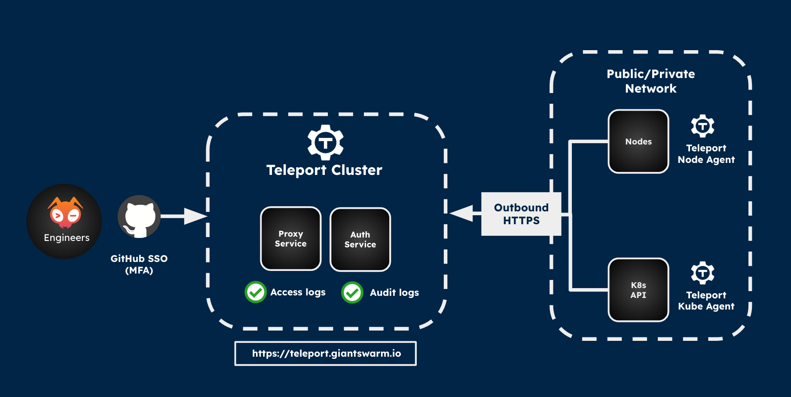

You've got secure access to your workload clusters by default. To provide you with the best support, our team at Giant Swarm also needs access to these clusters.

We'll walk you through how this access works and the security measures we've put in place to make sure your clusters are managed securely and responsibly.

## Intro

Let's talk about the two types of access to your Giant Swarm clusters:

1. User access - this is for you and your team to interact with your services.

2. Admin access - this is for our team to help with management, development, and support.

Want to learn more about how our infrastructure works? Check out our [operational layers article]()

## User access

We expose the Kubernetes API of each workload cluster to you. You can manage who gets access by connecting your external identity provider to the Kubernetes API.

## Admin access via Teleport

### What is Teleport?

[Teleport](https://goteleport.com/) is an open-source tool that helps us manage secure access to your infrastructure. It uses identity-aware reverse proxy and short-lived certificates instead of passwords or long-lived keys. This makes your clusters more secure and helps us follow regulations and work with different network setups.

Here's why Teleport is awesome:

- Makes VPN architecture obsolete
- Works with more network layouts and gets around CIDR range limitations
- Boosts security
- Gives us detailed audit logs
- Lets you see the audit logs too

### Teleport at Giant Swarm

We've made Teleport our go-to solution for accessing the infrastructure we manage. It gives us better audit and access logs than we had before. The best part? Teleport identity-aware reverse proxy with TLS routing makes everything more straightforward and secure. You don't need a VPN anymore, and you don't have to open extra ports in your network. It works smoothly behind corporate firewalls—all you need is outbound HTTPS traffic to our Teleport cluster.

### Teleport secured access points

Here's what we secure with Teleport:

- **SSH** - We protect SSH access with the Teleport Agent.

- **Kubernetes API** - We also secure the Kubernetes API on both management and workload clusters with the Teleport Agent.

- **Apps** - The Apps API on the management cluster gets the same Teleport protection.

Here's a diagram that shows how our Teleport setup works:

We secure Teleport access with GitHub SSO and multi-factor authentication. Only people in our GitHub organization can log in.

We've built our Teleport cluster to be super reliable, and we keep detailed access and audit logs for every session.

### Infrastructure provider access

You'll need to grant our operators admin rights to your infrastructure provider. Why? So we can manage your cluster's lifecycle - creating, configuring, and cleaning up resources like machines, networks, and security groups.

Don't worry about security, though - we encrypt all authentication secrets in Etcd, and protect access to Etcd and the Kubernetes API with certificates signed by Teleport following strict policies.
