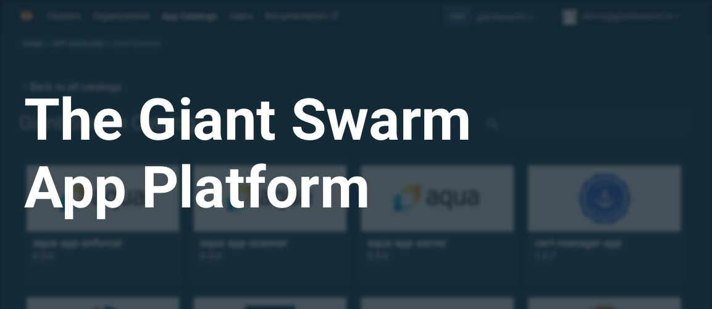
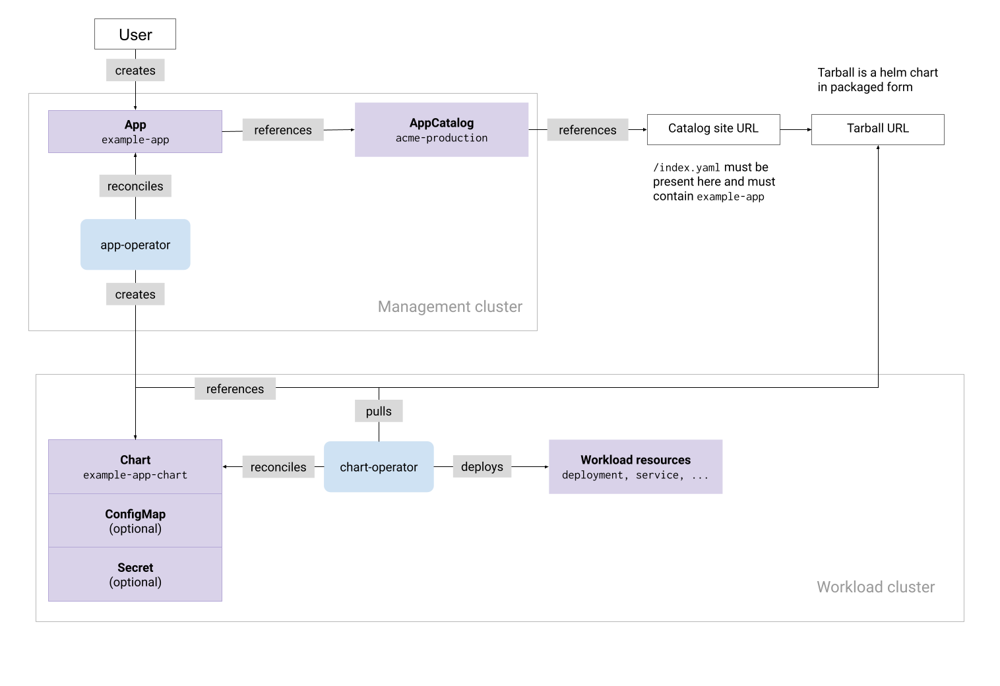

The _Giant Swarm App Platform_ refers to a set of features and concepts that allow
you to browse, install and manage the configurations of apps (such as Prometheus)
from a single place; the management cluster API.

We fully support [Helm](https://helm.sh/) as a general tool to deploy your applications as well as for our general App Catalog. Apps are packaged as Helm charts and can be configured with _values_. We provide a recommended [app configuration]() which you can override to meet your needs.

The App Platform then, underneath, installs these Helm Charts whenever an app installation is requested by you.
The Helm execution is mostly not configurable for you, with the exception to the options presented in 
[installation configuration]().

This feature of the platform provides a collection a collection of curated _Managed Apps_. These _Managed Apps_ are grouped into _App Catalogs_, which can be browsed through our web interface. may also install their own catalogs using the Management Cluster API. Finally, it's worth noting that Giant Swarm uses the App Platform to install the apps that are pre-installed in your clusters, such as CoreDNS or cluster-autoscaler.

In short: the _Giant Swarm App Platform_ refers to the whole feature, and an _App Catalog_ is a collection of _Apps_.

We provide a Giant Swarm _App Catalog_ with our offered set of Cloud Native Applications which are operated and pre-configured by us. You are able to set up your own [additional catalog(s)]() to provide for any needs you have at the enterprise level.

### What makes up the Giant Swarm App Platform {#what-makes-up-the-app-platform}

Technically the App Platform is implemented as a set of operators
running on your management cluster and workload clusters. These operators watch various
Custom Resources, some created by us, and others created by you. Together, they make up
the desired state of the App Platform.

For example, this "App" Custom Resource indicates that you want Kong installed
on a specific workload cluster. We [default]() some additional values for the workload cluster you select.

```yaml
apiVersion: application.giantswarm.io/v1alpha1
kind: App
metadata:
  name: "my-kong"
  namespace: "x7jwz"
spec:
  catalog: "giantswarm"
  config:
    configMap:
      name: "x7jwz-cluster-values"
      namespace: "x7jwz"
  name: "kong-app"
  namespace: "kong"
  version: "0.7.2"
  kubeConfig:
     inCluster: false
  userConfig:
    configMap:
      name: "kong-user-values"
      namespace: "x7jwz"
```

Below you can see a high level overview of the components and resources that work
together to enable the features of the Giant Swarm App Platform:


<!-- Original version: https://docs.google.com/drawings/d/1V3KcUImxRdrrb2v_nIQnkapHiRkRM6t8PoYGCqWebYY/edit -->


#### The Giant Swarm App Catalog

This catalog contains our stable, fully managed apps, with SLA (e.g. the NGINX Ingress Controller).

The maturity levels of apps in this catalog are expressed through semantic versioning as follows:

- Version with `-alpha` or `-beta` suffix - the application is only at a basic maturity level. There is no stable release. It is supported on a best effort basis,
- Version with `-rc*` suffix - the application is at a preview maturity level. This allows customers to preview a new release of an application and evaluate new features. It is supported on a best effort basis.
- version >= `v1.0.0` with no suffix - the specified version of the application is at a stable maturity level. It is available to our customers as a managed offering with support and SLA.


### What is a Managed App

A _Managed App_ is an app in our Giant Swarm Catalog that provides:

1. Safe and tested deployment

We make sure the Helm chart works, either sanitizing the upstream forked applications or creating good defaults for our maintained ones. We have [a common way of building apps](https://github.com/giantswarm/app-build-suite) and a [testing framework](https://github.com/giantswarm/app-test-suite) which ensure the application is deployable and works as expected. Security and upgradability are checked too during the integration process.

1. Monitoring

Giant Swarm makes sure all the main components of the app are running and that the app is working as expected. At the same time, we set up monitoring and alerting on necessary metrics to ensure our SLAs.

In case of an alert, we perform an RCA (root cause analysis) to understand if it is a Giant Swarm or customer-inflicted issue that broke the application.

__Note__: We generally do not fix bugs upstream when they involve significant code changes. That said, we always try to find a workaround or the root cause of the issue and submit a ticket to the upstream project. In some cases, we fix the bug ourselves where it’s necessary and possible for us, and provide the fix to the upstream project. This might result in temporarily running a non-upstream patch version from Giant Swarm until upstream merges our patch. Customers can, in general, expect the same level of service for a Managed Optional App as they get with "default" apps such as CoreDNS.

1. Configurations and Plug-ins

The customer can do unlimited configurations to the app. The customer can also install unlimited plugins to the app. The application configuration is the customer's responsibility. In other words, configurations that derail from the default ones have to be tested and maintained by the customer. Giant Swarm is always happy to help in validating whether those configurations adhere to best-practices and test them together with the customer, but it is the latter's responsibility to actually deploy those configurations in their environments according to their deployment processes and maintenance windows.

__Note__: Giant Swarm only perform tests for upgrades with the default values, so in case you have customized configuration you need to ensure that the upgrade procedure works as expected in a lower environment and reach out to our support in case of problems.

1. Upgrades

We following the common semantic versioning (`semver`) use in Cloud Native Projects to release our apps:

1. Patch releases: We do patch releases (For example, 2.1.1 -> 2.1.2 -> 2.1.3, and so on) automatically, add them to the change logs, and communicate the changes to the customer.  
1. Minor versions: We upgrade to minor versions, add them to the change logs, and communicate the changes to the customer.  
1. Major versions: We leave it to the customer to decide when to do a major upgrade. Similar to our Managed Kubernetes, we only support 1 major version back.  

We add all changes to change logs and communicate them to customers weekly.

It is the responsibility of the customer to upgrade the applications they run. Whereas Giant Swarm provides updated charts and the relative changelogs and is always willing to help customers understand the impact of upgrades, the responsibility of actually triggering upgrades resides on the customer. This ensures that no changes happen outside of customer-defined maintenance windows and gives customers all the time they need to validate upgrades in low environments before applying them to production ones. That said, Giant Swarm provides tooling to automate upgrades for the apps and customers can adopt it to automate changes on the platform.

1. Dependencies

If a Managed App requires secondary apps to run, we adapt the chart to run a "standard" deployment of the secondary app. We, however, do not manage nor maintain secondary apps.

__Note__: Overall, we adapt the chart to make sure the app works with the customer’s custom configurations and plug-ins.

### Installing your own App Catalog

It’s possible to create your own App Catalog. This is useful if you want to create a set of apps available to your company. Currently, this functionality is only available through direct access to the Giant Swarm Management API. You can request access from your Account Engineer. Prerequisite for this is a standard Helm chart repository. It should be served through HTTP and accessible to the management cluster and your workload clusters.

### How can I interact with the Giant Swarm App Platform

You can interact with the Giant Swarm App Platform through creating App custom resources using the Management API, our web interface, and our REST API.

- [App CRD reference]()
- [Web Interface Reference: The Giant Swarm App Platform]()
- [Apps and App Configs in the API reference](/api/#tag/apps)

Both our web interface and REST API are used to create (or update) a set of App Custom Resources on your Kubernetes management cluster.

As we are giving you direct access to the Management API you can also interact with the above mentioned resources using `kubectl`, and automate them just as you have been automating other parts of your stack.
And as Kubernetes resources and especially some CRDs require lots of boilerplate and conventions, we built a [kubectl plugin]() to help you with that.
