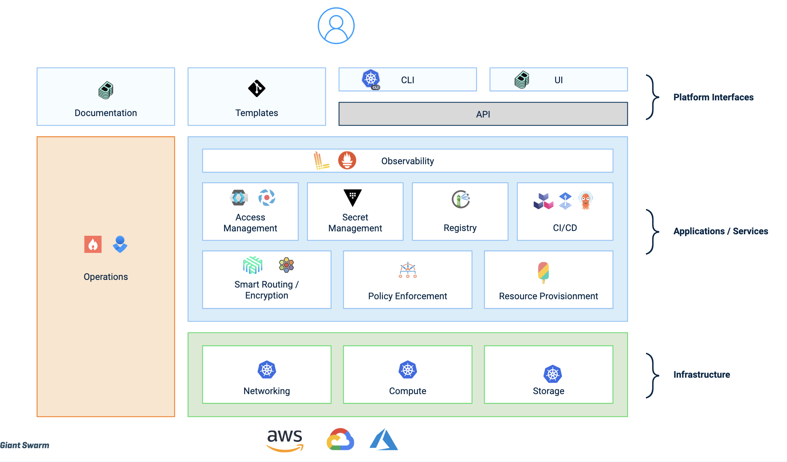
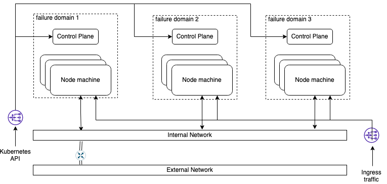

Giant Swarm's mission is to empower our customers to innovate rapidly and confidently, and we do that by providing fully automated infrastructure, applications, and ongoing tailored services to help our customers maximize the value of their clusters. We traditionally work alongside or fill the role of a platform, ops, or SRE team, depending on the organization's terminology. 

A natural extension of this mission is to offer support directly to those who stand to gain the most from a well-managed platform: the developers. Our customers reflect a broad range of internal capacity and priority for creating their own developer platforms, but all platforms teams are trying to solve the same set of problems -- things like: how developers securely build their applications, how to deploy these applications in an ephemeral environment easily or how to observe the behavior of these applications with minimal configuration. To that end, we want to build a platform that relies on the [good principles](https://www.giantswarm.io/blog/platform-engineering-its-not-about-a-tool-stack-its-a-set-of-capabilities) exposed by the community:

- Treat the platform as product
- Minimize cognitive load for developers
- Enable fast-flow software delivery

Some teams already enjoy robust internal tooling ecosystems, others maintain a lighter internal platform footprint. For that reason, we have created a composable system where customers can opt in or out of the various platform features. Whether your platform team has a headcount of 1 who wants a minimal interface and all the help they can get, or it is stacked with rockstars who want to turn every knob and be left to work their magic, our platform is intended to provide a happy path for most developer needs, based entirely on lock-in-free vanilla Kubernetes and open-source community tooling.

Starting from this premise we have built a solution that consists of various distinct systems. They can be categorized into four areas: interfaces, applications, infrastructure, and operations.

## Platform architecture

### Interfaces

There are several entrypoints to the platform via our largely Kubernetes-based interfaces.

We leverage Kubernetes and its extension capabilities to expose the main functionality. The [management API]() is just a Kubernetes API enriched to enable to serve complete golden paths for developers.

Beyond the management API, we recommend a [GitOps](https://www.giantswarm.io/blog/what-is-gitops)-based approach to ensure customers use solid principles for managing their workloads. Virtually all features of our platform can be described, configured, and stored in your repositories, maintaining a declarative source of truth.

Along with GitOps we have a [Web interface](), that simplifies the life of the platform engineering teams in order to visualize infrastructure, apps, and permissions across the entire platform. 

In addition, we offer a set of [templates](https://github.com/giantswarm/gitops-template) to start with the platform and a [documentation hub]() including a step-by-step guide to completing a Dev Platform Journey. 

### Applications

The capabilities of the platform are supported thanks to the fantastic selection Cloud Native tools available. At Giant Swarm, we use and manage a set of open-source tooling backed by the community, but we do not force you to stick to it. 

There is a set of capabilities that customers can rely on today, but we are also continuously on the hunt for new use cases. Every customer has different needs, which evolve over time, and we intend for the platform to evolve in kind.

Today we can offer a set of different features for building your platform, including:

- Access Management: Configure which users or groups can have access to the platform.
- Secret Management: Securely store the secrets your apps need to access other services.
- CI/CD: Create your pipelines to build and deploy the applications.
- Registry: Store application artifacts in a secure and available place.
- Smart Routing: Configure ingress/egress access to your applications with advanced service mesh capabilities.
- Policy Enforcement: Ensure compliance with company policies across the platform landscape.
- Resource provisioning: Enable easy provisioning and configuration of external resources.

### Infrastructure

For managing the infrastructure, we run a management cluster per provider and region where you want to have your workloads. From that management cluster, you can spin up as many individual Kubernetes clusters, called workload clusters, as you want. Our operations team works to maintain all cluster components' health, and continuously releases new versions with new features and patches.

Giant Swarm's cluster architecture is split into two logical parts. One encompasses the management cluster and all the components running there. The second part refers to the workload clusters that are created dynamically by the users to run their business workloads. In principle, the management cluster and workload cluster(s) are analogous in terms of infrastructure and configuration. The difference comes with the additional layers we deploy on top of the management cluster that helps manage your users and permissions, workload clusters, and the applications running on the workload clusters.

As explained previously, both the management cluster and the workload cluster(s) have the same structure and configuration. Giant Swarm also collaborates on [Cluster API](https://cluster-api.sigs.k8s.io/) to simplify the bootstrap and configuration of the cluster infrastructure and all the components needed for a cluster to function.

By default, the machines are spread across three different failure domains, or zones, to ensure the availability of the API and workloads running on top. In our setup, three control plane machines hold the Kubernetes API and the other controllers, and a variable number of worker machines contain the workloads.

Besides the Kubernetes machines, we run a bastion host that helps us with the operations. It is the single entry point to the running infrastructure. That way all cluster machines can live in a private network and reduce the exposure of the services running on them via explicit configuration. We are working on a [Teleport](https://goteleport.com/) solution to replace the necessity of the bastions and centralize cluster access through a single tool.

#### Providers

Although we try to maintain feature parity between infrastructure providers, offering the same features and using the same configuration, there are some subtle differences depending on the underlying provider functionality.




*Compatibility*

The setup supports organization virtual datacenters (OVCDs) running on VMware Cloud Director 10.3 and above. It must be backed by backed with NSX-T and NSX advanced load balancer (ALB) with the load balancer feature enabled on the Edge gateway. 

*Authentication*

Cluster API Provider VMware Cloud Director (CAPVCD), along with the associated Cloud Provider interface (CPI) and Container Storage interface (CSI), authenticate against the VMware Cloud Director API using an API Token (sometimes also referred to as Refresh Token) which is stored in a secret. Such a token can be created by any user with the right permission and can be revoked at any time should there be suspicion of it being compromised.

*Networking*

The kubernetes API and services of type `LoadBalancer` get IPs from a pool of external IPs available in the edge gateway. It can be set statically or takes the next available IP if unspecified. A virtual service is then created with the required IP/port and is associated with a load balancer pool that contains the relevant node IPs as members. For the CPI, we support the virtual service shared feature which was introduced in VCD 10.4 as well as the legacy method based on a single internal IP and multiple DNAT rules.

A network needs to be specified in the cluster definition to identify where the default gateway will be and where to connect the virtual machines (VMs). It is also possible to add additional networks in order to connect multiple virtual interfaces to the nodes along with a list of static routes. The nodes must have internet access which is usually achieved with a SNAT rule or via an HTTP proxy. Note that it is also possible to specify NTP servers and pools (Ubuntu based nodes running `chrony`) in the cluster definition, which is particularly useful in air-gapped environments.

*Compute*

The Kubernetes cluster is represented in VMware Cloud Director by a vAPP of the same name that contains one virtual machine for each node. Note that our setup also supports naming conventions for virtual machine names based on go templates. When a node is created, a virtual machine is provisioned in the cluster's vAPP using a vAPP template stored in a specific catalog. When configuring the control plane nodes or a node class for a node pool, several parameters can be set for the virtual machines such as the sizing policy, placement policy, virtual disk size and storage profile.

*Storage*

In order to offer persistent storage that is decoupled from the virtual machines, the container storage interface creates a Named Disk that can be attached or detached from the VM according to whether or not the persistent volume claim (PVC) is bound to a pod or not. Named disks currently only support Read-Write-Only (RWO) with block storage-backed named disks.




The setup uses a standalone VPC (though you can bring your own VPC) and creates private subnets for the machine in each availability zone. It uses NAT gateways for allowing machines to pull images or route requests from containers to the Internet. On the other side, it needs an Internet Gateway to route traffic from Internet to the containers. It leverages route tables to configure the routing for each subnet and gateways.







Internally, Cluster API (CAPI) uses kubeadm to configure all the machines according to current standards. It uses a template defined as yaml, part of CAPI, where we have hardened the different parameters for the API and other controllers running in the master machine.

### Operations

Aside from infrastructure and customer-facing applications, we also deploy a set of tooling that ensure we have a seamless delivery system, proper hardening, and clear observability.  

*Authentication Features of the Platform*

Giant Swarm configures clusters to be secure by default. [Role-Based Access Control (RBAC)](https://kubernetes.io/docs/reference/access-authn-authz/rbac/) is enabled by default and our customers can create their own roles or use the ones predefined in the cluster to gain access to manage their workloads. The concept of authenticated users and groups does not exist in Kubernetes, so it relies on an external solution to retrieve user/group information (e.g. via X.509 certificates or [OIDC](https://en.wikipedia.org/wiki/OpenID_Connect)). Although our platform allows users to access their clusters using certificates, we recommend using an OIDC compliant Identity Provider, such as Active Directory, to provide authentication. There are several advantages to using an OIDC provider, such as short lived tokens and taking advantage of existing user and group information. Once authentication is sorted out, the authorization part is handled with RBAC. RBAC, along with namespaces, lets users define granular permissions for each user or group. This [guide]() will walk you through it.

*Secure Features of the Platform*

Since our earliest releases, Giant Swarm has set up a secure baseline in all our customer clusters. In the early days, Kubernetes supported [Pod Security Policies (PSPs)](https://kubernetes.io/docs/concepts/policy/pod-security-policy/) to enforce pod security, which provided a built-in resource for a user to define permitted pod configurations or volume types. In Kubernetes `1.25`, this implementation has been phased out in favor of [Pod Security Admission(PSA)](https://kubernetes.io/docs/concepts/security/pod-security-admission/). We have not been able to maintain an equivalent set of capabilities using that technology, so, for now, we have [decided to leverage on Kyverno to enforce appropriately restricted and extensible policies](https://www.giantswarm.io/blog/giant-swarms-farewell-to-psp). By default, users and workloads running in Giant Swarm clusters are bound by a restrictive policy that disallows, among many others, behaviors like running containers as root or mounting host path volumes. Cluster operators must grant applications higher security privileges on a case by case basis.

In addition to the security policies, [Network Policies](https://kubernetes.io/docs/concepts/services-networking/network-policies/) define the communication policies to and from the applications in each namespace. All components to run a cluster provided by Giant Swarm come with strict policies by default. Our managed namespaces (“kube-system” and “giantswarm”) block all traffic in general, so only expected and specifically configured routes and ports are enabled. Customers can follow this approach and deny all communications by default in their application namespaces, forcing each workload to define which communications are allowed. This [guide]() helps to demonstrate how such a dynamic firewall works.

Currently, we run [Cilium](https://cilium.io/) as CNI in all our clusters which brings powerful new features to increase the security of our setups. Cilium extends Kubernetes network policies to allow us filter out based on domains and offers additional features for visibility and policy enforcement.

*Monitoring Features of the Platform*

Since we provide a **managed** Kubernetes platform, Giant Swarm keeps a close eye on the state of the platform, and is alerted for various types of unexpected events. To support our 24/7 operations, our management clusters run a [monitoring stack](https://www.giantswarm.io/blog/monitoring-on-demand-kubernetes-clusters-with-prometheus) to watch all workload clusters and ensure all managed components are healthy. In each workload cluster, there are several [exporters](https://prometheus.io/docs/instrumenting/exporters/) that gather and forward the metrics for each component.

Our on-call engineers are paged in case anything happens to the cluster or its base components. They respond to the incident based on our run-books, which we have written (and continue to update) over years operating Cloud Native systems. We perform post-mortem analyses to identify the cause of platform issues or outages, and to identify opportunities to improve the platform's resiliency. In case there is an improvement to be made, a solution will be implemented by the same team which is responsible for operating it. Any patch or fix added to the platform is then released to all customers.

*CI/CD Features of the Platform*

Since the appearance of [GitOps](https://www.giantswarm.io/blog/what-is-gitops) we have been enthusiastic about it. It provides many benefits while relying on the same principles we were already advocating for. Giant Swarm uses [Flux](https://www.giantswarm.io/blog/gitops-with-flux-giant-swarm) to control the configuration and definition of infrastructure and the software on top of it.

In our setup, we have two Flux instances running, one managing the resources specific to the overall operation of the management cluster (`flux-giantswarm`) and the second for handling resources generated by the customer (`flux-system`).

To support customers in their use of Flux and the CI/CD features available to the platform, we provide a common template structure [gitops-template](https://github.com/giantswarm/gitops-template/) which presents structures, ideas and best practices on how to use flux within the Giant Swarm eco-system.

## Further Reading

- [Giant Swarm Management API]()
- [Giant Swarm support model]()
- [Giant Swarm operational layers]()

