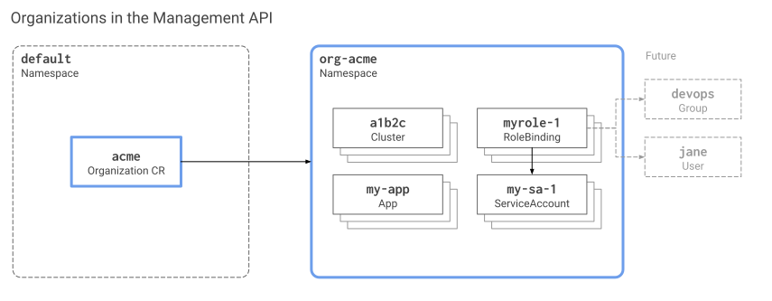

<div class="well disclaimer">

<i class="fa fa-warning"></i> This article covers organizations as defined in the [Management API](). These are replacing the organizations formerly used with the [REST API](). Existing users of the REST API should be aware of this transition.

</div>

## Introduction

_Organizations_ are a means to organize resources like clusters and apps in a way that different entities are isolated from each other. You can use organizations to separate resource for different projects, business units, teams etc. within the same Giant Swarm management cluster.

The organization concept makes use of some well-known building blocks of Kubernetes in the [Management API](), such as:

- Namespaces
- Role based access control (RBAC)
- Specific custom resources (CRs) that tie things together and make organizations easy to manage
- Operators which automate some management tasks

Typical use cases for organizations are:

- Separating clusters for development, experimentation, and testing from clusters used for staging and for production purposes.

- Isolating teams, business units, or even legal entities.

At Giant Swarm, for example, we run several shared installations where we allow different customers access to a single organization only, usually before they get their own installation. This way we can ensure that each customer, while using the same management cluster, can only access their own workload clusters and resources.

### Visual overview {#intro-visual}

[](organizations-management-api.svg)

<!-- Source for above image: https://docs.google.com/drawings/d/1PDve3HoE7br_6npe0RSCw8ddt-H7pFztPlSDiQbNabs/edit -->

## Current state and roadmap {#roadmap}

Organizations are transitioning from being managed completely by microservices behind our REST API to becoming entities you can manage fully via the Management API. In this section we dissect where we are coming from, where we are heading, and what the current situation is on the different providers.

- **2016 to present: REST API**

    - Our REST API provides [functions to manage organizations](https://docs.giantswarm.io/api/#tag/organizations).
    - Each workload cluster is owned by an organization.
    - Customers assign users with proprietary Giant Swarm user accounts to organizations as members, in which they have full permissions.

- **2019: introduction of the Management API**

    - In order to give customers full access to management clusters, workload cluster and app resources, we provide experimental access to the Kubernetes API of management clusters, which we now call the Management API. (We used to call it the _Control Plane API_ back then.)
    - For authentication we introduce OpenID Connect (OIDC), using the customer's own identity provider. We decide to abandon the proprietary Giant Swarm user account, used for the REST API, in the long run.
    - In the beginning, the concept of the organization does not exist in the Management API.
    - Cluster resources carry an annotation `giantswarm.io/organization` to indicate which organization they are assigned to via the REST API.

- **2020: introduction of the organization concept in the Management API**

    - With the [Organization CRD]() we introduce an entity in the Management API to represent an organization.
    - Operators ensure that a namespace exists for each organization in the management cluster.
    - Starting with workload cluster release v13.0.0 for Azure, cluster resources are created in the owner organization's namespace by default (meaning: unless the resource is placed in a different namespaces explicitly).

- **2021: synchronization of organizations in REST API and Management API**

    - We make sure that for each organization defined in the REST API, there is a companion in the Management API, and vice versa. And when one gets deleted, the companion gets deleted, too.

      Naming conventions for Management API organization names are more restricted than the REST API names were. In cases where the REST API organization name uses characters that are not supported in the management API (uppercase letters and underscores), the Organization CR will be named using only lowercase letters and using the dash (`-`) as the only special character. However, in the web interface, you will still see the original name of the organization.

    - Starting with workload cluster release v16.0.0 for AWS, cluster resources are created in the owner organization's namespace by default (meaning: unless the resource is placed in a different namespace explicitly).

- **Further plans**

    - We are migrating our [web user interface]() from using the REST API to the Management API. This also brings a switch from authentication via proprietary Giant Swarm user accounts to single sign-on (SSO), using your own identity provider. Once the switch is made, you will work with Management API organizations directly and there will be no longer such a thing as "membership" for an organization.
    - All resources related to workload clusters and apps should reside in the owner organization's namespace. See [roadmap#103](https://github.com/giantswarm/roadmap/issues/103) for details. As a next step, this will be implemented on-premises/KVM.
    For details regarding the state on the different providers, see [namespace use in different providers](#namespace-use) further down.
    - Once the web user interface only relies on the Management API as a backend, we will start supporting a variety of different user permissions. For example, based on RBAC it will be possible to admit users who have read permissions only. The web user interface will adapt to these restricted permissions and provide a good user experience, regardless of the permissions a user has. This will allow you to permit more users access to the web UI, using identities (user groups and individuals) from your own identity provider, authenticating via single-sign-on.

## Organization CRD and CRs {#organization-crd-cr}

If the concept of custom resources (CR) and custom resource definitions (CRD) is new to you: Kubernetes allows to define [arbitrary objects](https://kubernetes.io/docs/concepts/extend-kubernetes/api-extension/custom-resources/) to be handled via the Kubernetes API. The schema of such an object is specified by a custom resource definition. The actual objects are called the custom resources.

Giant Swarm management clusters provide a CRD named `Organization` (long form: `organizations.security.giantswarm.io`, [schema documentation]()). An organization is defined simply by a custom resource using that CRD, which we'll call an "organization CR" here for brevity.

The single most important aspect of an organization CR is its name. Therefore the CR looks as simple as this:

```text
$ kubectl gs template organization --name ecommerce
apiVersion: security.giantswarm.io/v1alpha1
kind: Organization
metadata:
  name: ecommerce
# [...]
```

Once an organization CR is created, our automation ([organization-operator](https://github.com/giantswarm/organization-operator), to be precise) ensures that a namespace `org-<name of organization>` exists for the organization.

## Naming conventions {#naming-conventions}

Organization names (technically: organization CR names) must follow these rules:

- Must be unique within the management cluster
- Must contain at most 59 characters.
- Has to conform the same convention as Kubernetes namespaces additionally (i. e. the [DNS label names convention](https://kubernetes.io/docs/concepts/overview/working-with-objects/names/#dns-label-names)), which means:
    - contain only lowercase alphanumeric characters or '-'
    - start with an alphanumeric character
    - end with an alphanumeric character

Since there will be a namespace created for each organization, prefixed with `org-`, we recommend against using that same prefix in the organization name, to avoid confusion.

## Organization namespace {#namespace}

For each organization there is a namespace created in the management cluster. The namespace is named after the organization CR name, prefixed with `org-`.

For example, for an organization `acme`, there is the defining organization CR named `acme`. In addition, organization-operator ensures the existence of the namespace `org-acme` in the management cluster.

We recommend to place all resources belonging to an organization into the organization's namespace. Our user interfaces and admission controllers are moving towards supporting this as a default.

### Namespace utilization in different providers {#namespace-use}

We default to storing all resources of an organization in its organization `org-*` namespace: clusters, node pools, apps, and more.

Vintage implementations still have a historical difference: resources belonging to apps deployed to workload clusters are not yet placed in the organization namespace. Instead they are placed in a namespace named after the workload cluster ID. For example, if a workload cluster is named `ve5v6`, the namespace `ve5v6` would contain the `App` CRs for that cluster. Resources are not automatically moved to the organization namespace.

## Managing organizations

Organizations can be managed in several ways.

- The [web user interface]() allows creating and deleting organizations interactively.

- The [Management API]() provides full, native support for managing all organization-related resources.

In addition, we plan to enhance the `kubectl` user experience for organization management via our [`gs`]() plug-in.

<!-- TODO: set links to more organization-specific sub sections once they are published -->
