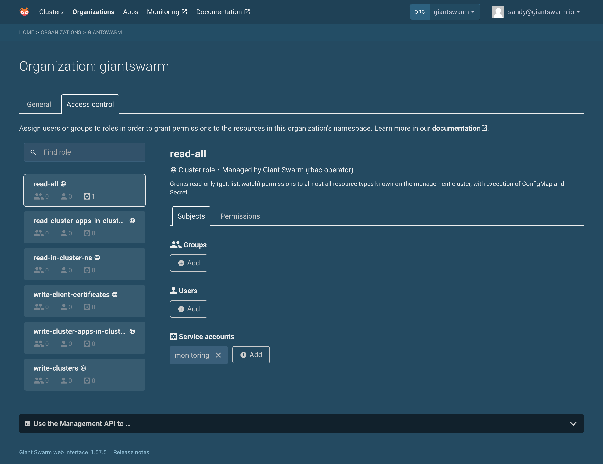
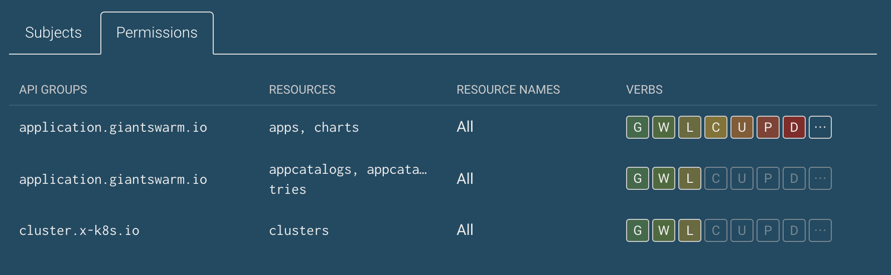

Learn how to quickly grant and revoke access to an organization's resources via the web user interface, using Kubernetes role based access control (RBAC) mechanisms.

{}

Granting access means that the users (when associating users or groups) or programs (when using service accounts) affected will be able to access resources via the Management API, including via the web user interface itself.

The access control UI in the web interface provides quick access to a focused set of RBAC resources, with the goal to make it easy for you to give individuals, groups, or service accounts access to resources in an organization's namespace.

To learn more about the subject, please also check out the broader article on [authorization in the Management API]().

## Where to find it {#where-to-find}

1. Log in to the web user interface, using the URL matching your management cluster/installation.
2. Click **Organizations** in the main menu in the top.
3. Click the organization you want to manage access for.
4. Select the **Access control** tab.

## User interface overview {#ui-overview}



The access control user interface provides:

- A list of roles to select from, sourced from both the organization's namespace and cluster roles. Each role defines a specific set of permissions for a number of resources. Cluster roles are marked using a 🌐 globe icon. In the list, it is also indicated how many users, groups, and service accounts are bound to each role in this organization's namespace.

- For the selected role:

    - Basic information regarding whether the role is a cluster role or a namespaced role, and who manages the role according to the `app.kubernetes.io/managed-by` label (defaulting to **You** if the label does not exist).

    - The list of **Subjects** associated with the role. Subjects are individual users or user groups, as defined in the identity provider you use for authentication.

    - The list of **Permissions** granted to any subject associated with the role.

While the **Subjects** tab will be explained in more detail below under [granting access](#granting-access), the information shown under **Permissions** deserves a closer look here.

### Inspecting permissions



The example above shows permission details for a role that grants:

- all permissions to `apps` and `charts` from the `application.giantswarm.io` API group.
- only `get`, `list`, and `watch` permission to `appcatalogs` and `appcatalogentries` from the `application.giantswarm.io` API group.
- only `get`, `list`, and `watch` permission for clusters.

The single letter icons in the **Verbs** column each represent one of the seven standard verbs: `get`, `watch`, `list`, `create`, `update`, `patch`, and `delete`. The last items, showing an ellipsis `⋯`, stands for additional, arbitrary verbs. Hovering over these icons with your pointer will reveal additional information in a tooltip.

The same permissions, shown as a partial YAML representation of the [Role](https://kubernetes.io/docs/reference/access-authn-authz/rbac/#role-and-clusterrole) definition, could look like this:

```yaml
rules:
- apiGroups:
  - application.giantswarm.io
  resources:
  - apps
  - charts
  verbs:
  - '*'
- apiGroups:
  - application.giantswarm.io
  resources:
  - appcatalogs
  - appcatalogentries
  verbs:
  - get
  - list
  - watch
- apiGroups:
  - cluster.x-k8s.io
  resources:
  - clusters
  verbs:
  - get
  - list
  - watch
```

## Finding roles {#finding-roles}

You can filter the list of roles and cluster roles based on a search term. This term is matched with the role name, all subject names, and all permission details. Examples for possible searches are:

- Show all roles with `read` in the name.
- Show all roles where `someone@example.com` appears as a subject.
- Show all roles explicitly granting permission to `events`.

## Granting access {#granting-access}

Granting access to an organization's resources means, in Kubernetes RBAC terms: you assign a role or cluster role to a subject (here: a service account) in the selected organization's namespace, by creating role bindings in this namespace.

In order to assign a role to a service account, follow these steps:

### 1. Select a role

Find and select the role or cluster role to assign within the list on the left hand side. Select the role that defines the permissions you want to grant.

For example, the `cluster-admin` ClusterRole, when assigned here, will grant all permissions within this organization's namespace. The `read-all` ClusterRole instead gives read-only access to most resources in this namespace.

### 2. Double-check permissions

By inspecting the **Permissions** tab, double check that the role grants only the permissions you are expecting.

### 3. Add subjects

On the **Subjects** tab, add or select the service account you want to assign to the selected role.

When adding a **service account** as a subject, you are free to select from the existing ones in the current organization's namespace, by using the suggestions in the input field. When typing some letters, these suggestions will present existing service accounts that match your input. However you can also create new service accounts here by entering new names here.

In either case, confirm by clicking the _OK_ button.

Done. You have successfully assigned subjects to one specific role for one specific organization.

### Resulting resources

As a result of the action above, there will be new role bindings (`RoleBinding` resources) in the organization's namespace. These resources' names follow the convention

```nohighlight
ROLE_NAME-TIMESTAMP
```

As an example, a `RoleBinding` for a `Role` or `ClusterRole` named `read-all` could be named `read-all-1618868398846`.

As mentioned, new service accounts may have been created in the organization's namespace.

You are free to edit or delete the role bindings and service accounts created via the web user interface in some other way via the Management API. Treat them as if they were yours.

## Revoking access

To revoke access from a service account you'll have to remove this subject's associations with any role in this organization's namespace. In RBAC terms, this means to remove or edit the role bindings referencing these roles.

In the access control user interface, this is how you do it:

1. Find the role you want to remove the subject from. This can be done easily using the **Find role** function described above under [finding roles](#finding-roles), which also accepts user, group, and service account names as a search criterium. Make sure to select the correct role by clicking it.

2. In the **Subjects** tab, next to the service account you want to remove, find the × icon and click it.

    

    You will have to confirm the removal once more.

Make sure to repeat this for all relevant roles.

## Limitations and future plans

- **Roles and cluster roles are read-only.** It is currently not possible to add new roles or cluster roles via the web user interface.

  As an admin user of the Management API, you can add roles or cluster roles directly, e.g. using `kubectl create role` and `kubectl create clusterrole`. Make sure to add the label `ui.giantswarm.io/display` with the string value `"true"` in order to get the role listed in the access control UI.

## Related

- [Our own guide to role based access control (RBAC)]()
- [Kubernetes project documentation on using RBAC authorization](https://kubernetes.io/docs/reference/access-authn-authz/rbac/)
