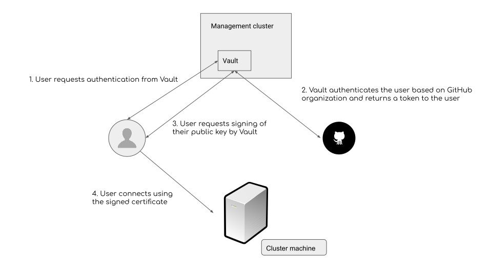

# Secure access to clusters for users and Giant Swarm support

It goes without saying that our customers will have secure access to their own clusters. In order to provide the best service possible, Giant Swarm staff also needs access to them.

In this document we will explain the nature of this access and the security measures in place to ensure management of your clusters is conducted privately and responsibly.

## Intro

Access to Giant Swarm clusters can be split into two parts.

1. User Access - designated for Giant Swarm customers to interact with the offered services.

2. Admin Access - designated for Giant Swarm staff for management/development/support purposes.

If you would like to know more about the different parts of the Giant Swarm infrastructure, please see our [operational layers article]()

## User access

User access is provided via two APIs for interaction with your clusters.

### Giant Swarm API

High-level cluster management access is provided to you via the Giant Swarm API. This includes creating, scaling, and deleting your clusters, as well as other organization and user management functions.
Network access to the API endpoint is typically whitelisted to a certain range of IP addresses. It can also be configured to work over a Virtual Private Network (VPN) following the general VPN connection schema shown below under [admin access](#admin-access). In this case, the connection to the API residing in the cluster can be established only via your configured VPN.

### Kubernetes API

The Kubernetes API of each cluster is exposed to customers. Authorized users of the cluster can be managed by connecting an external Identity Provider to the Kubernetes API, or by provisioning them directly through the Giant Swarm API. In either case, you retain full control over user management.

## Admin access

Admin access is restricted to a VPN that is managed via certificates (public/private keys).

Certificate management is backed by Hashicorp Vault, using the Giant Swarm GitHub organization for user authentication. Each Giant Swarm staff member uses their own individual keypair, the public key of which must be additionally signed by Vault after authorizing the user for each session.

### VPN secured access points

- **SSH** - SSH access is based on GitHub SSO. Only users in the GitHub Giant Swarm Organization are allowed to authenticate. The following diagram describes our SSH authentication in more detail:

Customer workload clusters are accessible only via SSH access to the Giant Swarm management cluster. The management cluster contains Giant Swarm's cluster automation and operations platform, and controls our access to the underlying workload clusters for diagnostic and "Day 2" operational reasons.

- **Management API** - Usage of the Kubernetes API on the management cluster is also secured with SSH.

### General VPN connection schema

The following schema illustrates what the VPN connection looks like in practice.

A cluster can be accessed by connecting to a Giant Swarm VPN server which establishes a secure connection with the jump host of the cluster.

We use two different VPN providers to provide highly resilient and available support to our customers.

### Cloud provider access

Currently, Giant Swarm operators - which are responsible for managing cluster lifecycle - are granted admin rights by the customer to the given cloud provider. This is necessary to create, configure, and clean up the underlying resources (machines, networks, security groups, etc.) used by the cluster.

The operator secret used for authentication with the cloud provider is stored in etcd.
Access to etcd or the Kubernetes API is secured based on certificates signed by Vault, to which only personnel in the Giant Swarm GitHub organization have access.

## Further reading

- [GitHub Vault authentication](https://www.vaultproject.io/docs/auth/github)
- [Vault SSH certificate](https://www.vaultproject.io/docs/secrets/ssh/signed-ssh-certificates)
- [Giant Swarm Operational Layers]()
- [Giant Swarm API]()
- [Giant Swarm User Space]()
