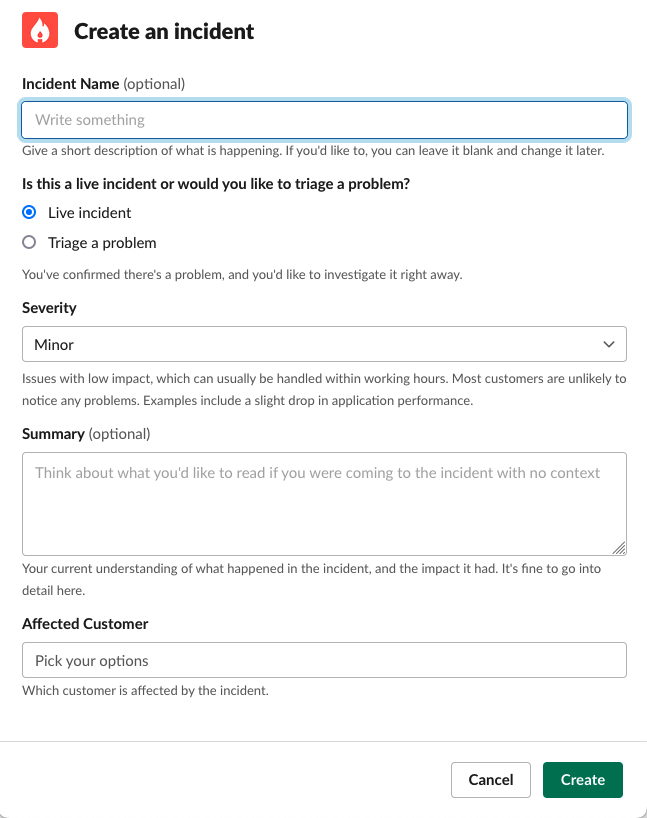
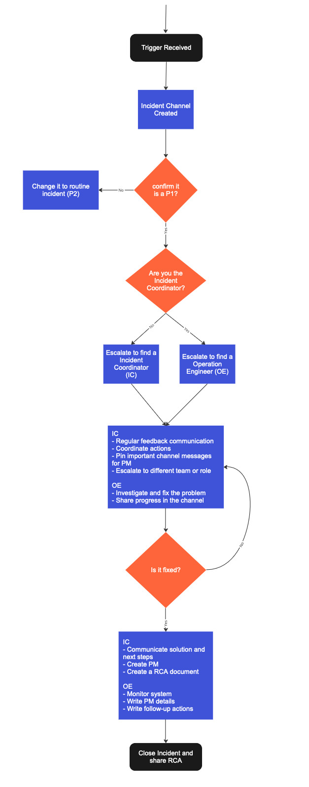

After years of handling critical enterprise workloads in production, Giant Swarm has strengthened the incident process based on valuable learnings. This document focuses on critical incidents, called `Priority 1` (P1) incidents, although some steps may also apply to regular incidents.

Giant Swarm classifies incidents as either critical (`P1`) or routine (`P2`). Critical incidents impair a customer production system, while routine incidents don't impact production and follow a straightforward process.

## Separation of responsibilities

It’s important to ensure that everyone involved in an incident knows their role and what's expected of them, without conflicting with others' responsibilities. Somewhat counterintuitively, a clear separation of responsibilities allows individuals more autonomy, as they don't need to constantly coordinate actions.

### Roles

At Giant Swarm, two roles are defined: `Incident Coordinators` and `Operations Engineers`.

### Incident coordinator

The `Incident Coordinator` maintains the high-level overview of the incident. Structuring the incident response, the coordinator assigns responsibilities according to need and priority. By default, the coordinator holds all positions/responsibilities not delegated. If necessary, the coordinator can remove roadblocks that prevent operations engineers from working effectively.

The coordinator is the public face of the incident response, responsible for issuing periodic updates to all involved teams—both customer teams and within Giant Swarm—acting as the bridge between customer and team. The coordinator will need to be present in the war rooms of customers. For this reason, an [Opsgenie team](https://support.atlassian.com/opsgenie/docs/what-are-teams-in-opsgenie/) groups all members who can act as incident coordinators.

When there is a dedicated coordinator assigned to an incident, this person isn’t debugging systems but focuses on coordinating the team and managing customer communication.

### Operations engineer

The `Operations Engineer` works with the coordinator to respond to the incident, responsible for debugging and applying changes to a system.

Out teams are on-call in [`Opsgenie`](https://support.atlassian.com/opsgenie/docs/what-are-teams-in-opsgenie/) in case any incident is triggered at any point of time.

## Incident process

Inspired by the well-known [Incident Command System](https://en.wikipedia.org/wiki/Incident_Command_System) used by US firefighters, the process is adapted to manage developer platforms.

The main tenet is to have a simple process integrated with incident tooling ([Incident.io](https://incident.io/)) to simplify life for engineers. Once a critical incident is declared, the process should guide actions without needing to read instructions.

The process is broken down into these steps:

1. [Identify](#identify)
2. [Investigate](#investigate)
3. [Fixing](#fixing)
4. [Monitoring](#monitoring)
5. [Closing up](#closing-up)

### Identify

The first step is to identify the incident and understand its impact and severity. There are three possible sources:

1. Alert received pointing to an impacted production system
2. Customer reaches out via Slack
3. Customer sends an urgent email

For the first two options, the engineer declares an incident using the `Slack` shortcut directly on the alert or customer message in the communication channel. The shortcut generates a pop-up to introduce details of the incident, such as name, whether it's a live incident or triage, severity, summary, or affected customer.

If the incident comes from an urgent email, [incident.io](https://incident.io/) automatically creates a channel for the incident and notifies the person on call. The incident is created in `triage` so the Operations Engineer needs to confirm the severity of the issue before triggering the P1 process. Often, the customer provides a call link to join and confirm the problem.

__Note__: For `triage` incidents, a [decision workflow](https://incident.io/blog/using-decision-flows) is designed to help engineers decide the severity of an incident.

Once the `P1` criticality is confirmed, [incident.io](https://incident.io/) triggers a set of [workflows](https://help.incident.io/en/articles/6971329-getting-started-with-workflows) to drive the incident. These workflows include:

- `Escalation Matrix`, displaying different customer contacts to call in an emergency.
- `Role assignment`, automatically assigning the Operations Engineer role to the person reporting the incident.
- `Ping people on call`, notifying colleagues who are on call once the incident is created automatically by urgent email.

For `P1` incidents, the first step is to build the team. Often, the engineer creating the channel isn't part of the [Incident Coordinators Group](https://giantswarm.app.opsgenie.com/teams/dashboard/f02504a3-83d4-4ea8-b55c-8c67756f9b2e/main), so escalation is needed to involve someone from that team. When creating an incident channel, [incident.io](https://incident.io/) provides a button to escalate and select the coordinator schedule from `Opsgenie`. At least a two-person team is needed to manage a critical incident (communications and operations).

### Investigate

Once the team is built, the person assigned to the `Operations Engineer` role will carry on with the investigation. The incident coordinator will be in contact with the customer, via messaging or in a call, providing information to the Operator to aid the investigation.

__Note__: In exceptional cases, the person who acknowledges the alert can manage communication and fix the problem simultaneously, but in such cases, ensure the customer is aware of the measures implemented to solve the issue.

Operations Engineers focus on the investigation, but 30-minute intervals are established to update the customer on the current state. Findings are shared in the channel, and the coordinator can pin these messages to help track actions performed.

If the coordinator needs more responders, escalation to more team members is possible using [incident.io](https://incident.io/) command `/inc escalate`.

By default, every 30 minutes [incident.io](https://incident.io/) will remind you to share updates with the customer or report any progress on the incident channel.

### Fixing

After identifying the root cause, a solution is implemented to prevent further downtime for the customer service. Often, the solution is temporary and replaced once the actual fix is rolled out to the platform. Once the cause is identified and the problem is being fixed, update the incident channel status to `Fixing` (using `/inc update`). The same command can be used to update the summary with any progress.

### Monitoring

Once the fix or workaround is implemented, the coordinator communicates with the customer and moves the incident status to the monitoring phase, where the team remains on standby. The engineer monitors metrics and communication channels to confirm no regression. The incident remains in this state for a period, typically a day or two, until agreement with the customer confirms no regression.

### Closing up

Closing the incident doesn’t mean the work is done. The coordinator creates a [`Postmortem`](https://docs.giantswarm.io/support/overview/#postmortem-process) document detailing all information collected during the incident and shares it with the customer. The [incident.io](https://incident.io/) functionality allows generating a `Google` document as post-mortem, filling most parts with metadata and pinned messages gathered during the incident. The dedicated account engineer for the customer will review and seek feedback from any incident participants.

Any remaining follow-up items are converted into GitHub tickets for the coordinator and moved to the product teams to improve service and avoid repeating mistakes.

### Diagram

The entire workflow is visualized for better understanding, focusing on the most common scenario and excluding all possible ramifications as those are exceptions.

## More info

- This process takes inspiration from [`incident coordinator` role](https://en.wikipedia.org/wiki/Incident_commander).
- [Incident shortcut cheatsheet](https://help.incident.io/en/articles/5948163-shortcuts-cheatsheet)
