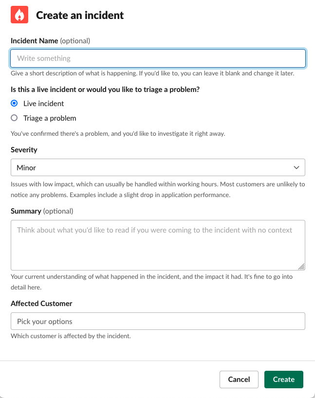
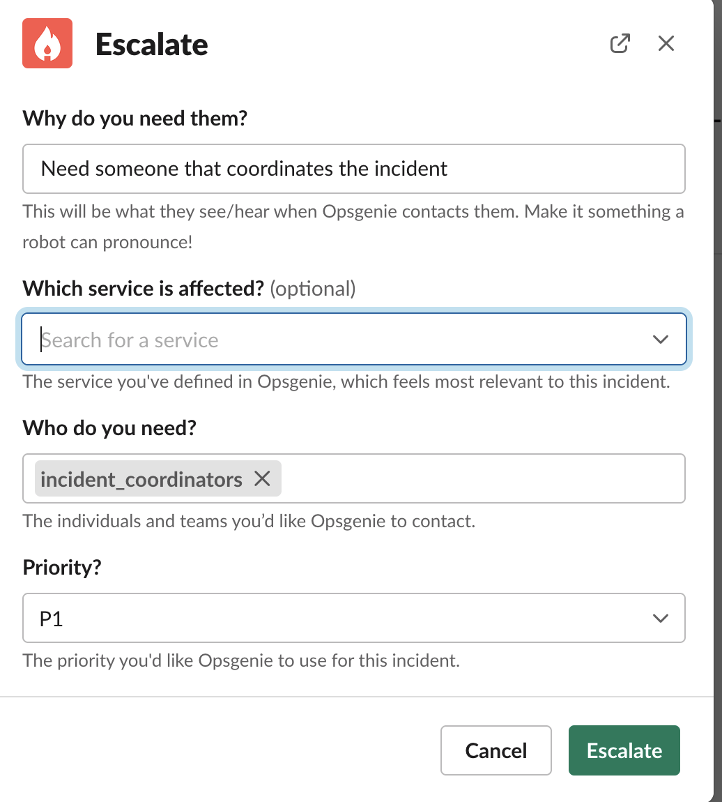
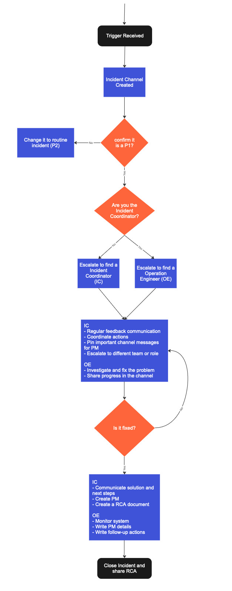

After years of handling critical enterprise workloads in production, we have hardened our incident process based on our learnings. In this document we focus on critical incidents, called `Priority 1` (P1) incidents, though some of the steps could be part of regular incidents too. 

Giant Swarm classifies incidents as being either critical (`P1`) or routine (`P2`). Critical incidents are those which impair a customer production system. Routine incidents are all other regular incidents which don't impact production and which have a straightforward process.

## Separation of Responsibilities

It’s important to make sure that everybody involved in an incident knows their role, what is expected from them, and that it doesn’t conflict with others' responsibilities. Somewhat counterintuitively, a clear separation of responsibilities allows individuals more autonomy, as they do not need to ask all the time and coordinate actions.

### Roles

At Giant Swarm we have two defined roles: Incident Coordinators and Operations Engineers.

### Incident Coordinator

The Incident Coordinator (IC) holds the high-level state about the incident. They structure the incident response, assigning responsibilities according to need and priority. De facto, the IC holds all positions/responsibilities that they have not delegated. If appropriate, they can remove roadblocks that prevent Operations Engineers from working most effectively.

The IC is the public face of our incident response. It is within the ICs duty to issue periodic updates to the team involved - both customer teams and within Giant Swarm - to act as the bridge between the customer and the team. The IC will need to be in the war rooms of our customers. For that reason, we have created a [Opsgenie team](https://support.atlassian.com/opsgenie/docs/what-are-teams-in-opsgenie/) grouping all members that can act as Incident Coordinators. 

If there is a dedicated IC, the IC isn’t debugging systems and keeps the focus on coordinating the team to do so, while managing the customer communication.

### Operations Engineer

The Operations Engineer (OE) works with the Incident Coordinator to respond to the incident and is the one responsible for debugging and applying changes to a system. 

In case of Operations Engineers, we have multiple [Opsgenie teams](https://support.atlassian.com/opsgenie/docs/what-are-teams-in-opsgenie/) oncall 24/7.

## P1 Incident Process

The process is inspired by the well-known [Incident Command System](https://en.wikipedia.org/wiki/Incident_Command_System) used by US firefighters to manage emergency situations. Obviously we have adapted to manage developer platforms. 

Our main tenet is to have a simple process integrated with our incident tooling ([Incident.io](https://incident.io/)) to simplify the life of our engineers. Once a critical incident is declared, nobody wants to read a process, but be driven by it. 

The process can be broken down in these steps:

1. [Identify](#identify)
2. [Investigate](#investigate)
3. [Fixing](#fixing)
4. [Monitoring](#monitoring)
5. [Closing up](#closing-up)

### Identify

First step is to identify the incident and understand its impact and severity. In our case, there are three possible sources:

1. Alert received pointing to an impacted production system
2. Customer reached out via Slack
3. Customer sent us an urgent email

For the first two options, our engineer [declares an Incident](https://help.incident.io/en/articles/5947915-declaring-incidents) using the Slack shortcut directly on the alert or customer message in the communication channel. The shortcut generates a pop-up to introduce the details of the incident like name, it is a live incident or triage, severity, summary or affected customer.

In case the incidents comes from an urgent email, [incident.io](https://incident.io/) creates automatically a channel for the incident and pings the person oncall. The incident is created in `triage` so Operations Engineer needs to confirm the severity of the issue before triggering the P1 process. Most of the times our customer provides with a call link to join and confirm the problem.

__Note__: For `triage` incidents, we have designed a [decision workflow](https://incident.io/blog/using-decision-flows) to help engineers when deciding the severity of an incident.

Once the `P1` criticality is confirmed, [incident.io](https://incident.io/) triggers a set of [workflows](https://help.incident.io/en/articles/6971329-getting-started-with-workflows) that helps to drive the incident. The workflows mentioned are:

- `Escalation Matrix` display the different contacts in the customer side to call in case of emergency.
- `Role assignment` which automatically assign Operation Engineer role to the person reporting the incident.
- `Ping people oncall` pings the colleagues that are on call once the incident is created automatically by urgent email.

For `P1` incidents the first thing to do is build the team. Most of the time, the engineer creating the channel is not part of the [Incident Coordinators Group](https://giantswarm.app.opsgenie.com/teams/dashboard/f02504a3-83d4-4ea8-b55c-8c67756f9b2e/main), so the engineer will need to escalate the issue to get someone from that team. For that reason, when you create an incident channel, [incident.io](https://incident.io/) shows you a button to escalate and let you select the IC schedule from Opsgenie. In the end, we need at least two person team to manage a critical incident (communications and operations).

### Investigate

Once the team is built, the person assigned to the Operations Engineer role will carry on with the investigation. The Incident Coordinator will be in contact with the customer, via messaging or in a call, and will provide information to the Operator to help with the investigation.

__Note__: In exceptional occasions the person who acknowledges the alert can manage the communication and fix the problem at the same time, but once it is the case make sure customer is aware of the measures have been implemented to solved the issue.

We leave space for the Operations Engineers to focus on the investigation, but we establish 30 minutes intervals to get back and inform the customer of the current state. Most of the time, the OEs will share the findings in the channel and the IC can pin those messages to help track the actions performed.

In case the Incident Coordinator needs to increase the number of responders, they can always escalate to more members of the team using [incident.io](https://incident.io/) command `/inc escalate`.

By default, every 30 minutes [incident.io](https://incident.io/) will remind you to share the update with customer or report any progress on the incident channel.

### Fixing

After we have found the root cause of the problem we implement a solution to avoid any more downtime for the customer service. Most of the time, the solution is temporary and will be replaced once the actual fix is rolled out to the platform. Once, we have identified the cause and we our fixing the problem we update the incident channel status to `Fixing` (using `/inc update`). Same command can be use to update the summary once there any progress on the issue.

### Monitoring

Once the fix or workaround has been implemented, IC communicates with the customer and move the incident status to monitoring phase, where we stay in standby, the OE keeps an eye on the metrics and communication channel to confirm there is no regression. We leave the incident in this state for some time, which could be a day or two, until we agree with the customer there is no regression.  

### Closing up

When we close the incident the work is not yet finished. The IC creates a [Postmortem](https://docs.giantswarm.io/support/overview/#postmortem-process) document to detail all information collected during the incident and shares with the customer. The [incident.io](https://incident.io/) functionality allows you to generate a Google Doc Post Mortem filling most of the parts with the metadata and pinned messages gathered during the incident. The dedicated Account Engineer of the customer will do a review and ask for feedback to any of the participants in the incident.

Any remaining follow-up items are converted to Github tickets for the IC and move to the product teams so we can improve our service and avoid making the same mistake twice.

### Diagram

We have drawn the entire workflow for better visualization. We have focussed in the most common scenario and discard all possible ramifications the process could have as those are exceptions.

## More info

- This process takes inspiration from [Incident Coordinator role](https://en.wikipedia.org/wiki/Incident_commander).
- [Incident shortcut cheatsheet](https://help.incident.io/en/articles/5948163-shortcuts-cheatsheet)
