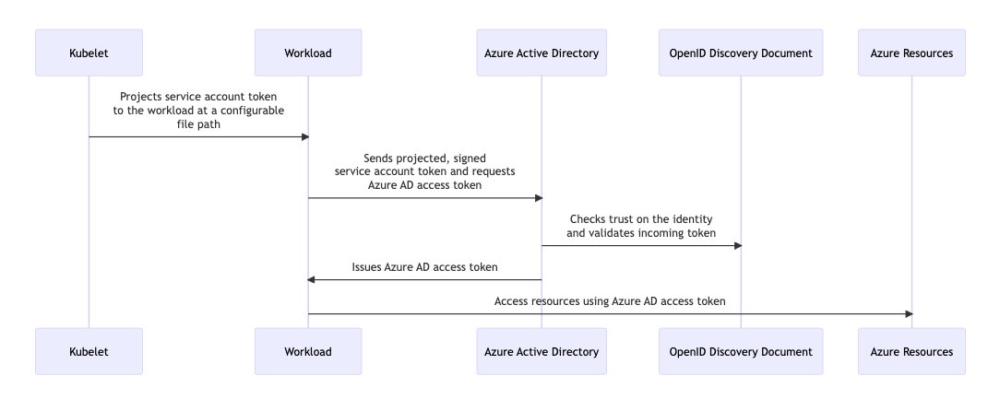

This tutorial is adapted from [Azure's documentation](https://azure.github.io/azure-workload-identity/docs/introduction.html).

Azure Workload Identity is a mechanism for configuring a Kubernetes cluster to use Azure Entra ID as a federated credential provider through the OpenID Connect (OIDC) protocol.
It is the successor of Azure AD Pod Identity offering broader support, better scaling, and simpler usage.

Configuring a workload cluster to enable Azure Workload Identity is not yet automated in the Giant Swarm platform.
However, customers that require it can configure their clusters manually.
These manual actions only need to be taken once for the lifecycle of each workload cluster, and do not require maintenance.

## How it works

The Kubernetes cluster issues tokens to Service Accounts.
These service account tokens are configured to be trusted on user-assigned managed identities.
Cluster workloads exchange a service account token projected to its volume for an Entra ID access token using the Azure Identity SDKs or the Microsoft Authentication Library (MSAL).



## Enabling Azure Workload Identity

### Prerequisites

* Azure workload cluster
* [Kubernetes CLI (`kubectl`)](https://kubernetes.io/docs/tasks/tools/#kubectl)
* [Azure CLI (`az`)](https://learn.microsoft.com/en-us/cli/azure/?view=azure-cli-latest)
* [Azure AD Workload CLI (`azwi`)](https://azure.github.io/azure-workload-identity/docs/installation/azwi.html)

### Retrieve service account public key

The Kubernetes API server issues tokens for service accounts.
The public part of the API server's key pair must be published in the OIDC JWKS document.
This public key must be retrieved so that we can generate the JSON Web Key Sets (JWKS) document in the next step.

Make sure that your `kubectl` context is set to your management cluster.
Then run the following command:

```bash
export MANAGEMENT_CLUSTER_CONTEXT="mc-context"
export ORGANIZATION_NAME="your-org"
export CLUSTER_NAME="your-workload-cluster"

kubectl --context ${MANAGEMENT_CLUSTER_CONTEXT} \
    --namespace org-${ORGANIZATION_NAME} \
    get secrets ${CLUSTER_NAME}-sa -o jsonpath="{.data.tls\.crt}" \
    | base64 --decode > sa.pub
```

The following section assumes that the public key is available in the `sa.pub` file.

### Setup OpenID Connect issuer

We first need a way to host the discovery and JWKS documents required by OpenID Connect.
These documents do not contain sensitive information, and must be hosted on a publicly accessible endpoint.
For this we will use an Azure Storage Account.

The following script will:

  1. Deploy an Azure Storage Account.
  2. Generate and publish the OIDC discovery document.
  3. Generate and publish the OIDC JWKS document.

```bash
#!/usr/bin/env bash

set -o errexit
set -o nounset
set -o pipefail

# Resource group that contains the workload cluster.
# By default, it is the same name as the cluster.
export RESOURCE_GROUP="${CLUSTER_NAME}"
export LOCATION="westeurope"
# Randomly generate a storage account name.
# Be sure to manually set the name if you need to re-run the script.
export AZURE_STORAGE_ACCOUNT="oidcissuer$(openssl rand -hex 4)"
# A special container that is always publicly accessible,
# even when the storage account is private.
export AZURE_STORAGE_CONTAINER="\$web"

echo "Deploying Azure Storage Account..."

az storage account create --resource-group $RESOURCE_GROUP --name $AZURE_STORAGE_ACCOUNT
az storage container create --name $AZURE_STORAGE_CONTAINER
az storage blob service-properties update --account-name $AZURE_STORAGE_ACCOUNT --static-website

AZURE_WEB_ENDPOINT=$(az storage account show --query "primaryEndpoints.web" --output tsv --name $AZURE_STORAGE_ACCOUNT)

echo "Generating and publishing the OIDC discovery document..."

cat <<EOF > openid-configuration.json
{
    "issuer": "${AZURE_WEB_ENDPOINT}",
    "jwks_uri": "${AZURE_WEB_ENDPOINT}openid/v1/jwks",
    "response_types_supported": [
        "id_token"
    ],
        "subject_types_supported": [
        "public"
    ],
    "id_token_signing_alg_values_supported": [
        "RS256"
    ]
}
EOF

az storage blob upload \
  --container-name "${AZURE_STORAGE_CONTAINER}" \
  --file openid-configuration.json \
  --name .well-known/openid-configuration

echo "Generating and publishing the OIDC JWKS document..."

azwi jwks --public-keys sa.pub --output-file jwks.json

az storage blob upload \
  --container-name "${AZURE_STORAGE_CONTAINER}" \
  --file jwks.json \
  --name openid/v1/jwks
  
echo "Done! Your OIDC Issuer is located at:"
echo "${AZURE_WEB_ENDPOINT}"
```

### Configure workload cluster

Once the OIDC Issuer is created, you must configure it as a service account issuer in your workload cluster.
You can do so by adding the following workload cluster configuration:

```yaml
cluster:
  providerIntegration:
    controlPlane:
      kubeadmConfig:
        clusterConfiguration:
          apiServer:
            serviceAccountIssuers:
              # Fill in your own OIDC Issuer here.
              # Example: https://oidcissuera67fb168.z6.web.core.windows.net
              - url: 
              # Make sure to include this entry, leaving it at this value.
              - url: https://kubernetes.default.svc.cluster.local
```

Applying this configuration will roll the control plane.
After the configuration is done, applications in your cluster can use Azure Workload Identity.

### Deploy mutating admission webhook controller

<!-- 
    TODO: This is packaged as an App for use on MCs.
    How to reuse this app for the WC instead of doing it manually?
-->

```bash
#!/usr/bin/env bash
export AZURE_TENANT_ID=$(az account show --query tenantId -o tsv)
helm repo add azure-workload-identity https://azure.github.io/azure-workload-identity/charts
helm repo update
helm install azure-workload-identity-webhook azure-workload-identity/workload-identity-webhook \
   --namespace azure-workload-identity-system \
   --create-namespace \
   --set azureTenantID="$AZURE_TENANT_ID"
```

## Example usage

This section is based on [Azure's quick start guide](https://azure.github.io/azure-workload-identity/docs/quick-start.html).

Running the following script will:

* Deploy an Azure Key Vault
* Create a user-assigned managed identity
* Grant permission to the identity to read secrets from the Key Vault
* Deploy an example application to your workload cluster to read a secret

```bash
#!/usr/bin/env bash

set -o errexit
set -o nounset
set -o pipefail

# The name of your workload cluster.
export CLUSTER_NAME="robin02"
# Azure location of your workload cluster resources.
export LOCATION="westeurope"
# HTTPS URL to the OIDC issuer that was created in the previous section.
export SERVICE_ACCOUNT_ISSUER="https://oidcissuer85517dcb.z6.web.core.windows.net/"
# The name of the resource group that contains the workload cluster.
export RESOURCE_GROUP="${CLUSTER_NAME}"

export KEYVAULT_NAME="azwi-kv-${CLUSTER_NAME}"
export KEYVAULT_SECRET_NAME="my-secret"

export USER_ASSIGNED_IDENTITY_NAME="${CLUSTER_NAME}-msal"
export SERVICE_ACCOUNT_NAMESPACE="default"
export SERVICE_ACCOUNT_NAME="workload-identity-msal"

echo "Creating the Azure Key Vault and Secret..."

VAULT_ID=$(az keyvault create --resource-group "$RESOURCE_GROUP" \
   --location "$LOCATION" \
   --name "$KEYVAULT_NAME" \
   --query id -o tsv )

# Assign the logged-in user permissions to manage secrets in the Key Vault.
ASSIGNEE_OBJECT_ID=$(az ad signed-in-user show --query id -o tsv)
az role assignment create \
  --assignee-object-id $ASSIGNEE_OBJECT_ID \
  --assignee-principal-type User \
  --role "Key Vault Secrets Officer" \
  --scope $VAULT_ID

echo "Waiting for Azure Key Vault RBAC permissions to apply..."
sleep 60

az keyvault secret set --vault-name "$KEYVAULT_NAME" \
   --name "$KEYVAULT_SECRET_NAME" \
   --value "Hello\!"

echo "Creating user-assigned managed identity..."
USER_ASSIGNED_IDENTITY_CLIENT_ID=$(az identity create \
    --name "$USER_ASSIGNED_IDENTITY_NAME" \
    --resource-group "$RESOURCE_GROUP" \
    --query clientId -o tsv)

USER_ASSIGNED_IDENTITY_OBJECT_ID=$(az identity show \
    --name $USER_ASSIGNED_IDENTITY_NAME \
    --resource-group $RESOURCE_GROUP \
    --query principalId -o tsv)

az role assignment create \
  --assignee-object-id $USER_ASSIGNED_IDENTITY_OBJECT_ID \
  --assignee-principal-type ServicePrincipal \
  --role "Key Vault Secrets User" \
  --scope $VAULT_ID
  
echo "Creating Kubernetes service account..."

kubectl create serviceaccount $SERVICE_ACCOUNT_NAME
kubectl annotate serviceaccount $SERVICE_ACCOUNT_NAME azure.workload.identity/client-id=$USER_ASSIGNED_IDENTITY_CLIENT_ID

echo "Creating federated credential..."

az identity federated-credential create \
  --name "workload-identity-fc" \
  --identity-name $USER_ASSIGNED_IDENTITY_NAME \
  --resource-group $RESOURCE_GROUP \
  --issuer $SERVICE_ACCOUNT_ISSUER \
  --subject system:serviceaccount:${SERVICE_ACCOUNT_NAMESPACE}:${SERVICE_ACCOUNT_NAME}
  
echo "Creating example workload..."

KEYVAULT_URL=$(az keyvault show \
    --resource-group $RESOURCE_GROUP \
    --name $KEYVAULT_NAME \
    --query properties.vaultUri -o tsv)

cat <<EOF | kubectl apply -f -
apiVersion: v1
kind: Pod
metadata:
  name: quick-start
  namespace: ${SERVICE_ACCOUNT_NAMESPACE}
  labels:
    azure.workload.identity/use: "true"
spec:
  serviceAccountName: ${SERVICE_ACCOUNT_NAME}
  containers:
    - image: ghcr.io/azure/azure-workload-identity/msal-go
      name: oidc
      env:
        - name: KEYVAULT_URL
          value: ${KEYVAULT_URL}
        - name: SECRET_NAME
          value: ${KEYVAULT_SECRET_NAME}
      securityContext:
        allowPrivilegeEscalation: false
        capabilities:
          drop: [ALL]
  nodeSelector:
    kubernetes.io/os: linux
  securityContext:
    runAsNonRoot: true
    seccompProfile:
      type: RuntimeDefault
EOF
```

If the test is successful, the `quick-start` Pod should periodically log something like this:

```console
I0210 15:46:04.114179       1 main.go:63] "successfully got secret" secret="Hello\\!"
I0210 15:47:04.274439       1 main.go:63] "successfully got secret" secret="Hello\\!"
I0210 15:48:04.404953       1 main.go:63] "successfully got secret" secret="Hello\\!"
I0210 15:49:04.696782       1 main.go:63] "successfully got secret" secret="Hello\\!"
I0210 15:50:04.816333       1 main.go:63] "successfully got secret" secret="Hello\\!"
I0210 15:51:05.003743       1 main.go:63] "successfully got secret" secret="Hello\\!"
I0210 15:52:05.120376       1 main.go:63] "successfully got secret" secret="Hello\\!"
I0210 15:53:05.285953       1 main.go:63] "successfully got secret" secret="Hello\\!"
```
