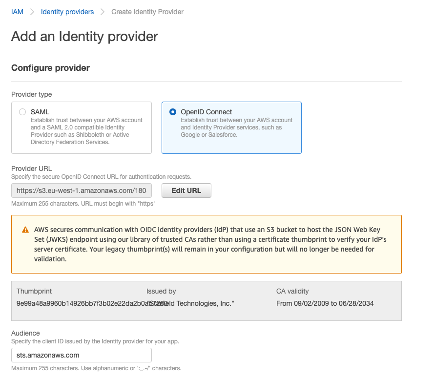

*Basic knowledge about how service accounts work in Kubernetes is necessary for understanding what this page is about. If you could use a quick refresher, we strongly suggest taking a look at [this article](https://learnk8s.io/authentication-kubernetes).*

You can associate an IAM role with a `Kubernetes` service account. This service account can then provide AWS permissions to the containers in any pod that uses that service account. With this feature, you no longer need to provide extended permissions to the Giant Swarm node IAM role so that pods on that node can call AWS APIs.

Applications must sign their AWS API requests with AWS credentials. This feature provides a strategy for managing credentials for your applications, similar to the way that Amazon EC2 instance profiles provide credentials to Amazon EC2 instances. Instead of creating and distributing your AWS credentials to the containers or using the Amazon EC2 instance’s role, you can associate an IAM role with a `Kubernetes` service account. The applications in the pod’s containers can then use an AWS SDK or the AWS CLI to make API requests to authorized AWS services.

The official documentation from AWS: [IAM roles for service accounts](https://docs.aws.amazon.com/eks/latest/userguide/iam-roles-for-service-accounts.html) `IRSA`.

## IAM role permissions on `capa` controller

The Cluster APi for AWs controller comes with an attached policy name `giantswarm-<INSTALLATION>-irsa-controller-policy` that contains permissions like:

```json
  {
      "Effect": "Allow",
      "Action": [
        "iam:CreateOpenIDConnectProvider",
        ...
        "cloudfront:TagResource",
        ...
        "acm:RequestCertificate",
        ...
      ],
      "Resource": "*"
  },
  {
      "Effect": "Allow",
      "Action": [
        "s3:CreateBucket",
        ...
      ],
      "Resource": "arn:aws:s3:::*-g8s-*"
  }
```

This policy allows the controller to create a Cloudfront distribution, ACM certificate, S3 bucket and OpenID Connect provider to enable the usage of the IRSA feature.

## Using IAM roles for service accounts

### IAM role

#### IAM Role Trusted Entity

The **trusted entity** of a IAM role needs to contain a condition like the `sub` service account name of a JSON Web token (JWT). You need to ensure one of those conditions match against the `JWT`, which is used by one of your applications.

This is a example `JWT` from `external-dns` which is verified against the `external-dns` IAM role.

```json
{
  "aud": [
    "sts.amazonaws.com"
  ],
  "kubernetes.io": {
    "namespace": "kube-system",
    "pod": {
      "name": "external-dns-7dfdc97c55-v5spg",
    },
    "serviceaccount": {
      "name": "external-dns",
    }
  },
  "sub": "system:serviceaccount:kube-system:external-dns"
}
```

### Service account

The service account has to be annotated with a full `ARN` of the IAM role. You can get the `ARN` of the role in the AWS console, when you check role details.

The annotation key has to be `eks.amazonaws.com/role-arn`.

```yaml
apiVersion: v1
kind: ServiceAccount
metadata:
  annotations:
    eks.amazonaws.com/role-arn: arn:aws:iam::$AWS_ACCOUNT:role/$IAM_ROLE_NAME
  name: s3-access
  namespace: default
```

## Cross Account Roles {#cross-account}

### IAM role cross account

In order to assume roles cross AWS accounts you will need to create a new AWS Identity Provider (OpenID Connect) in the AWS account where the IAM role is located.



Login into the AWS on the account where the cluster is running:

- Grab the address of the `Identity Provider` in your current cluster `IAM > Identity Providers`. It will look like `https://s3.REGION.amazonaws.com/AWS_ACCOUNT-g8s-CLUSTER_ID-oidc-pod-identity-v2` or `https://CLOUDFRONT_ID.cloudfront.net`.

Login into the account where the IAM role is located and create an identity provider in `IAM > Identity Providers`:

- Set `Provider URL` to the previously gathered address and click the `Get thumbprint` to import the certificate.
- Set the `audience` to `sts.amazonaws.com` OR `sts.amazonaws.com.cn` for China regions.

## Verify your configuration is correct

Once your pod is running with the configured service account, you should see a file in the pod called `/var/run/secrets/eks.amazonaws.com/serviceaccount/token`, which contains a `JWT` token with details of the role.

The pod should also have configured environment variables `AWS_WEB_IDENTITY_TOKEN_FILE` and `AWS_ROLE_ARN`.

Check the pod using command `kubectl -n NAMESPACE get pod POD_NAME -o yaml` and search for the environment variables or for the volume mounts.

Learn more about the [IAM roles for service accounts](https://docs.aws.amazon.com/eks/latest/userguide/iam-roles-for-service-accounts.html) in the official AWS documentation.
