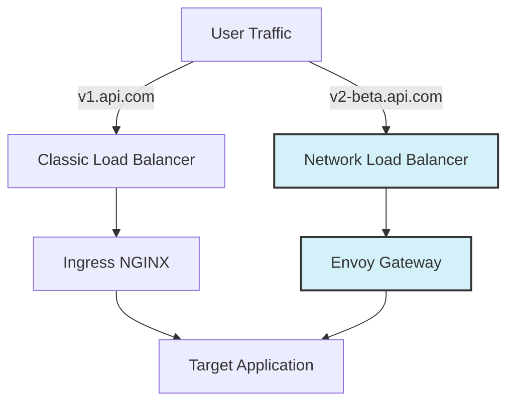

[Gateway API](https://gateway-api.sigs.k8s.io/) is the successor to the Kubernetes Ingress API, offering a more expressive and extensible model for managing traffic routing. This guide walks you through migrating from Ingress resources to Gateway API with Envoy Gateway on Giant Swarm clusters.

## Why migrate to Gateway API

- **Future standard**: Gateway API is the emerging standard for Kubernetes ingress, with active development and broad industry adoption.
- **More expressive routing**: It natively supports advanced traffic management like traffic splitting, header-based routing, and URL rewrites.
- **Better role separation**: It separates infrastructure concerns (Gateway) from application routing (HTTPRoute), enabling better multi-team workflows.
- **Extensibility**: The Policy attachment model allows adding capabilities like rate limiting, authentication, and retries without modifying routes.

## Prerequisites

Before starting, ensure you have:

- An existing Giant Swarm workload cluster with an Ingress controller installed.
- `kubectl` configured to access your workload cluster.
- Access to the Giant Swarm platform API (management cluster) for app installation.
- On AWS-based clusters, [`aws-load-balancer-controller`](https://github.com/giantswarm/aws-load-balancer-controller-app) installed for AWS Network Load Balancers.

## Understanding your current Ingress setup

Before migrating, it's helpful to understand how Ingress controller ingress-nginx works in Giant Swarm clusters. For detailed information, see the [exposing workloads guide]().

Migrating involves a conceptual shift from the monolithic `Ingress` resource to the distributed Gateway API model.

| Feature | Ingress (Legacy) | Gateway API (New) |
| :--- | :--- | :--- |
| **Routing Resource** | `Ingress` (All-in-one) | `HTTPRoute` (Just routing rules) |
| **Infrastructure** | Implicit (Controller flags) | `Gateway` & `GatewayClass` (Explicit) |
| **Traffic Policies** | Annotations (`nginx.ingress...`) | Dedicated Resources (`BackendTrafficPolicy`, `SecurityPolicy`) |
| **DNS/TLS** | Annotations on Ingress | Configured on the `Gateway` listeners |

### DNS schema

Giant Swarm clusters use a consistent DNS naming pattern. For ingress-nginx, the default DNS entry is:

```text
ingress.BASEDOMAIN
```

This DNS record points to the ingress-nginx controller's load balancer. Applications using ingress-nginx typically use this hostname directly or configure additional DNS records.

### How DNS records are created

When you create an Ingress resource, the following happens automatically:

1. A wildcard CNAME record (`*.BASEDOMAIN`) is created during cluster provisioning, pointing to your ingress controller's load balancer DNS record
2. external-dns watches Ingress resources and can create additional DNS records based on annotations. Note that the Giant Swarm managed external-dns only creates records for subdomains of your cluster's BASEDOMAIN. For custom domains, you need to run your own external-dns instance.
3. cert-manager can automatically provision TLS certificates using annotations

A typical Ingress resource looks like this:

```yaml
apiVersion: networking.k8s.io/v1
kind: Ingress
metadata:
  name: my-app
  namespace: default
spec:
  ingressClassName: nginx
  rules:
  - host: ingress.abc12.provider.gigantic.io
    http:
      paths:
      - path: /
        pathType: Prefix
        backend:
          service:
            name: my-app-service
            port:
              number: 8080
```

## Installing the Gateway API bundle

The Giant Swarm Gateway API bundle includes Gateway API CRDs, Envoy Gateway, and a pre-configured default Gateway.

To install the Giant Swarm Gateway API Bundle on one of your workload clusters:

Create a file named `gateway-api-bundle.yaml`:

```yaml
apiVersion: v1
kind: ConfigMap
metadata:
  name: <CLUSTER_NAME>-gateway-api-bundle
  namespace: org-<ORGANIZATION>
data:
  values: |
    clusterID: <CLUSTER_NAME>
    organization: <ORGANIZATION>
    # additional configuration
    # apps:
    #   gatewayApiConfig:
    #     userConfig:
    #       configMap:
    #         values: |
    #           gateways:
    #             ...
---
apiVersion: application.giantswarm.io/v1alpha1
kind: App
metadata:
  labels:
    app-operator.giantswarm.io/version: 0.0.0
  name: <CLUSTER_NAME>-gateway-api-bundle
  namespace: org-<ORGANIZATION>
spec:
  catalog: giantswarm
  kubeConfig:
    inCluster: true
  name: gateway-api-bundle
  namespace: org-<ORGANIZATION>
  userConfig:
    configMap:
      name: <CLUSTER_NAME>-gateway-api-bundle
      namespace: org-<ORGANIZATION>
  version: 1.10.2
```

Check the [bundle repository](https://github.com/giantswarm/gateway-api-bundle) for the latest version of the `gateway-api-bundle`. For all available configuration options, see the `values.yaml` files in the [gateway-api-bundle repository](https://github.com/giantswarm/gateway-api-bundle/blob/main/helm/gateway-api-bundle/values.yaml), [gateway-api-config-app repository](https://github.com/giantswarm/gateway-api-config-app/blob/main/helm/gateway-api-config/values.yaml) and [envoy-gateway-app repository](https://github.com/giantswarm/envoy-gateway-app/blob/main/helm/envoy-gateway/values.yaml).

Replace `<CLUSTER_NAME>` with your cluster name and `<ORGANIZATION>` with your organization name, then apply it on your management cluster:

```bash
kubectl apply -f gateway-api-bundle.yaml
```

### Verifying the installation

After the bundle deploys, verify the GatewayClass and Gateway exist on your workload cluster:

```bash
kubectl get gatewayclass
```

Expected output:

```text
NAME                 CONTROLLER                                      ACCEPTED
giantswarm-default   gateway.envoyproxy.io/gatewayclass-controller   True
```

```bash
kubectl get gateway -n envoy-gateway-system
```

Expected output:

```text
NAME                 CLASS                ADDRESS                            PROGRAMMED
giantswarm-default   giantswarm-default   axx8.eu-west-2.elb.amazonaws.com   True
```

## Configuring the Gateway API bundle

The Gateway API bundle creates a default GatewayClass (`giantswarm-default`) and Gateway (`giantswarm-default`) with HTTP (port 80) and HTTPS (port 443) listeners.

### Key difference from ingress-nginx

With ingress-nginx, DNS records and TLS certificates are created automatically based on Ingress annotations. With Gateway API, you must explicitly configure which subdomains the Gateway accepts.

### Adding subdomains for DNS and certificates

To enable DNS records and TLS certificates for your applications, configure the subdomains in the bundle configuration. Update your configmap:

```yaml
apiVersion: v1
kind: ConfigMap
metadata:
  name: <CLUSTER_NAME>-gateway-api-bundle
  namespace: org-<ORGANIZATION>
data:
  values: |
    clusterID: <CLUSTER_NAME>
    organization: <ORGANIZATION>
    apps:
      gatewayApiConfig:
        userConfig:
          configMap:
            values: |
              gateways:
                default:
                  listeners:
                    https:
                      subdomains:
                      - myapp
                      - api
                      - dashboard
```

This configuration:

1. Creates CNAME DNS records pointing to the Gateway load balancer (for example, `myapp.CLUSTER_ID.k8s.gigantic.io`)
2. Adds the subdomains to the TLS certificate's `dnsNames` list
3. Automatically handles certificate provisioning via cert-manager and Let's Encrypt

If you need to use your own certificate issuer instead of the default one provided by the gateway-api-bundle, you can disable the built-in Issuer and reference your own ClusterIssuer or Issuer in the bundle configuration.

Example:

```yaml
apiVersion: v1
kind: ConfigMap
metadata:
  name: <CLUSTER_NAME>-gateway-api-bundle
  namespace: org-<ORGANIZATION>
data:
  values: |
    clusterID: <CLUSTER_NAME>
    organization: <ORGANIZATION>
    apps:
      gatewayApiConfig:
        userConfig:
          configMap:
            values: |
              gateways:
                default:
                  tlsIssuer:
                    enabled: false
                  listeners:
                    https:
                      certificate:
                        enabled: true
                        issuer:
                          kind: ClusterIssuer
                          name: letsencrypt-giantswarm-dns
```

### How DNS endpoint resources work

The `gateway-api-config-app` automatically creates `DNSEndpoint` custom resources when you configure subdomains. These resources are picked up by external-dns to create the actual DNS records. You don't need to manage these resources directly.

### Using custom external-dns annotations

If you're running your own external-dns instance or need custom DNS configuration, you can configure the `gateway-api-config-app` to use different annotations on the generated `DNSEndpoint` resources. This is useful when:

- You have a custom external-dns deployment for specific DNS providers
- You need to target a different DNS zone than the cluster default
- You want to use external-dns with custom domains outside the cluster's BASEDOMAIN

Example:

```yaml
apiVersion: v1
kind: ConfigMap
metadata:
  name: <CLUSTER_NAME>-gateway-api-bundle
  namespace: org-<ORGANIZATION>
data:
  values: |
    clusterID: <CLUSTER_NAME>
    organization: <ORGANIZATION>
    apps:
      gatewayApiConfig:
        userConfig:
          configMap:
            values: |
              gateways:
                default:
                  listeners:
                    https:
                      certificate:
                        enabled: true
                        issuer:
                          kind: ClusterIssuer
                          name: letsencrypt-giantswarm-dns
                      dnsEndpoints:
                        enabled: true
                        annotations:
                          giantswarm.io/external-dns: managed
```

## Enabling Gateway API support in cert-manager

This section is only required for clusters where the HTTP-01 Let's Encrypt challenge is used for certificate validation. If you're using DNS-01 challenges, you can skip this step.

For cert-manager to provision certificates for Gateway resources, you must enable Gateway API support. Add this configuration to your cluster's user configmap on the management cluster.

**Important**: Do this only after the Gateway API CRDs are installed by the bundle.

```yaml
global:
  apps:
    certManager:
      values:
        config:
          apiVersion: controller.config.cert-manager.io/v1alpha1
          enableGatewayAPI: true
          kind: ControllerConfiguration
```

After applying this change, cert-manager will watch for Gateway resources and provision certificates accordingly.

## Migrating Ingress resources to HTTPRoutes

### Using ingress2eg for conversion reference

The [ingress2eg](https://github.com/kkk777-7/ingress2eg) tool converts nginx Ingress resources to Gateway API and Envoy Gateway resources. While it can generate resources directly, the output is most useful as a reference for understanding how to translate your existing Ingress configurations.

For Helm users, treat the generated HTTPRoute and policy resources as examples to incorporate into your own Helm charts rather than applying them directly. This approach ensures your Gateway API resources are managed consistently with your existing deployment workflow.

See the [ingress2eg README](https://github.com/kkk777-7/ingress2eg) for installation instructions and the full list of supported nginx annotation conversions.

#### Basic usage

Convert Ingress resources from your cluster:

```bash
# Convert all Ingress resources in a specific namespace
ingress2eg print --namespace myapp > httproutes.yaml

# Convert all Ingress resources across all namespaces
ingress2eg print --all-namespaces > httproutes.yaml

# Convert from a local file
ingress2eg print --input-file ingress.yaml > httproutes.yaml
```

#### What ingress2eg generates

Depending on your Ingress annotations, ingress2eg produces:

- **HTTPRoute**: Core routing rules (always generated)
- **BackendTrafficPolicy**: Load balancing, retries, timeouts
- **SecurityPolicy**: Cross-origin resource sharing (CORS), basic auth, external auth, IP allow lists
- **ClientTrafficPolicy**: mTLS settings

#### Example conversion

**Before (Ingress)**:

```yaml
apiVersion: networking.k8s.io/v1
kind: Ingress
metadata:
  name: my-app
  namespace: default
  annotations:
    nginx.ingress.kubernetes.io/rewrite-target: /
    nginx.ingress.kubernetes.io/enable-cors: "true"
    nginx.ingress.kubernetes.io/cors-allow-origin: "https://example.com"
spec:
  ingressClassName: nginx
  rules:
  - host: ingress.abc12.k8s.gigantic.io
    http:
      paths:
      - path: /api
        pathType: Prefix
        backend:
          service:
            name: my-app-service
            port:
              number: 8080
```

**After (generated by ingress2eg)**:

```yaml
apiVersion: gateway.networking.k8s.io/v1
kind: HTTPRoute
metadata:
  name: my-app
  namespace: default
spec:
  parentRefs:
  - name: giantswarm-default
    namespace: envoy-gateway-system
  hostnames:
  - ingress.abc12.k8s.gigantic.io
  rules:
  - matches:
    - path:
        type: PathPrefix
        value: /api
    filters:
    - type: URLRewrite
      urlRewrite:
        path:
          type: ReplacePrefixMatch
          replacePrefixMatch: /
    backendRefs:
    - name: my-app-service
      port: 8080
---
apiVersion: gateway.envoyproxy.io/v1alpha1
kind: SecurityPolicy
metadata:
  name: my-app-cors
  namespace: default
spec:
  targetRefs:
  - group: gateway.networking.k8s.io
    kind: HTTPRoute
    name: my-app
  cors:
    allowOrigins:
    - type: Exact
      value: "https://example.com"
```

#### Post-conversion steps

After running ingress2eg:

1. Review the generated resources and adjust as needed
2. Update the `parentRefs` to point to `giantswarm-default` in the `envoy-gateway-system` namespace
3. Ensure the hostname subdomain is configured in your Gateway API bundle (see [Adding subdomains](#adding-subdomains-for-dns-and-certificates))
4. Apply the resources to your cluster

### Manual migration

For simple Ingress resources without complex annotations, you can manually create HTTPRoutes.

**Ingress**:

```yaml
apiVersion: networking.k8s.io/v1
kind: Ingress
metadata:
  name: simple-app
  namespace: default
spec:
  ingressClassName: nginx
  rules:
  - host: ingress.abc12.k8s.gigantic.io
    http:
      paths:
      - path: /
        pathType: Prefix
        backend:
          service:
            name: simple-service
            port:
              number: 80
```

**Equivalent HTTPRoute**:

```yaml
apiVersion: gateway.networking.k8s.io/v1
kind: HTTPRoute
metadata:
  name: simple-app
  namespace: default
spec:
  parentRefs:
  - name: giantswarm-default
    namespace: envoy-gateway-system
  hostnames:
  - ingress.abc12.k8s.gigantic.io
  rules:
  - matches:
    - path:
        type: PathPrefix
        value: /
    backendRefs:
    - name: simple-service
      port: 80
```

## Parallel Operation Strategy

You can run both ingress-nginx and Gateway API simultaneously, which is recommended for gradual migration. This allows you to migrate one application at a time without downtime.



### Migration workflow

1. **Install Gateway API**: It creates a new Load Balancer separate from NGINX.
2. **Dual Expose**: Configure your app with *both* an `Ingress` (old domain) and an `HTTPRoute` (new/test domain).
3. **Validate**: Test the application via the Gateway API path.
4. **Cutover**: Update DNS to point the main domain to the Gateway Load Balancer, or update the `HTTPRoute` to take over the main hostname.

## Troubleshooting

If your new route isn't working, check the status of the `HTTPRoute` object. It is the single source of truth for configuration errors.

```bash
kubectl describe httproute <your-route-name> -n <namespace>
```

**Common Status Messages:**

- **`Condition: Accepted, Status: True`**: The route is valid and attached to the Gateway.
- **`Condition: ResolvedRefs, Status: False`**: The `backendRef` (Service) cannot be found. Check the service name and port.
- **`Reason: NotAllowedByListeners`**: The Gateway exists, but no listener matches your hostname, or the listener blocks this namespace.
- **`Reason: Detached`**: The route references a Gateway that doesn't exist or isn't programmed.

### DNS considerations

During migration, you have two options:

- **Different subdomains**: Use new subdomains for Gateway API routes (for example, `myapp-new.CLUSTER_ID.k8s.gigantic.io`) while keeping existing Ingress routes active
- **Gradual traffic shift**: Update DNS to point to the Gateway load balancer once HTTPRoutes are validated

## Key differences summary

| Aspect | Ingress-nginx | Gateway API |
|--------|---------------|-------------|
| DNS records | Created via external-dns annotations on Ingress | Configured via subdomains in Gateway bundle |
| TLS certificates | cert-manager annotations on Ingress | Listener certificate config in Gateway bundle |
| Routing resource | Ingress | HTTPRoute |
| Traffic policies | Annotations on Ingress | Separate policy resources (BackendTrafficPolicy, SecurityPolicy) |
| Role separation | Single resource for all concerns | Gateway (infra) + HTTPRoute (app) + Policy (ops) |

## Further reading

- [Gateway API installation guide]()
- [Gateway API usage examples]()
- [ingress2eg on GitHub](https://github.com/kkk777-7/ingress2eg)
- [Gateway API documentation](https://gateway-api.sigs.k8s.io/)
