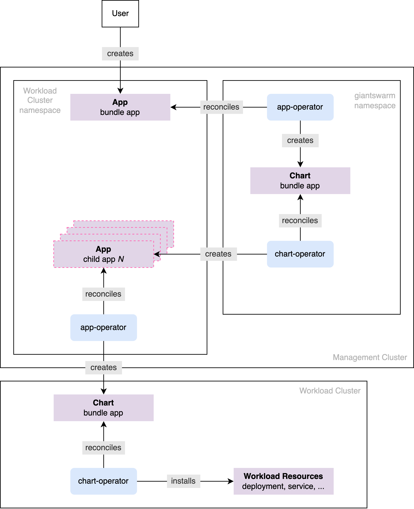
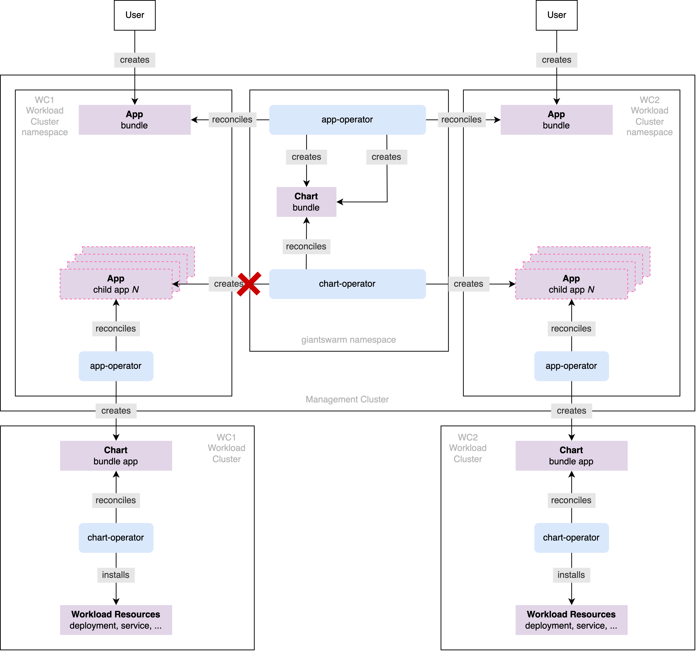

## App bundle definition {#app-bundle-definition}

As stated in the [app platform overview]() all managed apps are packaged, maintained and offered as `helm` charts and it's no different for the app bundles. What makes them special in comparison to solitary apps is that the bundle `helm` chart, instead of carrying a regular resources composing the actual application, carries [`App` custom resources]() which, once delivered and consumed by the app platform, install the expected applications and their resources.

In other words, an app bundle can be thought of a meta package, not installing anything in the workload cluster on its own, but requesting installation of certain pre-defined applications.

The distinction between solitary (on the left side) and bundle (on the right side) apps is depicted in the
figure below.


The `A1` apps `helm` chart consists of end resources representing the actual application. Upon installing this app, these resource are created in the **workload cluster directly**. On the other side is a bundle `helm` chart carrying the `A1-A4` `App` custom resources. Installing this bundle results in the creation of these nested `App` custom resources in the **management cluster**. These `App` custom resources are then picked up and reconciled by the app platform which only then results in creating end resources in the workload cluster.

As already hinted above, the direct consequence of nesting `App` custom resources inside a `helm` chart is how the app is installed. Installing a solitary app for the workload cluster doesn't result in creating any resources in the management cluster, whilst the bundle app is first installed in the management cluster, where it creates the `App` custom resources, which are then, in the second step, installed in the workload cluster. More about this in the [`App Bundle` installation](#app-bundle-installation).

## App bundle installation {#app-bundle-installation}

### High overview

The solitary app installation process has been already well depicted in the [app platform overview](). The bundle installation process is very similar except it involves one extra layer, and hence extra controllers.

This layer consists of the management cluster's app and chart operators whose purpose is to install applications and controllers designed to provide management layer functionality and these may be leveraged to install app bundles.

The figure below depicts the process. Note however, some parts present in the [App Platform Overview]() figure, like pulling the tarball archive, have been omitted for brevity.



When `App` custom resource for the bundle is created within the management cluster, it's first picked up by the management cluster's app operator which is called, by convention, `unique`. It lives under the protected `giantswarm` namespace, but in principle operates the same way the workload clusters app operators do. Essentially, it reconciles the `App` custom resource by creating a corresponding [`Chart` custom resource]() in the `giantswarm` namespace, which is then picked up by the management cluster's chart operator also living in that namespace. The chart operator then installs the app resources, which in this case are nested `App` custom resources to be created in the workload cluster namespace. Once delivered, the nested `App` custom resources are picked up by the workload cluster's app operator and installed in the well known way.

<div class="feedback well">

<h5>
<i class="fa fa-help-outline"></i>
Is it possible to install app bundles without involving the management cluster layer
</h5>
No, at least not in the current implementation form. The reason is, app bundles install `App` custom resources that are understood only by the management clusters. Attempt to install them directly to the workload cluster would result in an error because corresponding `App` custom resource definition isn't available there, resulting in the `kubernetes` not understanding the submitted objects.
</div>

Now, obviously in order to leverage this management cluster layer, the bundle `App` custom resource must be configured in a certain way which is slightly different in comparison to the solitary apps. Find more details in the [Technical Details paragraph](#technical-details).

### Technical details {#technical-details}

#### Naming the bundle's `App` resource

The first, not so obvious, consequence of installing a bundle in a management cluster before its nested apps are installed in the workload cluster, is the requirement for name uniqueness. When a given app bundle is to be installed for more than one workload cluster, each `App` custom resource instance of this bundle must be given a unique name within the management cluster.

It becomes natural for solitary apps, for example, the [`Hello World` app](https://github.com/giantswarm/hello-world-app), that when one needs to install it twice in the workload cluster, both `App` custom resources instances must be named uniquely. It's natural because both live under the same namespace, but even if we could break them into separate namespaces, this uniqueness would still be demanded because both apps targets the same workload cluster, hence must be distinguished by its operators.

It's less obvious for the bundle apps, because these are usually scattered across the namespaces for the corresponding workload clusters from the very beginning, hence giving the impression they're isolated, which we already know to not be the case. Not complying to this rule results in apps competing over certain resources, and hence conflicting.

Let's walk through an example to understand it better.

Imagine that a user has two workload clusters created, the `WC1` and the `WC2`, on the management cluster. The user then installs, via the `App` custom resource called just `bundle`, an app bundle in the `WC1` cluster. Everything works perfectly so far, see the figure below.


The flow of actions can be thought of as an unbroken link. The continuity of this link is guarantee of delivering end resources. Now let's assume the user wants to install the same app bundle, but for the `WC2` cluster this time.

The user creates `App` custom resource in the `WC2` namespace and names it `bundle` as well. This is a problem, because globally, the`bundle` app is already installed in the management cluster, hence corresponding `Chart` custom resource of the name `bundle` already exists. Creating another app of the same name results in unique app operator to re-assign this `Chart` custom resource to the new instance of the app, effectively breaking the aforementioned link for the old one. See this in the figure below.



The broken link doesn't result in removing the first instance. It however results in `Chart` custom resource being continuously switched between apps leading to continuous re-deployments and hence instability. Due to this it's required that the bundle `App` custom resources are named uniquely, which results in creation of a separate set of corresponding resources and effectively unique deployment link. See the figure below.

<div class="feedback well">
<h5><i class="fa fa-help-outline"></i>
How to best make the names unique
</h5>
It's a common practice to either prepend or append the workload cluster name to the `App` custom resource name, creating for example `wc1-bundle` or `bundle-wc1`.
</div>


#### Configuring the bundle's `App` resource for the unique app operator

Once unique names are ensured, the `App` custom resource must be configured to be installed in the management cluster by the unique app operator. It's done by the means of the `app-operator.giantswarm.io/version: 0.0.0` label and the `.spec.kubeConfig.inCluster: true` field. See the snippet below, note some fields have been removed for brevity.

```yaml
apiVersion: application.giantswarm.io/v1alpha1
kind: App
metadata:
  labels:
    app-operator.giantswarm.io/version: 0.0.0
  name: bundle-wc1
  ...
spec:
  ...
  kubeConfig:
    inCluster: true
  name: bundle-app
  ...
```

These two settings ensure this `App` custom resource is picked up and reconciled by the unique app operator. When the `kubectl-gs` is used then both of these fields are set correctly when templating an app, when the
`--in-cluster` flag is used, see [kubectl gs template app](), so that there is no need to remember about it.

<div class="feedback well">
<h5>
<i class="fa fa-help-outline"></i>
Is possible to install any app in the management cluster
</h5>No, but it will work for some apps. The management cluster's chart operator uses a limited set of permissions when installing user-requested apps, prohibiting the creation of certain cluster-scoped resources such as `ClusterRole`, `ClusterRoleBinding` or custom resource definitions, or to access certain namespaces, like `kube-system`. When the app being requested is limited to the namespace you have access to, and doesn't require cluster scoped resource creation, then installing it within the management cluster should work.
</div>

#### Configuring target workload cluster for the nested apps

Once the `App` custom resource name and configuration for unique App Operator are taken care of, the only thing left is to configure the bundle so that nested `App` custom resources are placed into correct workload cluster namespace, and with the correct configuration. This requires two steps.

Firstly, the `App` custom resources `.metadata.namespace` and `.spec.namespace` fields must be equal, meaning must reference the same namespace. Let's consider the snippet from the previous paragraph and enrich it with these settings.

```yaml
apiVersion: application.giantswarm.io/v1alpha1
kind: App
metadata:
  labels:
    app-operator.giantswarm.io/version: 0.0.0
  name: bundle-wc1
  namespace: wc1
spec:
  ...
  kubeConfig:
    inCluster: true
  name: bundle-app
  namespace: wc1
  ...
```

Secondly, each app bundle helm chart exposes the `clusterName` and `organization` configuration options in its
`values.yaml` file, see below.

```yaml
clusterName: ""
organization: ""
...
```

It's obligatory if no further customization is needed to, at minimum, fill in these two fields and provide such
`values.yaml` as user configuration to the `App` custom resource. Let's go back to the example above and enrich it further.

```yaml
apiVersion: application.giantswarm.io/v1alpha1
kind: App
metadata:
  labels:
    app-operator.giantswarm.io/version: 0.0.0
  name: bundle-wc1
  namespace: wc1
spec:
  ...
  kubeConfig:
    inCluster: true
  name: bundle-app
  namespace: wc1
  userConfig:
    configMap:
      name: bundle-wc1-userconfig
      namespace: wc1
  ...
---
apiVersion: v1
data:
  values: |
    clusterName: wc1
    organization: testorg
kind: ConfigMap
metadata:
  name: bundle-wc1-userconfig
  namespace: wc1
```

Please refer to [`App` configuration]() to understand how the user configuration works, and to the [kubectl gs template app]() reference to understand how you can automate this process.

At this point, the bundle's `App` custom resource carries all the information to be successfully installed.
