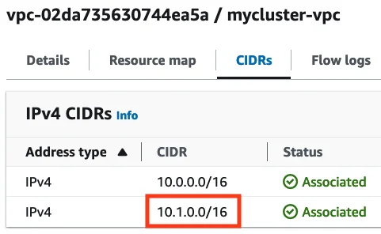
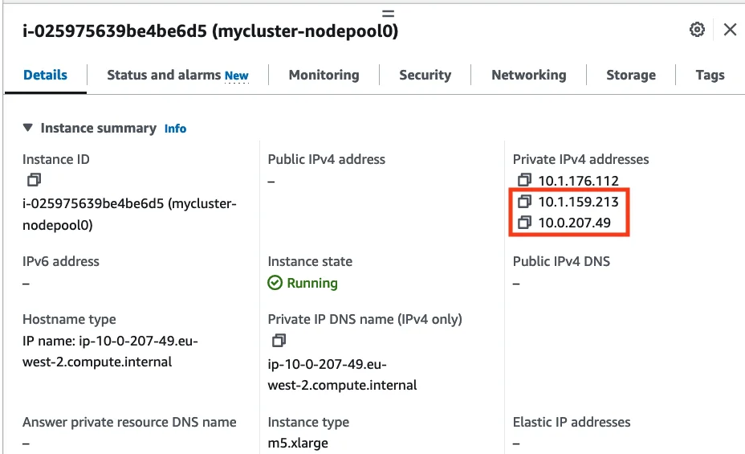

By default, AWS workload clusters on the Giant Swarm platform use the [`ipam: kubernetes` mode](https://docs.cilium.io/en/latest/network/concepts/ipam/kubernetes/) of the Cilium CNI (Container Network Interface). This mode allocates pod IPs from the single range `100.64.0.0/12` across nodes (configurable with [`global.connectivity.network.pods.cidrBlocks`](https://github.com/giantswarm/cluster-aws/tree/main/helm/cluster-aws#connectivity)). In this way, pod IPs aren't visible on the AWS network. The number of pods can be high, since no limits apart from the CIDR size apply. **We therefore recommend using this default mode unless you have specific requirements, as listed below.**

A workload cluster can be configured to deviate from this default and choose pod IPs from an AWS-allocated IP range (CIDR). **The [Cilium ENI IPAM mode](https://docs.cilium.io/en/latest/network/concepts/ipam/eni/) creates ENIs (Elastic Network Interfaces) and allocates pod IPs directly on those interfaces.**

## Advantages of Cilium ENI IPAM mode

- Pods get directly assigned IPs, belong to an AWS subnet and are assigned to a separate security group `<mycluster>-pods`. This allows handling pod traffic separately, for example firewalling or peering.
- Pod traffic isn't encapsulated or translated by NAT. The pod IPs can be visible in a peered VPC or behind a transit gateway.

## Disadvantages of Cilium ENI IPAM mode

- Strong limitation for number of pods: each AWS EC2 instance type has a certain maximum number of ENIs (Elastic Network Interfaces) and each of those has a maximum number of assignable IPs (see [AWS documentation](https://docs.aws.amazon.com/AWSEC2/latest/UserGuide/using-eni.html#AvailableIpPerENI)). For example, instance type `m5.xlarge` can host up to 4 ENIs (of which one is already used for the node IP CIDR), 15 IP addresses per ENI and therefore `(4 - 1 ENIs) * 15 IPs per ENI = 45` pods. This can lead to higher costs because fewer pods can be run on each node, even if more would fit based on available CPU and memory.
- A large CIDR is recommended for the pod network, as each pod will use one IP. This could be a problem if you don't have enough CIDRs left to choose from, for example if the CIDR must not overlap with others in your network.

## Creating an AWS workload cluster with Cilium ENI IPAM mode

The IPAM mode must be set at cluster creation time and can't be changed for a running cluster. Below, you will create a cluster template and adjust the required values before actually creating the cluster.

First, template a regular cluster (refer to [Creating a workload cluster]()):

```sh
kubectl gs template cluster \
  --provider capa \
  --name mycluster \
  --organization testing \
  > cluster.yaml
```

Open the YAML file in an editor. It should look like this:

```yaml
---
apiVersion: v1
data:
  values: |
    global:
      connectivity:
        availabilityZoneUsageLimit: 3
        network: {}
        topology: {}
      controlPlane: {}
      metadata:
        name: mycluster
        organization: testing
      # [...]
kind: ConfigMap
metadata:
  # [...]
  name: mycluster-userconfig
  namespace: org-testing
---
apiVersion: application.giantswarm.io/v1alpha1
kind: App
metadata:
  # [...]
  name: mycluster
  namespace: org-testing
spec:
  catalog: cluster
  # [...]
  name: cluster-aws
  namespace: org-testing
  userConfig:
    configMap:
      name: mycluster-userconfig
      namespace: org-testing
  version: # [...]
```

Edit the values in the YAML file:

- Set value [`global.connectivity.cilium.ipamMode=eni`](https://github.com/giantswarm/cluster-aws/blob/main/helm/cluster-aws/README.md#connectivity)
- Set value [`global.connectivity.network.pods.cidrBlocks`](https://github.com/giantswarm/cluster-aws/blob/main/helm/cluster-aws/README.md#connectivity) to the CIDR you want for the pods. This will be associated as secondary CIDR to the VPC.

  In this example, we use the value `10.1.0.0/16`. It must not overlap with the primary VPC CIDR (default `global.connectivity.network.vpcCidr=10.0.0.0/16`).
- If you chose a different CIDR than `10.1.0.0/16`, please also set [`global.connectivity.eniModePodSubnets`](https://github.com/giantswarm/cluster-aws/blob/main/helm/cluster-aws/README.md#connectivity), for example by copy-pasting the documented default list of subnets and changing the CIDR split (default: `10.1.0.0/16` split into three subnet blocks `10.1.0.0/18`, `10.1.64.0/18`, `10.1.128.0/18`). Also check [AWS IPv4 CIDR block association restrictions](https://docs.aws.amazon.com/vpc/latest/userguide/vpc-cidr-blocks.html#add-cidr-block-restrictions) before making choices.

The changed values should look like this, while the rest stays the same:


---
apiVersion: v1
data:
  values: |
    global:
      connectivity:
        availabilityZoneUsageLimit: 3

        cilium:
          ipamMode: eni

        network:
          pods:
            cidrBlocks:
              - 10.1.0.0/16

        # See above hint - you only need to fill `eniModePodSubnets` if the pod
        # CIDR isn't `10.1.0.0/16`
        # ---
        # eniModePodSubnets: <list of subnets>

        topology: {}
      controlPlane: {}
      metadata:
        name: mycluster
        organization: testing
      # [...]
kind: ConfigMap
# [...]


Make sure you are connected to a management cluster. Create the workload cluster like this:

```sh
kubectl apply -f cluster.yaml
```

After a few minutes, the cluster should be up. In the AWS EC2 console, you will find the secondary VPC CIDR (pod network), and EC2 instances having secondary network interfaces which list their currently allocated pod IPs:





Your workload cluster is now ready and uses Cilium ENI IPAM mode!
