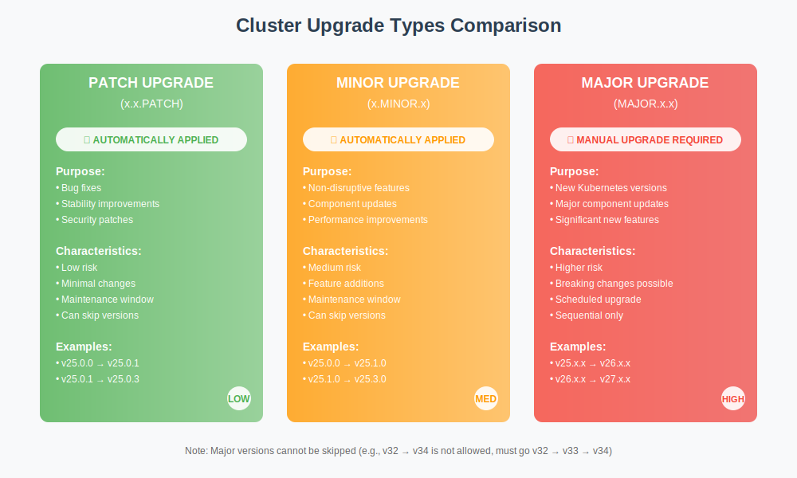

This guide explains how workload cluster upgrades work and how to prepare your workloads to remain operational during upgrades. Giant Swarm advocates for frequent, small updates to keep changes manageable. Our goal is to help you run all clusters on the latest version without disrupting your operations.

## Workload cluster releases

A **release** bundles certain versions of third-party and Giant Swarm specific components:

- [Kubernetes](https://kubernetes.io/) with its sub-components
- [Flatcar Container Linux](https://www.flatcar-linux.org/docs/latest/) as the node's operating system
- [Containerd](https://github.com/containerd/containerd) as a container runtime environment
- [Cilium](https://cilium.io/) for networking and security
- [Observability bundle](https://github.com/giantswarm/observability-bundle)
- [Security bundle](https://github.com/giantswarm/security-bundle)

Each release is specific to the provider (AWS, Azure, or VMware) and identified by a version number. See the [workload cluster releases](https://github.com/giantswarm/releases/) repository for all available releases. Releases are **immutable** once deployed, ensuring consistency. Changes only happen through upgrades to a new release.

Versions are named **<major>.<minor>.<patch>**.

**Patch upgrades** increase the patch version for bug fixes and stability improvements.

**Minor upgrades** introduce non-disruptive features that are typically less significant than major upgrades.

**Major upgrades** include new Kubernetes releases, third-party components, and significant new features. Major releases align with Kubernetes upstream releases.

When a new major version is released, the oldest major release is deprecated. You could still create clusters with deprecated releases if necessary. Existing clusters remain unaffected.

## How to upgrade

**Patch and minor upgrades** are automatically rolled out by Giant Swarm, respecting agreed maintenance windows or schedules.

**Major upgrades** are not automated. You'll be notified to schedule the upgrade, possibly after updating workloads. Giant Swarm staff may assist or initiate these upgrades.

You cannot skip major versions when upgrading (e.g. v32.x.y to v34.x.y) – upgrades must proceed sequentially through major versions. You can usually skip minor and patch releases if needed. Please always check the [changelog]().

To trigger an upgrade:

- **GitOps**: Update the cluster configuration file with the desired release version
- **kubectl-gs** command line tool: Use the [`update cluster`]() command with the `--release-version` flag

## Avoid downtime during upgrades

To ensure your workloads remain operational during upgrades:

- **Ensure redundancy**: Use two or more replicas for all critical deployments
- **Distribute workloads**: Use [inter-pod anti-affinity](https://kubernetes.io/docs/concepts/scheduling-eviction/assign-pod-node/#inter-pod-affinity-and-anti-affinity) to spread replicas across nodes
- **Use probes**: Implement [liveness and readiness probes](https://kubernetes.io/docs/tasks/configure-pod-container/configure-liveness-readiness-startup-probes/) with appropriate `initialDelaySeconds` values
- **Handle termination signals**: Ensure pods handle `TERM` signals gracefully and configure `terminationGracePeriodSeconds` for longer shutdowns if needed
- **Set disruption budgets**: Use [PodDisruptionBudgets](https://kubernetes.io/docs/tasks/run-application/configure-pdb/) to maintain minimum pod counts (avoid `maxUnavailable=0` for single-replica deployments)
- **Set scheduling priorities**: Use Pod priority classes and set resource requests/limits to influence scheduling
- **Avoid ephemeral resources**: Use controllers (Deployments, StatefulSets) instead of standalone Pods
- **Configure webhook timeouts**: Set low timeout values (e.g., 5 seconds) for validation and mutation webhooks
- **Verify pod health**: Ensure all critical pods are running before upgrades with `kubectl get pods --all-namespaces | grep -v "Running\|Completed"`

## How upgrades work under the hood

Upgrades occur at runtime while maintaining workload functionality. Control plane nodes are recreated (causing temporary API slowness), then worker nodes are drained, stopped, and recreated while pods get rescheduled.




Control plane machines are rotated first, followed by worker nodes. Control plane nodes are replaced one by one to keep the cluster operational.

The Cluster API for AWS controller manages upgrades using EC2 instances. The default [instance warmup](https://github.com/search?q=repo%3Agiantswarm%2Fcluster-aws%20refreshPreferences&type=code) configuration ensures AWS doesn't replace all nodes at once but in steps, allowing human intervention if needed. For small node pools, one node is replaced every 10 minutes. For larger pools, small sets of nodes are replaced every 10 minutes.

Worker nodes receive a terminate signal from AWS. The preinstalled [`aws-node-termination-handler`](https://github.com/aws/aws-node-termination-handler) drains machines gracefully before termination. The default timeout is [`global.nodePools.PATTERN.awsNodeTerminationHandler.heartbeatTimeoutSeconds=1800`](https://github.com/giantswarm/cluster-aws/blob/main/helm/cluster-aws/README.md#node-pools), which you can adjust as needed.



Control plane machines are rotated first, followed by worker nodes. Control plane nodes are replaced one by one to keep the cluster operational.

Worker upgrade behavior is based on the MachineDeployment (individual VMs, typically in an Availability Set): Cluster API performs a rolling update. By default it creates one new node, waits for it to become Ready, then drains and deletes one old node (maxSurge=1, maxUnavailable=0).

Nodes being removed are cordoned and drained before deletion. For VMSS-initiated scale-in or eviction (for example Spot VM eviction), Azure Scheduled Events are emitted; a node-termination handler drains the node gracefully before the VM is removed. Drain/timeout behavior is configurable.


Control plane machines are rotated first, followed by worker nodes. Control plane nodes are replaced one by one to keep the cluster operational.

Workers are managed via MachineDeployments. Cluster API uses a rolling update strategy by default (maxSurge=1, maxUnavailable=0): it adds a new VM/node, waits for it to be Ready, then cordons, drains, and deletes one old VM at a time.

There is no cloud-level termination signal on vSphere. Draining and deletion are orchestrated by Cluster API. Timeouts for draining and node deletion are configurable (for example via KubeadmControlPlane’s nodeDrainTimeout/nodeDeletionTimeout and the MachineDeployment rolling update strategy).


Control plane machines are rotated first, followed by worker nodes. Control plane nodes are replaced one by one to keep the cluster operational.

Workers are managed via MachineDeployments. Cluster API performs a rolling update (default maxSurge=1, maxUnavailable=0): new VMs are brought up and made Ready before old nodes are cordoned, drained, and removed.

Cloud Director does not provide termination notices to the node. Draining is handled by Cluster API before VM deletion. Because Cloud Director operations (power off, guest customization, network attachment) can take longer than on IaaS clouds, rollouts may progress more slowly. Drain and deletion timeouts are configurable to accommodate environment characteristics.


