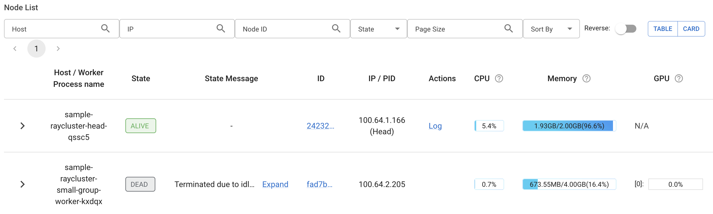
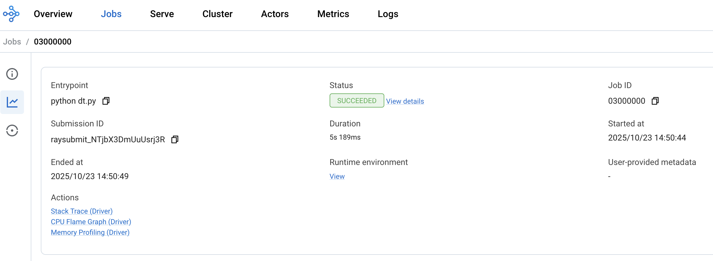

[Ray](https://ray.io/) is a unified framework for scaling AI and Python applications. It provides a simple, universal API for building distributed applications and includes libraries for machine learning, reinforcement learning, and hyperparameter tuning. [KubeRay](https://ray-project.github.io/kuberay/) is the official Kubernetes operator for Ray that automates the deployment, scaling, and management of Ray clusters on Kubernetes.

Key benefits of using Ray with KubeRay on Giant Swarm:

- **Scalable distributed computing**: Automatically scale Ray clusters based on workload demands
- **Native Kubernetes integration**: Leverage Kubernetes features like resource management, networking, and monitoring
- **Machine learning workflows**: Run distributed training, hyperparameter tuning, and inference workloads
- **Resource efficiency**: Dynamic resource allocation and cluster autoscaling

## Prerequisites

Before starting this tutorial, ensure you have:

- A running Giant Swarm workload cluster with sufficient resources
- `kubectl` configured to access your workload cluster
- Basic understanding of Kubernetes concepts (pods, services, deployments)
- Familiarity with Python and distributed computing concepts

## Installing the KubeRay operator

The KubeRay operator manages the lifecycle of Ray clusters on Kubernetes. You can install it using the Giant Swarm App Platform.

### Using the App Platform

Create an `App` resource to install the KubeRay operator from the Giant Swarm catalog:

```bash
export CLUSTER=your-cluster-id
export ORGANIZATION=your-org-id

kubectl gs template app \
  --catalog=giantswarm \
  --cluster-name=${CLUSTER} \
  --name=kuberay-operator \
  --organization=${ORGANIZATION} \
  --target-namespace=kuberay-system \
  --version=1.1.0 > kuberay-operator.yaml

kubectl apply -f kuberay-operator.yaml
```

### Verifying the installation

Check that the KubeRay operator is running:

```bash
kubectl get pods -n kuberay-system

NAME                                READY   STATUS    RESTARTS   AGE
kuberay-operator-7b5c8f6d4b-xyz12   1/1     Running   0          2m
```

Verify that the Custom Resource Definitions (CRDs) are installed:

```bash
kubectl get crd | grep ray

rayclusters.ray.io                    2025-10-12T10:00:00Z
rayjobs.ray.io                        2025-10-12T10:00:00Z
rayservices.ray.io                    2025-10-12T10:00:00Z
```

## Deploying a Ray cluster

Once the KubeRay operator is installed, you can deploy Ray clusters using the `RayCluster` custom resource.

### Basic Ray cluster configuration

Create a basic Ray cluster configuration:

```yaml
apiVersion: ray.io/v1alpha1
kind: RayCluster
metadata:
  name: sample-raycluster
  namespace: default
spec:
  rayVersion: '2.50.1'
  enableInTreeAutoscaling: true
  headGroupSpec:
    rayStartParams:
      dashboard-host: '0.0.0.0'
      block: 'true'
    template:
      spec:
        containers:
        - name: ray-head
          image: rayproject/ray:2.50.1
          ports:
          - containerPort: 6379
            name: gcs-server
          - containerPort: 8265
            name: dashboard
          - containerPort: 10001
            name: client
          resources:
            limits:
              cpu: "2"
              memory: "2Gi"
            requests:
              cpu: "1"
              memory: "1Gi"
  workerGroupSpecs:
  - replicas: 2
    minReplicas: 1
    maxReplicas: 5
    groupName: small-group
    rayStartParams: {}
    template:
      spec:
        affinity:
          nodeAffinity:
            preferredDuringSchedulingIgnoredDuringExecution:
            - weight: 1
              preference:
                matchExpressions:
                - key: nvidia.com/gpu.present
                  operator: In
                  values:
                  - "true"
        runtimeClassName: nvidia
        tolerations:
          - key: nvidia.com/gpu
            value: "true"
            effect: NoSchedule
        containers:
        - name: ray-worker
          image: rayproject/ray:2.50.1
          resources:
            limits:
              cpu: "2"
              memory: "2Gi"
            requests:
              cpu: "1"
              memory: "1Gi"
```

Save this configuration as `ray-cluster.yaml` and apply it:

```bash
kubectl apply -f ray-cluster.yaml
```

### Verifying the Ray cluster deployment

Check the status of your Ray cluster:

```bash
kubectl get raycluster

NAME                 DESIRED WORKERS   AVAILABLE WORKERS   STATUS   AGE
sample-raycluster    2                 2                   ready    3m
```

List the Ray cluster pods:

```bash
kubectl get pods -l ray.io/cluster=sample-raycluster

NAME                                          READY   STATUS    RESTARTS   AGE
sample-raycluster-head-xxxxx                  1/1     Running   0          3m
sample-raycluster-worker-small-group-xxxxx    1/1     Running   0          3m
sample-raycluster-worker-small-group-yyyyy    1/1     Running   0          3m
```

## Accessing the Ray cluster

### Using the Ray Dashboard

The Ray Dashboard provides a web interface for monitoring your Ray cluster. Forward the dashboard port to access it locally:

```bash
kubectl port-forward service/sample-raycluster-head-svc 8265:8265
```

Open your browser and navigate to `http://localhost:8265` to access the Ray Dashboard.



## Running a test job

Once your Ray cluster is running, you can submit a computing job using the Ray Job Submission SDK to test the cluster capabilities.

First, make sure you have the Ray client on your local machine:

```bash
pip install -U "ray[default]"
```

Set up port forwarding to access your Ray cluster:

```bash
kubectl port-forward service/sample-raycluster-head-svc 8265:8265
```

Let's use calculation of PI number using Monte Carlo method. The python script can be found [here](http://bit.ly/4o7Tc2h). You can use this command to submit the job to the cluster API.

```bash
# Submit a job using Ray CLI
ray job submit \
  --address="http://localhost:8265" \
  --runtime-env-json='{"pip": ["numpy"], "working_dir": "."}' \
  -- python http://bit.ly/4o7Tc2h
```

Observe in the dashboard how the job is executed in parallel and how resources are scaled based on load.



## Further reading

- [Ray Documentation](https://docs.ray.io/)
- [KubeRay Documentation](https://ray-project.github.io/kuberay/)
- [Giant Swarm App Platform]()
