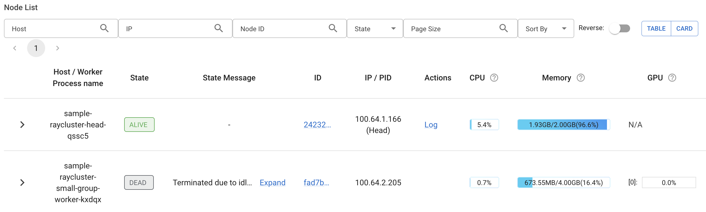
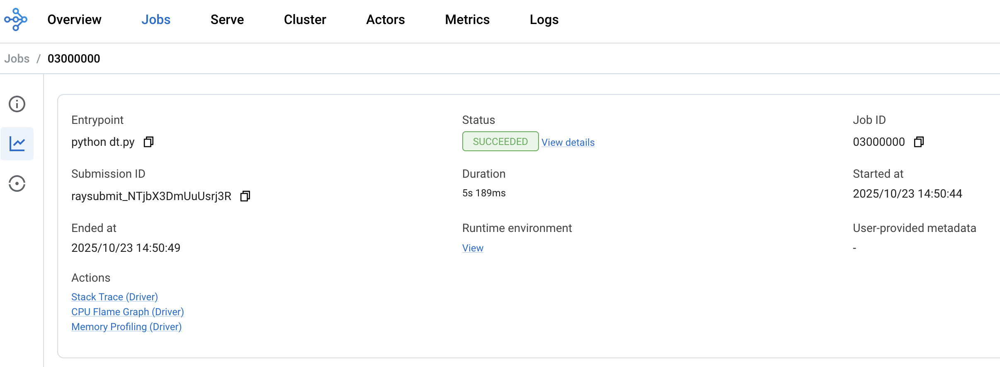

[Ray](https://www.ray.io/) is a unified framework for scaling AI and Python applications. It provides a simple, universal API for building distributed applications and includes libraries for machine learning, reinforcement learning, and hyperparameter tuning. [KubeRay](https://ray-project.github.io/kuberay/) is the official Kubernetes operator for Ray that automates the deployment, scaling, and management of Ray clusters on Kubernetes.

Key benefits of using Ray with KubeRay on Giant Swarm:

- **Scalable distributed computing**: Automatically scale Ray clusters based on workload demands
- **Native Kubernetes integration**: Leverage Kubernetes features like resource management, networking, and monitoring
- **Machine learning workflows**: Run distributed training, hyperparameter tuning, and inference workloads
- **Resource efficiency**: Dynamic resource allocation and cluster autoscaling

## Prerequisites

Before starting this tutorial, ensure you have:

- A running Giant Swarm workload cluster with sufficient resources
- `kubectl` configured to access your workload cluster
- Basic understanding of Kubernetes concepts (pods, services, deployments)
- Familiarity with Python and distributed computing concepts

## Installing the KubeRay operator

The KubeRay operator manages the lifecycle of Ray clusters on Kubernetes. You can install it using the Giant Swarm App Platform.

### Using the App Platform

Create an `App` resource to install the KubeRay operator from the Giant Swarm catalog:

```bash
export CLUSTER=your-cluster-id
export ORGANIZATION=your-org-id

kubectl gs template app \
  --catalog=giantswarm \
  --cluster-name=${CLUSTER} \
  --name=kuberay-operator \
  --organization=${ORGANIZATION} \
  --target-namespace=kuberay-system \
  --version=1.1.0 2>/dev/null > kuberay-operator.yaml

kubectl apply -f kuberay-operator.yaml
```

**Note**: `kubectl gs template app` may print a deprecation banner in latest releases of `kubectl gs` related to a transition how apps are deployed. That is why we are redirecting the `stderr`.

### Verifying the installation

Check that the KubeRay operator is running:

```nohighlight
$ kubectl get pods -n kuberay-system

NAME                                READY   STATUS    RESTARTS   AGE
kuberay-operator-7b5c8f6d4b-xyz12   1/1     Running   0          2m
```

Verify that the Custom Resource Definitions (CRDs) are installed:

```nohighlight
$ kubectl get crd | grep ray

rayclusters.ray.io                    2026-05-19T10:00:00Z
rayjobs.ray.io                        2026-05-19T10:00:00Z
rayservices.ray.io                    2026-05-19T10:00:00Z
```

## Deploying a Ray cluster

Once the KubeRay operator is installed, you can deploy Ray clusters using the `RayCluster` custom resource.

### Basic Ray cluster configuration

Create a basic Ray cluster configuration. The manifest below works on a standard Giant Swarm workload cluster with PSS-restricted policies enforced by Kyverno (the default on most installations):

```yaml
apiVersion: ray.io/v1
kind: RayCluster
metadata:
  name: sample-raycluster
  namespace: default
spec:
  rayVersion: '2.50.1'
  enableInTreeAutoscaling: true
  # The operator injects an autoscaler sidecar into the head pod when
  # enableInTreeAutoscaling is true. PSS-restricted clusters reject it
  # unless we set its securityContext explicitly.
  autoscalerOptions:
    securityContext:
      runAsNonRoot: true
      runAsUser: 1000
      allowPrivilegeEscalation: false
      seccompProfile:
        type: RuntimeDefault
      capabilities:
        drop: [ALL]
  headGroupSpec:
    rayStartParams:
      dashboard-host: '0.0.0.0'
      block: 'true'
    template:
      spec:
        securityContext:
          runAsNonRoot: true
          runAsUser: 1000
          runAsGroup: 100
          fsGroup: 100
          seccompProfile:
            type: RuntimeDefault
        containers:
        - name: ray-head
          image: rayproject/ray:2.50.1
          securityContext:
            runAsNonRoot: true
            runAsUser: 1000
            allowPrivilegeEscalation: false
            seccompProfile:
              type: RuntimeDefault
            capabilities:
              drop: [ALL]
          ports:
          - containerPort: 6379
            name: gcs-server
          - containerPort: 8265
            name: dashboard
          - containerPort: 10001
            name: client
          resources:
            # 4Gi memory is the practical minimum for the head: the Ray
            # dashboard subprocesses sit around ~1.94Gi on idle, so a 2Gi
            # limit OOMs the moment you submit a job.
            limits:
              cpu: "2"
              memory: "4Gi"
            requests:
              cpu: "1"
              memory: "2Gi"
  workerGroupSpecs:
  - replicas: 2
    minReplicas: 1
    maxReplicas: 5
    groupName: small-group
    rayStartParams: {}
    template:
      spec:
        securityContext:
          runAsNonRoot: true
          runAsUser: 1000
          runAsGroup: 100
          fsGroup: 100
          seccompProfile:
            type: RuntimeDefault
        containers:
        - name: ray-worker
          image: rayproject/ray:2.50.1
          securityContext:
            runAsNonRoot: true
            runAsUser: 1000
            allowPrivilegeEscalation: false
            seccompProfile:
              type: RuntimeDefault
            capabilities:
              drop: [ALL]
          resources:
            limits:
              cpu: "2"
              memory: "2Gi"
            requests:
              cpu: "1"
              memory: "1Gi"
```

Save this configuration as `ray-cluster.yaml` and apply it:

```bash
kubectl apply -f ray-cluster.yaml
```

**Note**:  The manifest above schedules `Ray` workers on any node. If you want workers to land on GPU nodes, add a `runtimeClassName: nvidia` plus a toleration for the `nvidia.com/gpu` taint to the worker `template.spec`. Drop those settings on non-GPU clusters, they prevent scheduling there.

### Verifying the Ray cluster deployment

Check the status of your Ray cluster:

```nohighlight
$ kubectl get raycluster

NAME                DESIRED WORKERS   AVAILABLE WORKERS   CPUS   MEMORY   GPUS   STATUS   AGE
sample-raycluster   2                 2                   6      6Gi      0      ready    3m
```

List the Ray cluster pods:

```nohighlight
$ kubectl get pods -l ray.io/cluster=sample-raycluster

NAME                                          READY   STATUS    RESTARTS   AGE
sample-raycluster-head-xxxxx                  2/2     Running   0          3m
sample-raycluster-small-group-worker-xxxxx    1/1     Running   0          3m
sample-raycluster-small-group-worker-yyyyy    1/1     Running   0          3m
```

The head pod shows `2/2` containers because the operator injects an autoscaler sidecar alongside the Ray head when `enableInTreeAutoscaling: true`.

## Accessing the Ray cluster

### Using the Ray Dashboard

The Ray Dashboard provides a web interface for monitoring your Ray cluster. Forward the dashboard port to access it locally:

```bash
kubectl port-forward service/sample-raycluster-head-svc 8265:8265
```

`sample-raycluster-head-svc` is a headless service (`ClusterIP: None`), but `kubectl port-forward` resolves it to the head pod and works the same way.

Open your browser and navigate to `http://localhost:8265` to access the Ray Dashboard.



## Running a test job

Once your Ray cluster is running, submit a computing job to validate it. We'll calculate the value of π using the Monte Carlo method. The Python script lives [in this gist](https://gist.githubusercontent.com/pipo02mix/a32771ec8358d338426c915e2b7a8078/raw/9bb509f37dba7edf09f042cee5e71f78aa0ccb10/dt.py).

Make sure the dashboard port is still forwarded:

```bash
kubectl port-forward service/sample-raycluster-head-svc 8265:8265
```

You can submit the job in two ways.

### Option A: Ray CLI

Install the Ray client if you don't already have it:

```bash
pip install -U "ray[default]"
```

Then submit the job. The `working_dir` points at the gist so you don't need a local copy:

```bash
ray job submit \
  --address="http://localhost:8265" \
  --runtime-env-json='{"pip": ["numpy"], "working_dir": "https://gist.githubusercontent.com/pipo02mix/a32771ec8358d338426c915e2b7a8078/archive/9bb509f37dba7edf09f042cee5e71f78aa0ccb10.zip"}' \
  -- python dt.py
```

### Option B: REST API (no Python required)

If you don't have Python or `ray` installed locally, submit the job directly with `curl`:

```bash
curl -X POST http://localhost:8265/api/jobs/ \
  -H "Content-Type: application/json" \
  -d '{
    "entrypoint": "python dt.py",
    "runtime_env": {
      "pip": ["numpy"],
      "working_dir": "https://gist.githubusercontent.com/pipo02mix/a32771ec8358d338426c915e2b7a8078/archive/9bb509f37dba7edf09f042cee5e71f78aa0ccb10.zip"
    }
  }'
```

The response includes a `submission_id`. Poll the status with:

```bash
curl -s http://localhost:8265/api/jobs/<submission_id>
```

Either way, observe in the dashboard how the job is executed in parallel and how resources are scaled based on load.



## Further reading

- [Ray Documentation](https://docs.ray.io/)
- [KubeRay Documentation](https://ray-project.github.io/kuberay/)
- [Giant Swarm App Platform]()
