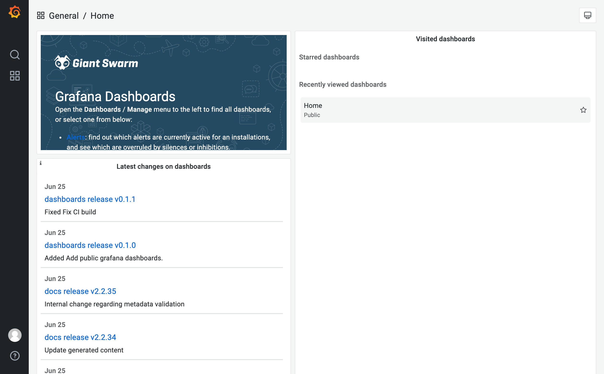

Giant Swarm provides an Observability Platform in each installation, based on [Grafana Mimir](https://grafana.com/oss/mimir/) for metrics, and [Grafana Loki](https://grafana.com/oss/loki/) for logs, collecting data from the system and apps managed by Giant Swarm, as well as any source of data you configure according to [the data ingestion tutorial]().

These metrics and logs are available to be explored in your [Grafana](https://grafana.com/) instance on the installation.

We aim to provide a useful set of dashboards for you to quickly explore all observability data relevant to you, giving you access to the same information that we use for operations, support, and billing.

## Accessing dashboards

The address for your installation's `grafana` instance is composed of the base domain plus the `grafana` subdomain.

If you don't know the base domain for your installation, you can ask your Giant Swarm support contact for the address.

## Authentication and authorization

Access to `grafana` is controlled via `single sign-on` (SSO), using the same identity provider you use for the [platform API]().

In order to access Grafana as a customer, you must be a member of the admin group. Specifically, that's a group in your identity provider selected to specify which users have admin permissions in the Giant Swarm installation.

__Note__: If you don't have `single sign-on` (SSO) configured yet or have any questions regarding the admin group, please contact your Account engineer.

Once you open the Grafana address for your installation, you will be able to login via the Giant Swarm SSO. The screenshot below shows an example.

There is one identity provider configured for Giant Swarm staff and one for you as a customer admin. Depending on the type of identity provider used for you as a customer, the label for the button to click can look slightly different.

After selecting the right identity provider, you may run through an authentication workflow. However, if you are already authenticated within the current browser, this will be skipped and you should see the Home dashboard as a result.

When you log in, you will be logged into the Shared Org. which contains a curated set of provided dashboards that we manage and that is accessible to everyone. If you want to learn more about organizations and multi-tenancy, we can only advise you to read the related [documentation]).

## Limitations

Grafana access is currently not available in shared installations, where several customer's observability data would be available from the same Grafana instance.
