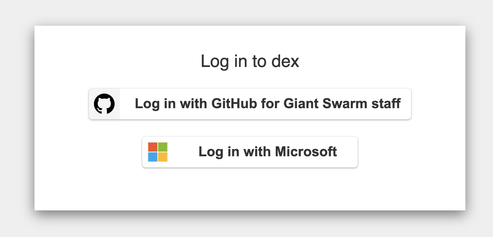

Giant Swarm provides an Observability Platform in each installation, based on [Grafana Mimir](https://grafana.com/oss/mimir/) for metrics, and [Grafana Loki](https://grafana.com/oss/loki/) for logs, collecting data from the system and apps managed by Giant Swarm, as well as any source of data you configure according to [the data ingestion tutorial]().

These metrics and logs are available to be explored in your [Grafana](https://grafana.com/) instance on the installation.

We aim to provide a useful set of dashboards for you to quickly explore all observability data relevant to you, giving you access to the same information that we use for operations, support, and billing.

## Accessing dashboards

If you have access to the Giant Swarm [web interface](), the easiest way to get to Grafana is to click the **Monitoring** link in the top menu when logged in.

In case you don't have access to the Giant Swarm web interface, you can ask your Giant Swarm support contact for the address. In general the address follows the same pattern of any managed service, having the **grafana** subdomain on your installations base URI.

In case you want to construct the address to the Grafana web application in your installation yourself, it follows the same pattern as the one for our web interface and many other services.

For example, if your web interface address is

    https://happa.g8s.example.westeurope.azure.gigantic.io/

then simply replace `happa` with `grafana` to get to your Grafana address:

    https://grafana.g8s.example.westeurope.azure.gigantic.io/

## Authentication and authorization

Access to Grafana is controlled via **single sign-on** (SSO), using the same identity provider you use for the [Management API]().

In order to access Grafana as a customer, you must be a member of the admin group. Specifically, that's a group in your identity provider selected to specify which users have admin permissions in the Giant Swarm installation.

**Note**: If you don't have SSO configured yet or have any questions regarding the admin group, please contact your Account Engineer.

Once you open the Grafana address for your installation, you will be greeted by a page titled "Log in to Dex", where you are prompted to select the identity provider to authenticate with. The screenshot below shows an example.

There is one identity provider configured for Giant Swarm staff and one for you as a customer admin. Depending on the type of identity provider used for you as a customer, the label for the button to click can look slightly different.

After selecting the right identity provider, you may run through an authentication workflow. However, if you are already authenticated within the current browser, this will be skipped and you should see the Home dashboard as a result.

## Repository

Dashboard are defined in the [giantswarm/dashboards](https://github.com/giantswarm/dashboards) repository. As an example, [this link](https://github.com/giantswarm/dashboards/blob/2be49ef09bccdb65c4fd62c835567bc0794617da/helm/dashboards/dashboards/shared/home.json) takes you to the _Home_ dashboard definition.

You can easily track changes in that repository directly from the Home dashboard in Grafana or via the [changes and releases](/changes/dashboards/) section.

## Limitations

Grafana access is currently not available in shared installations, where several customer's observability data would be available from the same Grafana instance.
