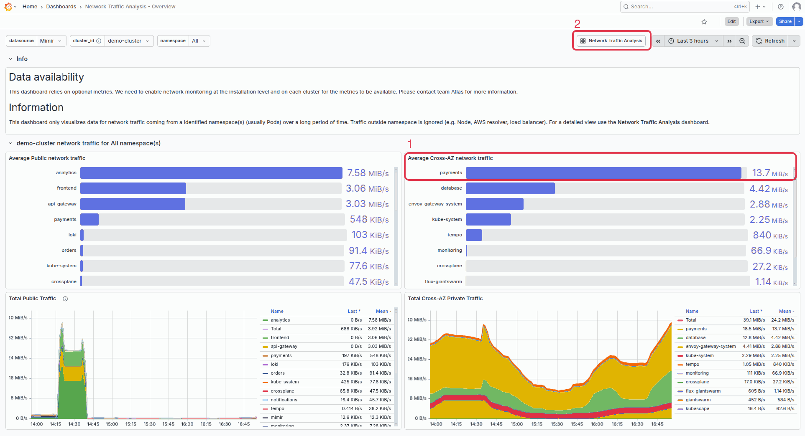
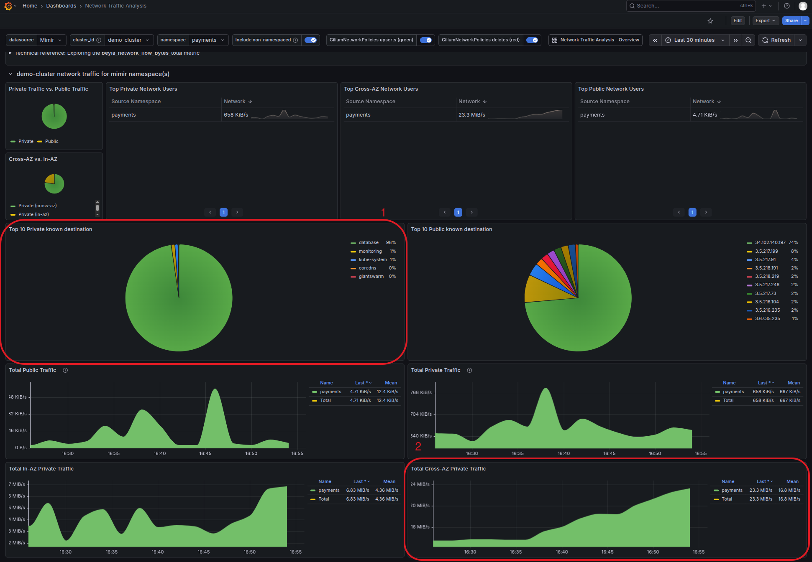
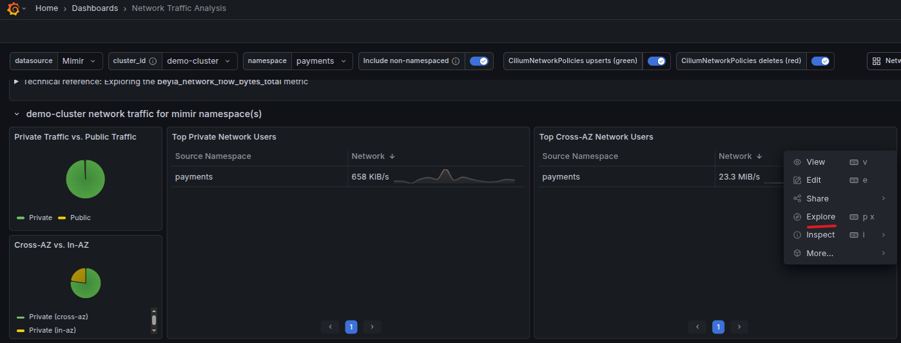
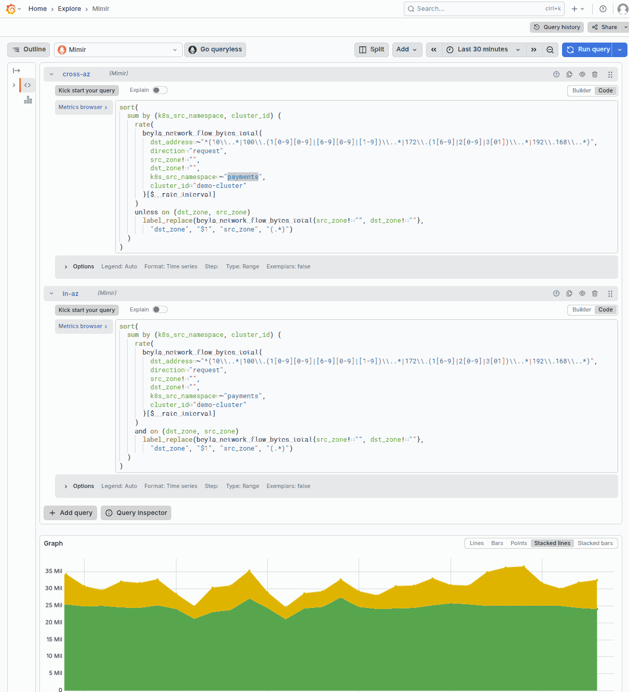

Network traffic, particularly cross-availability zone (cross-AZ) and egress traffic, is often a hidden but significant cost driver in cloud environments. Cloud providers typically charge for data transfer between availability zones. For example, AWS charges approximately $0.01/GB for cross-AZ traffic, and these costs can add up quickly in distributed systems.

This tutorial shows you how to enable network traffic monitoring on your clusters, interpret the provided dashboards, and identify opportunities to reduce your infrastructure costs.

## Prerequisites

Before starting this tutorial, ensure you have:

- A workload cluster running on the Giant Swarm platform
- The `observability-bundle` version 2.3.0 or later installed
- Access to Grafana dashboards in the platform

**Important**: Network monitoring produces a significant amount of monitoring data, which may increase resource consumption on the management cluster. Consider this when enabling the feature on many clusters simultaneously.

## Enable network monitoring

Network monitoring is not enabled by default and requires explicit opt-in. To enable it, add the label `giantswarm.io/network-monitoring=true` to your workload cluster's `Cluster` resource.

For example using kubectl:

```sh
kubectl label cluster <cluster-name> giantswarm.io/network-monitoring=true
```

After applying the label, the platform automatically deploys the network monitoring components. The collector runs within the existing `alloy-logs` DaemonSet in the `kube-system` namespace, with one collector instance per node.

### Verify Monitoring Is Active

You can verify that network monitoring is active by checking if the `beyla_network_flow_bytes_total` metric is being collected. In Grafana, navigate to **Explore** and run the following query:

```promql
beyla_network_flow_bytes_total{cluster_id="<your-cluster-id>"}
```

If data is returned, network monitoring is working correctly. Allow a few minutes after enabling for data to start appearing.

## Understanding the Dashboards

Two Grafana dashboards are available for analyzing network traffic. You can find them by searching for the tag `topic:networking-traffic-analysis` in Grafana.

### Network Traffic Analysis - Overview

This dashboard provides a high-level view of network traffic patterns over the **last 7 days**, aggregated at the namespace level. Use this dashboard for:

- **Trend analysis**: Spot changes in traffic patterns over time
- **Identifying top consumers**: See which namespaces generate the most cross-AZ or public traffic
- **Capacity planning**: Understand your network usage trends

Key panels:

| Panel | Description |
|-------|-------------|
| Average Public Network Traffic | Shows public-facing traffic by namespace |
| Average Cross-AZ Network Traffic | Shows traffic crossing availability zone boundaries by namespace |
| Total Public Traffic | Time series of aggregate public traffic |
| Total Cross-AZ Private Traffic | Time series of cross-AZ internal traffic |

### Network Traffic Analysis

This dashboard provides detailed, real-time visibility into network traffic over a **30-minute window**. Use this dashboard for:

- **Investigation**: Drill down into specific traffic patterns
- **Identifying top consumers**: See which namespaces generate the most traffic
- **Traffic classification**: Understand the split between private, public, and cross-AZ traffic

Key panels:

| Panel | Description |
|-------|-------------|
| Traffic Classification | Pie charts showing private vs public traffic distribution |
| Top Network Users | Tables ranking namespaces by private, public, and cross-AZ bandwidth |
| Top Destinations | Most common traffic destinations |
| Time Series | Graphs for public, private, in-AZ, and cross-AZ traffic over time |


### Example Scenario: High Cross-AZ Traffic Between Services

In this scenario, your cloud bill shows high network costs. You suspect cross-AZ traffic but need to identify which services are responsible and how to fix it.

**The problem**: A `payments` service frequently queries a `database` service. Because pods are distributed across availability zones for high availability, many of these requests cross zone boundaries. At $0.01/GB, a service transferring 50 GB/day across zones costs approximately $15/month - and this adds up quickly across multiple services.

#### Step 1: Identify high cross-AZ namespaces

1. Open the **Network Traffic Analysis - Overview** dashboard in Grafana
2. Look at the **Average Cross-AZ Network Traffic** panel
3. Identify namespaces with consistently high cross-AZ traffic
4. Note the traffic volume for the `payments` namespace shows 13.7 MiB/s of cross-AZ traffic, that's approximately $330 / month in unnecessary costs



#### Step 2: Investigate Traffic Source

1. Open the **Network Traffic Analysis** dashboard (the detailed view)
2. Use the namespace filter to select the `payments` namespace we identified
3. Check the **Top 10 Private known destinations** panel to see which services are receiving traffic from this namespace
4. Review the time series panels to understand if the traffic is constant or occurs in bursts



For advanced investigation, you can explore specific panel queries, for example to see cross-AZ traffic:





#### Step 3: Apply Optimizations

Based on your investigation, choose one or more of the following strategies to reduce cross-AZ traffic:

- [Kubernetes topology-aware routing](https://kubernetes.io/docs/concepts/services-networking/topology-aware-routing/) to configure the destination service to prefer same-zone endpoints
- [Topology spread constraints](https://kubernetes.io/docs/concepts/scheduling-eviction/topology-spread-constraints/) to ensure your workload is which maximizes the chance of same-zone communication when combined with topology-aware routing
- [Pod affinity for co-location](https://kubernetes.io/docs/concepts/scheduling-eviction/assign-pod-node/#inter-pod-affinity-and-anti-affinity): for services that communicate frequently, use pod affinity to prefer scheduling them in the same zone.

#### Step 4: Verify the optimization

After applying changes, allow some time for traffic patterns to stabilize, then verify the improvement:

1. Return to the **Network Traffic Analysis - Overview** dashboard
2. Compare the cross-AZ traffic for your namespace before and after the change
3. You should see a reduction in the **Average Cross-AZ Network Traffic** panel

**Important**: Some cross-AZ traffic is expected and healthy - it ensures your application remains available if a zone fails. The goal is to reduce unnecessary cross-AZ traffic, not remove it entirely.

## Understanding the Metrics

Network monitoring collects data using the `beyla_network_flow_bytes_total` metric. Key labels include:

| Label | Description |
|-------|-------------|
| `k8s_src_namespace` / `k8s_dst_namespace` | Source and destination Kubernetes namespaces |
| `src_name` / `dst_name` | Source and destination pod names |
| `src_zone` / `dst_zone` | Availability zones (critical for cross-AZ analysis) |
| `direction` | Traffic direction (ingress/egress) |
| `transport` | Transport protocol (TCP/UDP) |

Traffic is classified as "cross-AZ" when `src_zone` and `dst_zone` have different values.
