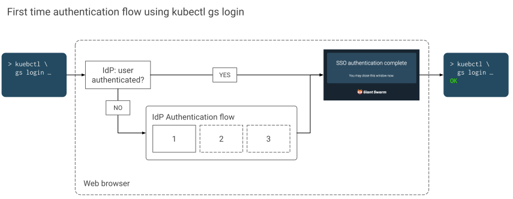

# Authentication for the Management API

Here we explain how you'll authenticate against the management API as a user. For admins, we provide some information regarding the requirements for the initial [single sign-on setup](#sso-requirements) and as some [technical details](#technical-details) you might want to be interested in.

## Authenticating as a user {#user-auth}

As a user of the management API for any given installation, you need

- A **user account** in the customer's identity provider (single sign-on).
- The management API **endpoint URL** of the installation. Alternatively, the web user interface URL.

### Using kubectl gs login

Assuming that you want to work with the API using `kubectl`, the easiest method to authenticate is using the [Giant Swarm plug-in]() named `gs`. It can be [installed]() easily using `krew` and is recommended for all users of the management API.

To set up your `kubectl` configuration file, execute the following command:

```nohighlight
kubectl gs login <URL>
```

As a URL, use the management API endpoint URL (normally starting with `https://g8s.`) or the web user interface URL (normally starting with `https://happa.g8s.`) of the installation.

More information can be found in the [`kubectl gs login`]() manual page.

[](sso-auth-flow-with-kubectl-gs-login.svg)

In order to complete the authentication flow, `kubectl gs` will open your default web browser. If in that browser you are authenticated with your identity provider (determined e. g. via a cookie), you will see a confirmation page and can close the browser window again. However, if you weren't authenticated with your identity provider yet, you'll have to go through the authentication process you are used to. When this is done, a confirmation page will be shown.

As a result of running the command, your `kubectl` configuration has a new context, user, and cluster entry. The context is named according to the pattern

```nohighlight
gs-<installation-name>
```

This context is selected automatically as the current context, so you should be ready to use kubectl with the management API.

When switching back to this context, it should not be necessary to go through the web-based authentication flow again. `kubectl` will automatically refresh the authentication token when needed, without your interaction.

### Alternative method

You can alternatively initiate the single sign-on authentication directly in a browser, without a need to install the `kubectl` plug-in.

We provide a login helper utility. If you have your installation's management API endpoint URL, you can construct the utility's URL by prepending `login.` to the host name.

If, for example, your management API URL is

```nohighlight
https://g8s.base.domain.tld
```

then the login utility can be accessed via

```nohighlight
https://login.g8s.base.domain.tld
```

The tool will immediately redirect you to your identity provider's authentication flow where you proceed providing your credentials as usual. After that, or if you are already authenticated in the current browser, you will be redirected to a resulting page.

The screenshot shows an example of that result page.


Here you can inspect the details that will be passed to the management API as part if the ID token. You can use this to verify the details coming from your identity provider, especially the `email` (which is used as your user identifier) and `groups` claim.

The rest of the page helps you set up `kubectl` manually.

## Authenticating for programmatic access {#service-auth}

For programmatic access, for example from CI/CD pipelines, you should not rely on the above authentication mechanism. Instead, please use [service accounts](https://kubernetes.io/docs/reference/access-authn-authz/service-accounts-admin/).

Each Giant Swarm installation provides a service account named `automation` in the `default` namespace. The according token can be found by inspecting this `ServiceAccount` resource. It is usually named starting with `automation-token-`.

**Note:** Since the above token is extremely powerful, **we strongly recommend to create a specific service account for each integration**, binding it to specific roles and only to the required namespaces.

## Single sign-on requirements {#sso-requirements}

Giant Swarm assists all customers with setting up single sign-on (SSO) for the management API. During that process, we make sure that these requirements are met:

- As a customer, you need to decide for an **identity provider** to use. Most enterprise-grade organizations have their solution in place. Since we use [Dex](https://github.com/dexidp/dex) as a connector between the management API and your identity provider, we can support a variety of common standards like OpenID Connect (OIDC) and LDAP.

    For cases where no suited identity provider is available, or not yet available, we recommend to use Github, where an organization and teams can be set up and managed easily.

- Your identity provider must define a **group to be considered as admins** for the Giant Swarm installation. All members of this group automatically get administrative permissions when authenticating with the management API.

- TODO: email claim.

- All additional (non-admin) users you'll want to grant access to the management API in the future will also need to have a user account in your selected identity provider.

## Technical details {#technical-details}

Here we provide some additional details you might want to be aware of, either as a user or as an admin.

### ID-token lifetime {#id-token-ttl}

By default, ID tokens for the management API are issued with a lifetime of **{} minutes**.

When assigning users to groups in your identity provider, and when removing users from groups, it can take up to that {} minutes until the change becomes effective for end users. If a user has authenticated and obtained an ID token before the change, tools like `kubectl` will use that token until it expires.

To force the adoption of up-to-date user information and group assignments, a user can manually remove the `id-token` value from the user entry in their `kubectl` configuration file.
