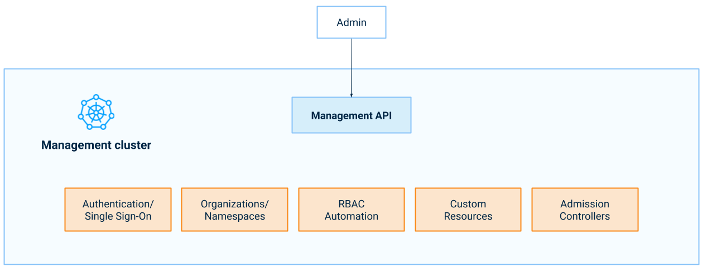

## What it is

In a Giant Swarm installation, the [management cluster]() is a dedicated Kubernetes cluster that runs all the operational and monitoring workloads which are needed to create and manage the workload clusters. These are the clusters you create to run your actual workloads.

Your workload clusters and other associated resources are represented in the management cluster as [custom resources](https://kubernetes.io/docs/concepts/extend-kubernetes/api-extension/custom-resources/) (CRs). To access these, you use the Kubernetes API of the management cluster, or in short, the Management API.

<!-- Original: https://docs.google.com/drawings/d/1pt6_ExX2FVyFCI7mj_KuFWaVjqAGgAlqKfAFYNjKKgk/edit -->

Apart from the CRs and custom resource definitions (CRDs) the Management API provides, its behavior is defined by admission controllers enforcing some policies and providing some defaulting.

The concept of [organizations]() and the way namespaces are used play an important role for access control in the Management API. Together with our RBAC automation, they allow simple isolation of resources between tenants (or environments, teams, projects, purposes).

## How to gain access

Access to the Giant Swarm Management API is secured using OIDC. Our [authentication]() section provides additional information both for admins and end users. Please contact your Account Engineer to sort out the details.

## How to use

Currently (as of February 2022) most Giant Swarm customers already interact with the Management API when accessing our [web user interface](). However, for customers that have not yet switched to single sign-on (SSO), the web interface uses the deprecated REST API.

Independent of the switch to SSO, all customers can use the Management API via `kubectl`. To facilitate this we provide a kubectl plug-in called [`kubectl gs`]().

Besides general Kubernetes know-how this will require only a bit of structural knowledge:

### How we organize resources in namespaces

We are working towards making [organization namespaces]() the default location for all resources associated with one organization. Please check [this dedicated section](#namespace-use) regarding the current progress towards this on various providers.

### Which custom resources are used for what purpose

Following are some resources that should help you:

- The guide [creating workload clusters via the Management API]() explains step by step how you can create a cluster and node pools via the Management API. Here you learn about all the custom resources a cluster comprises.
- The [app platform]() introduction outlines the several custom resources involved when managing app catalogs and apps.
- Our [custom resource definitions (CRD) documentation]() provides details on all the custom resources (CR) we use with the various providers and their versions and schema.

## Feedback is welcome

We are keen to learn from you about your experience with using the Management API, with navigating the custom resources via the API, with our reference documentation and the user guides we provide. This helps us provide more and better material and improve to make the journey more seamless, more satisfactory for you.

So please, don't hesitate to give your feedback in your Slack channel.
