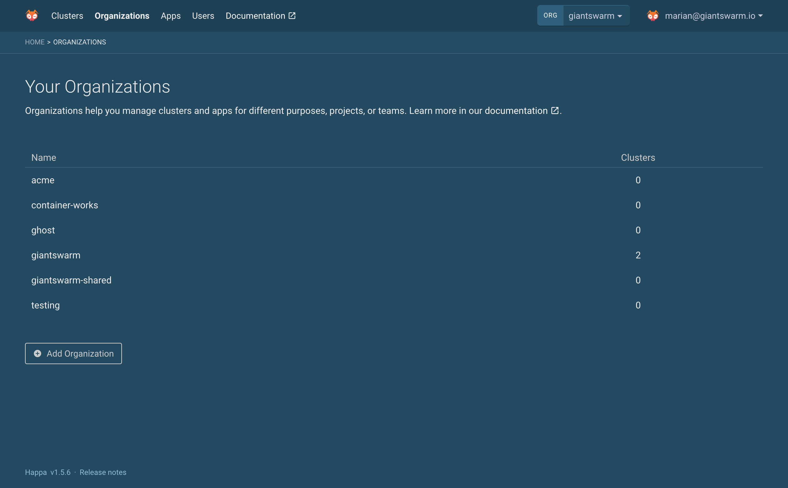

# Creating, inspecting and deleting organizations

{}

## The organizations overview

In the web user interface top navigation menu you can easily find the **Organizations** section. Click this item to navigate to an overview of the organizations you have access to.

If you are an admin user, this page shows all organizations existing in the management cluster of your installation. As a non-admin user, you see the organizations you have access to.

To learn more about an individual organization, and to find more management functions, click on one of the organizations in the list.

## Adding an organization

Below the organization overview, as a permitted user, you find the option to create a new organization.

All you have to do here is to enter the name of the new organization. There are a few requirements for the name:

- Must be unique within the management cluster.
- Must contain at most 59 characters.
- Has to conform the DNS label names convention as [documented by Kubernetes](https://kubernetes.io/docs/concepts/overview/working-with-objects/names/#dns-label-names) additionally, which means
    - contain only lowercase alphanumeric characters or '-'
    - start with an alphanumeric character
    - end with an alphanumeric character

<!-- TODO: Move the above details over to general / organizations once it exists, and link there -->

## Deleting an organization

From the organizations overview, click on an organization in order to open its detail page.

As a permitted user - either an admin or a non-admin user with _delete_ permission for the [Organization]() resource - you will find at the bottom of this page a section titled **Delete this organization**.

Apart from adequate permission, in order to be able to delete an organization there must not be any workload clusters owned by the organization.

**Warning:** Deleting an organization also causes deletion of resources in the according namespace, e. g. apps, role bindings, secrets, configmaps etc. in the organization's namespace.

Once the _Delete organization_ button appears and is clickable, a click on this button will prompt an additional confirmation. After that confirmation, the organization and the according namespace with everything in it will be deleted.

## Related

- [Grant access to an organization's resources]()
<!-- TODO: link to MAPI tutorial on adding, deleting organizations once they exist -->
