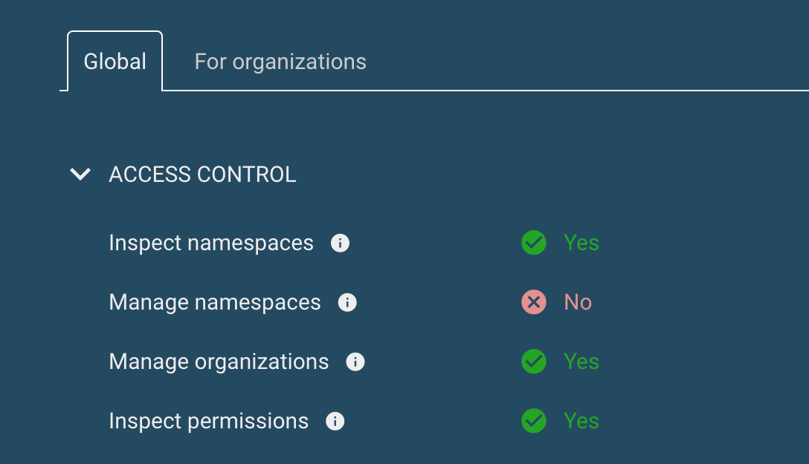

<abbr title="Role based access control">RBAC</abbr> enables administrators to fine-tune access to various resources in the Giant Swarm [Management API](), restricting access to a variety of use cases.

To allow you to manage access with confidence, our web interface offers ways to easily inspect a user's (or group's, or service account's) permissions. Instead of listing permissions on a Kubernetes resource level (which can be done via `kubectl auth can-i`), our UI takes a unique approach to evaluate permissions based on use cases.

## Querying a subject

As a user of the web interface, you can at least inspect your own permissions. In your installation's web interface, click the user menu on the top-right and click on **Permissions** to open the page titled **Inspect permissions**.

By default, the page will display your own permissions for the Management API.

If you have permission to inspect another subject's permissions (yes, it's inception!), the page will also give you the option to inspect permissions for another user, group, or service account, as shown in the image below.

If this element is not shown, you don't have permission to inspect other user's permissions. The page will behave as if the option **Myself** is selected. Please talk to an administrator in case you think you should have additional permissions.

What do these options mean, exactly?

- **Myself**: This selection lets you query permissions for the current authenticated user.

- **Group**: In this mode, you must specify the name of a group to query permissions for. The group name must match exactly the name you are using in your RBAC role bindings in the management cluster. As you should be using Dex and OIDC for authentication, your group names are defined in your identity provider, and they must be prefixed with the Dex connector ID. The exact spelling must be matched, including upper- and lowercase. In our case the prefix is always `customer:`. So if the group in your identity provider is called `giant-swarm-admins`, you must enter `customer:giant-swarm-admins`.

- **User**: Similar to the Group mode, this mode lets you specify a user identifier to query permissions for. Again, the identifier must match some subject definition in your RBAC role bindings in the management cluster. With Giant Swarm, user identifiers are typically configured to be email address. Just like group names, these are case sensitive. In contrast to the group names, there is no prefixing required.

  **Note**: You might be thinking of a person in your identity provider, which is member of a number of groups, and want to query the permissions as a result of the persons's various group memberships (and potentially individual permissions in addition to those). Be aware that this is not possible. When querying permissions e. g. for a user named `jane@acme.com`, there is no way to know which groups the user is a member of.

- **Service account**: This mode allows to specify a service account name. Here, the format `system:serviceaccount:NAMESPACE:NAME` must be used. As with the other subject types, the exact case sensitive spelling must be used.

## Permissions display

Permissions are shown in a tabbed view, with tabs labelled **Global** and **For organizations**.

- **Global permissions**: On this tab you will find use cases which require permissions outside the organization namespace. That usually means the cluster scope or the `default` namespace.

- **For organizations**: Use cases shown here require permissions to be specified in organization namespaces. They are evaluated for each organization individually.

## Use cases

Permissions are evaluated based on use cases, and use cases are grouped for better overview.

For each use case, the evaluation result can be either of

- **Yes**: all permissions required for this use case are granted
- **No**: not all permissions required for this use case are granted

For groups of use cases, there are three possible evaluation results:

- **Yes**: all use cases in the group show **Yes**
- **No**: all uses cases in the group show **No**
- **Partial**: the use cases in the group show mixed results

As an example, on the **Global** tab, in the group **Access control**, the use case named **Inspect permissions** represents the permissions to `list` and `get` (to name the RBAC verbs) resources of type `RoleBinding` and `ClusterRoleBinding`.

Since the web interface's source code is open, you can take a look at the definition of this example use case as at the time of writing this bit of content on [GitHub](https://github.com/giantswarm/happa/blob/1363a43fc2ca90cd11911470831d19b178809d77/scripts/permissions-use-cases.yaml#L49-L62).

In the future, we expect the list of use case definitions to evolve, based on our customers' requirements. We welcome your input and your feedback on this topic.

## Further reading

- [Authorization for the Management API]() explains how permissions are granted to Management API users and service accounts.
