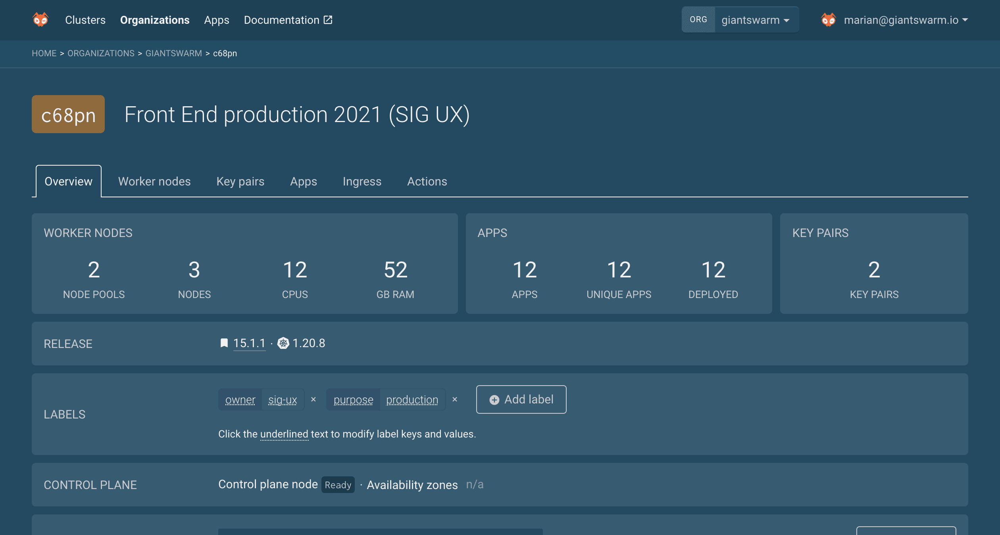
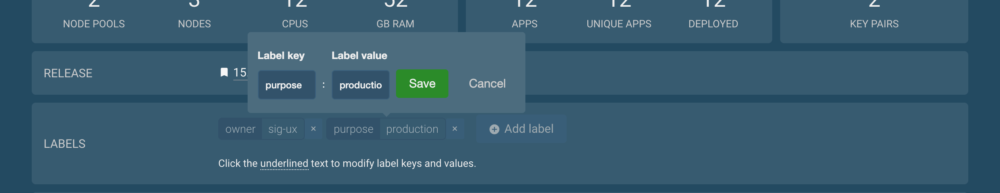
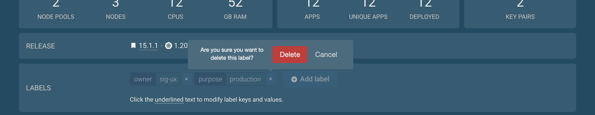

# Labelling workload clusters using the web interface

Labels are a mechanism to assign short pieces of additional information to your workload clusters.
For more information about this feature, check out the [labelling workload clusters]() user guide.

## Viewing workload cluster labels

The cluster details page shows the labels set on the cluster in the _Overview_ tab.

## Editing workload cluster labels

Each label is editable by clicking on its key or label part.
Doing so opens a tooltip where you can make changes and confirm them.

Your changes will be validated to match the [Kubernetes labels syntax and character set](https://kubernetes.io/docs/concepts/overview/working-with-objects/labels/#syntax-and-character-set).
It is not possible to save invalid changes.

## Deleting workload cluster labels

It it possible to remove a cluster label by clicking the `×` icon on a label.
A confirmation tooltip will allow you to confirm your action.

