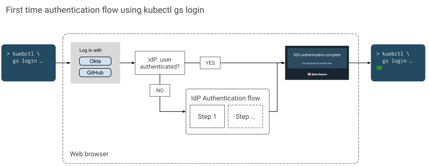

As a user of the Management API for any given installation, you need:

- A **user account** in the identity provider used by the installation (single sign-on).
- The Management API **endpoint URL** of the installation. Alternatively, the web user interface URL.

For command-line access to the cluster using `kubectl`, authentication via our `kubectl` plugin is required. Detailed instructions are provided below. If you prefer a graphical interface, we also outline the Web UI login method.

## Using `kubectl gs login` {#kubectl-gs-login}

Assuming that you want to work with the API using `kubectl`, we recommend you install the [Giant Swarm plug-in]() named `gs`. It can be [installed]() and updated using `krew`.

To set up your `kubectl` configuration with a context for your Giant Swarm installation's Management API, execute the following command:

```nohighlight
kubectl gs login URL
```

As a `URL`, use either

- the Management API endpoint URL (normally starting with `https://g8s.`) or
- the web user interface URL (normally starting with `https://happa.g8s.`) of the installation.

More information can be found in the [`kubectl gs login`]() manual page.

[](sso-auth-flow-with-kubectl-gs-login.svg)

In order to complete the authentication flow, `kubectl gs` will open your default web browser. The page in the browser will prompt you to select an identity provider you want to use for the authentication. If you are authenticated with the identity provider you select (determined e.g. via a cookie), you will see a confirmation page and can close the browser window again. However, if you weren't authenticated with your identity provider yet, you'll have to go through the authentication process you are used to. When this is done, a confirmation page will be shown.

You can also execute the `login` command with the `--connector-id` flag, and specify an identifier of the desired connector (related to your preferred identity provider) for the authentication:

```nohighlight
kubectl gs login URL --connector-id CONNECTOR_ID

As a result of running the command, your `kubectl` configuration has a new context, user, and cluster entry. The context is named according to the pattern

```nohighlight
gs-INSTALLATION_NAME
```

`INSTALLATION_NAME` is the unique name of your Giant Swarm installation.

This context is selected automatically as the current context, so you are ready to use kubectl with the Management API.

When switching back to this context, it should not be necessary to go through the web-based authentication flow again. `kubectl` will automatically refresh the authentication token when needed, without your interaction.

## Web UI login {#web-ui}

Our Web UI provides a simple single sign-on mechanism that will send each user through your chosen identity provider's authentication process and finally redirect to the web UI. Behind the scenes, the same mechanism is used as in the examples above.

## Further reading

- [Authentication for programmatic access]() explains how to authenticate in an automation context
- [Technical details]() on authentication and single sign-on (SSO) for the Management API
- [Authorization in the Management API]() explains how to assign permissions to authenticated users
