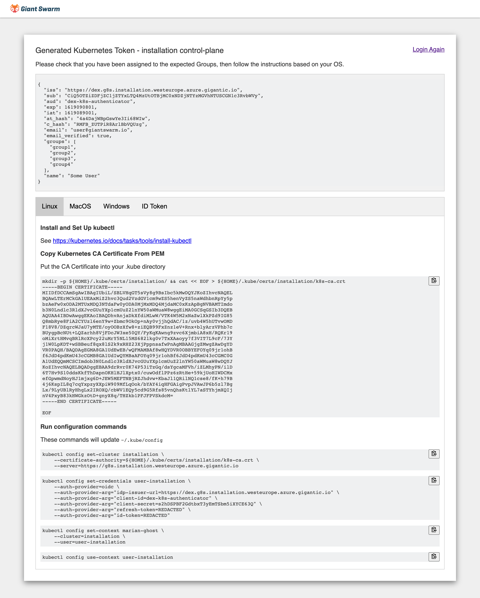

As a user of the Management API for any given installation, you need:

- A **user account** in the identity provider used by the installation (single sign-on).
- The Management API **endpoint URL** of the installation. Alternatively, the web user interface URL.

The recommended method for authentication, as it's the fastest and most convenient one, uses our `kubectl` plug-in and is explained next. Further down we also provide instructions for an [alternative method](#alternative-method) that does not require installing the plugin.

## Using `kubectl gs login` {#kubectl-gs-login}

Assuming that you want to work with the API using `kubectl`, we recommend you install the [Giant Swarm plug-in]() named `gs`. It can be [installed]() and updated using `krew`.

To set up your `kubectl` configuration with a context for your Giant Swarm installation's Management API, execute the following command:

```nohighlight
kubectl gs login URL
```

As a `URL`, use either

- the Management API endpoint URL (normally starting with `https://g8s.`) or
- the web user interface URL (normally starting with `https://happa.g8s.`) of the installation.

More information can be found in the [`kubectl gs login`]() manual page.

[](sso-auth-flow-with-kubectl-gs-login.svg)

In order to complete the authentication flow, `kubectl gs` will open your default web browser. If in that browser you are authenticated with your identity provider (determined e.g. via a cookie), you will see a confirmation page and can close the browser window again. However, if you weren't authenticated with your identity provider yet, you'll have to go through the authentication process you are used to. When this is done, a confirmation page will be shown.

As a result of running the command, your `kubectl` configuration has a new context, user, and cluster entry. The context is named according to the pattern

```nohighlight
gs-INSTALLATION_NAME
```

`INSTALLATION_NAME` is the unique name of your Giant Swarm installation.

This context is selected automatically as the current context, so you are ready to use kubectl with the Management API.

When switching back to this context, it should not be necessary to go through the web-based authentication flow again. `kubectl` will automatically refresh the authentication token when needed, without your interaction.

## Alternative method

You can alternatively initiate the single sign-on authentication directly in a browser, without the need of installing the `kubectl gs` plug-in.

We provide a web-based login helper utility named [Dex K8s Authenticator](https://github.com/mintel/dex-k8s-authenticator), available under a URL specific for each installation. If you know your installation's Management API endpoint URL, you can construct the utility's URL by prepending `login.` to it.

If, for example, your Management API URL is

```nohighlight
https://g8s.example.domain.tld
```

then the login utility can be accessed via

```nohighlight
https://login.g8s.example.domain.tld
```

The tool will immediately redirect you to your identity provider's authentication flow where you proceed providing your credentials as usual. After that, or if you are already authenticated in the current browser, you will be redirected to a resulting page.

The screenshot shows an example of that result page.



Here you can inspect the details that will be passed to the Management API as part of the ID token. You can use this to verify the details coming from your identity provider, especially the `email` (which is used as your user identifier) and `groups` claim.

This page will also present your Management API endpoint's certificate authority (CA) certificate. In order to connect to your Management API endpoint, you should add this CA certificate to your client's trusted (root) certificates.

The rest of the page helps you set up `kubectl` manually, adaptable for various operating systems.

## Web UI login {#web-ui}

Our Web UI provides a simple single sign-on mechanism that will send each user through your chosen identity provider's authentication process and finally redirect to the web UI. Behind the scenes, the same mechanism is used as in the examples above.

## Further reading

- [Authentication for programmatic access]() explains how to authenticate in an automation context
- [Technical details]() on authentication and single sign-on (SSO) for the Management API
- [Authorization in the Management API]() explains how to assign permissions to authenticated users
