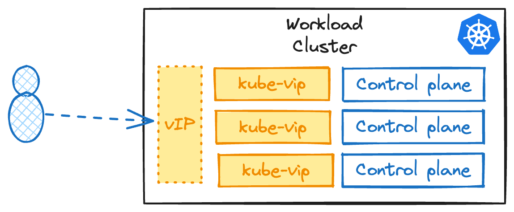
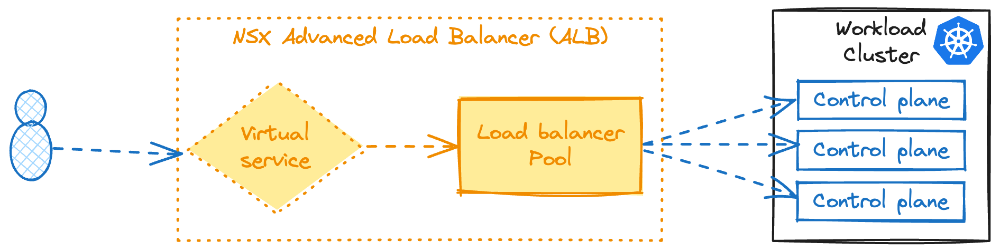

In order to run the Giant Swarm platform in your VMware vSphere environment, a number of prerequisites must be satisfied to support Cluster API Provider vSphere (CAPV).

## vSphere infrastructure and minimum version

It is recommended to create a resource pool to deploy your Kubernetes cluster(s) nodes. However, it is possible to deploy them in the implicit root resource pool located at the vSphere cluster level.

To use PersistentVolumes (PV), the cluster needs support for Cloud Native Storage (CNS), which is available in vSphere 6.7 Update 3 and later.

## vSphere User permissions

In order to follow the principle of least privilege, it is recommended to create a user role with the minimum permissions required and assign it to a user that is dedicated to CAPV.

You can create a user role in `Administration > Access Control > Roles > NEW`. This user role must have at least the following permissions:

| Categorie | permissions |
| -------- | -------- |
| Datastore | `Allocate space` `Browse datastore` `Low level file operations` |
| global | `Disable methods` `Enable methods` `Licenses` |
| Network | `Assign network` |
| Resource | `Assign virtual machine to resource pool` |
| Sessions | `Message` `Validate session` |
| Profile-driven storage | `Profile-driven storage view` |
| vApp | `Import` |
| Virtual machine | `Configuration/Change Configuration` `Configuration/Add existing disk` `Configuration/Add new disk` `Configuration/Add or remove device` `Configuration/Advanced configuration` `Configuration/Change CPU count` `Configuration/Change Memory` `Configuration/Change Settings` `Configuration/Configure Raw device` `Configuration/Extend virtual disk` `Configuration/Modify device settings` `Configuration/Remove disk` `Configuration/Create from existing` `Configuration/Remove` `Interaction/Power off` `Interaction/Power on` `Provisioning/Deploy template` |

The role must be assigned to the following objects:

* vCenter Server
* Datacenters or datacenter folders
* Hosts and clusters
* VM templates
* Resource pools (With Propagate to children)
* Distributed Port Group
* Distributed Switch
* VM and Template folders (With Propagate to children).

### Considerations for single cluster failure domains

If you want to leverage failure domains at the host level where a group of hosts is a failure domain (stretched cluster, racks, PDU distribution...), CAPV will need to work with Anti-Affinity rules.

As a result the user requires the following permissions: `Host > Edit > Modify cluster`

## Networking

A network needs to be specified in the cluster definition to identify where the default gateway will be and where to connect the virtual machines (VMs). The DHCP service must be enabled on this network to assign IP addresses to the nodes.

Because vSphere has no concept of load balancer, the implementation of CAPV includes `kube-vip`, a layer-2 load balancer to address all environments, including those where NSX Advanced Load Balancer isn't available.



Since vSphere has no concept of load balancers out of the box, CAPV ships with [kube-vip](), a layer-2 load balancer that works with ARP requests. By default, `kube-vip` only handles the Kubernetes API access but at Giant Swarm, we also deploy the `kube-vip` cloud provider to offer the capability to create services of type load balancer.

ARP is a layer 2 protocol that is used to inform the network of the location of a new address. `kube-vip` runs in-cluster as opposed to a more traditional external load-balancer that will forward IP packets to its backend servers.

As a result, the network in which the cluster is deployed must have a range of the subnet outside of the DHCP scope and dedicated to `kube-vip`. We recommend one management cluster per subnet to avoid mistakes leading to IP conflicts. Example below:

By default, when deploying a CAPV cluster, it will automatically pick up an IP from the ipam pool. However, you must explicitely set a CIDR located in the nodes' subnet to have available IPs for services of type load balancer in the workload cluster.

Learn more about how to configure `kube-vip` for CAPV in the [advanced documentation]().



In the case of using NSX Advanced Load Balancer (NSX ALB), the virtual IP addresses management is handled by the NSX ALB Service Engine.

Reconciliation of the NSX ALB resources can be done using Avi Kubernetes Operator (AKO) in the clusters to handle Kubernetes API access and services of type load balancer.




The network (nodes) must have access to the vCenter endpoint on port 443 for the controllers to manage the lifecycle of the cluster (CAPV, cloud provider interface, container storage interface).

## VM templates (node images)

Giant Swarm must have the permissions to upload VM templates to deploy Kubernetes nodes from. They will be named following the convention `ubuntu-2004-kube-v1.24.11`.
