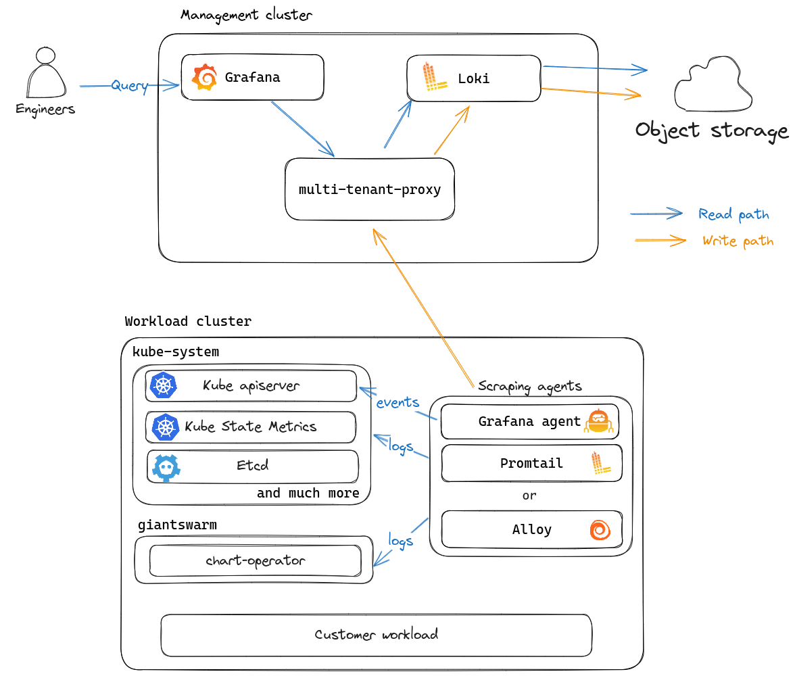

Logging is an important pillar of observability and it is thus only natural that Giant Swarm provides and manages a logging solution for operational purposes.

This document gives an overview of how logging is managed by Giant Swarm, including which logs are stored, which tools we use to ship and store them, as well as why we chose those tools in the first place.

## Overview of the logging platform

Here is an architecture diagram of our current logging platform:

<!-- Source: https://drive.google.com/file/d/1Gzl0mTdJcaui_zIC9QuHcgMX3QJygALo -->

In this diagram, you can see that we run the following tools in each management cluster as part of our logging platform:

- `Grafana Loki` that is accessible through our managed Grafana instance.
- `multi-tenant-proxy`, a proxy component used to handle multi-tenancy for Loki.
- A couple of logging agents (`Grafana Promtail` and `Grafana Agent`) that run on the management cluster and your workload clusters alike. We currently need two different tools for different purposes.
    - Promtail is used to retrieve the container and kubernetes audit logs
    - Grafana Agent is used to retrieve the kubernetes events.

If you want to play with Loki, you should definitely check out our guides explaining [how to access Grafana]() and how to [explore logs with LogQL]()

## Logs stored by Giant Swarm

Kubernetes clusters produce a vast amount of machine and container logs.

The logging agents that we have deployed on management and workload clusters currently send the following logs to Loki:

- `Kubernetes container logs` in the `kube-system` and `giantswarm` namespaces.
- `Kubernetes events` happenning in the `kube-system` and `giantswarm` namespaces.
- [`Kubernetes audit logs`]()

In the future, we will also store the following logs:

- [`Machine audit logs`]()
- `Teleport audit logs` currently being worked on here: https://github.com/giantswarm/roadmap/issues/3250
- Giant Swarm `customer workload logs` as part of our observability platform being worked on https://github.com/giantswarm/roadmap/issues/2771

## Why we prefer Loki over its competitors

The reasons that lead us to using Grafana Loki in favor of its competitors (which boils down to only opendistro in our case) are numerous.

First, we are **strong believers in Open Source** so the full Elastic stack is obviously out of the question.

Second, we are quite used to the Grafana ecosystem and the different tools are made to work with one another whereas the existing logging solutions are either supposed to work on their own (like OpenDistro) or need to use the full-fledged solution (i.e. being able to **collect and correlate all observability data**) which is rarely open-source (coming back to the first point above).

Third, we are full-fledged users of Prometheus and PromQL and **LogQL, the Loki Query Language is a natural extension to PromQL**, which makes it easy for our platform engineers to use and love.

The fourth reason is **cost and resource consumption** as Loki is cheaper to run than its competitors because it does not rely that much on persistent storage and uses Object storage instead which is always cheaper in the cloud. The storage of the index is also cheaper for Loki as it uses label-based indexing which is definitely smaller than any kind of text-based indexing solution that full-text search engine can provide.

Finally, the last reason comes down to the history of Giant Swarm and it mostly boils down to **operation and maintenance**. Before we decided to run Loki, we used to run elasticsearch as our logging solution. Elasticsearch in itself is really hard to operate, especially at scale, even more so on Kubernetes because it is by its nature a stateful application (and for good reasons). This was an especially important factor in our decision since we do not need the full capabilities of OpenDistro like full-text search.
