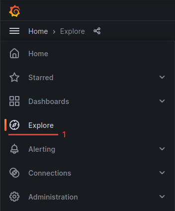
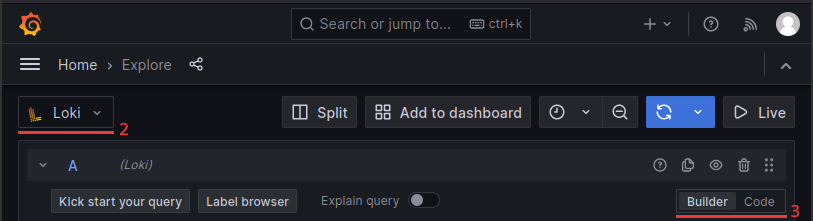
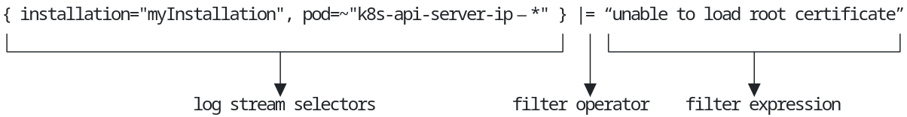

Logs, which are records of events and activities generated by systems and applications, serve as a rich source of information for administrators, developers, and security professionals. The ability to search through logs is essential to help with troubleshooting and debugging by looking through a detailed history of events, errors and warnings. It is also a valuable source of information in the context of performance monitoring, security and compliance.

This guide provides you with the basics to get started with exploring Logs using the powerful capabilities brought by Grafana and Loki.

## How do I access the logs ?

Once you have [access to your management cluster's grafana](), you should:

1. Go to `Explore` item in the `Home` menu


2. Select `Loki` datasource on the top left corner


3. Choose how you prefer to build your queries:
   * `builder` and play with the dropdowns to build your query
   * `code` to write your query using [LogQL](https://grafana.com/docs/loki/latest/logql/)

__Note__: The live mode feature of Grafana Loki is not available at the moment because we use multi-tenancy (c.f. https://github.com/grafana/loki/issues/9493) 😢

## LogQL basics

[LogQL](https://grafana.com/docs/loki/latest/query/) is a powerful querying language for the Loki logging system. It allows users to filter and aggregate log data to facilitate data analysis and troubleshooting. Here you have the basics to help you get started.

### Query anatomy



### Log stream selectors

Log stream selectors are used to filter the log stream by labels. Labels are key-value pairs that can be attached to each log stream. These selectors are used to find specific log streams where the labels match certain conditions.

```nohighlight
=  : This operator checks for label values that are exactly equal to the specified value. It returns all log streams where the label value equals the specified value.

!= : This operator checks for label values that are not equal to the specified value. It returns all log streams where the label value does not equal the specified value.

=~ : This operator is used for regex (regular expression) matching on label values. It returns all log streams where the label value matches the specified regular expression pattern.

!~ : This operator is used when the regular expression does not match the label value. It returns all log streams where the label value does not match the specified regular expression pattern.
```

### Filter operators

Filter operators are used to refine the selection of text within the log stream. They help you narrow down the results by matching specific patterns or excluding certain data.

```nohighlight
|= : This operator is used when the log stream contains a specific string. It returns all log lines that contain the specified string.
!= : This operator is used when the log stream does not contain a specific string. It filters out and excludes all log lines that contain the specified string.
|~ : This operator is used for regex (regular expression) matching. It returns all log lines where the specified regular expression pattern matches.
!~ : This operator is used when the regular expression does not match the log stream. It filters out and excludes all log lines where the specified regular expression pattern matches.
```

## Example of useful LogQL queries

Here are a few LogQL queries you can test and play with to understand the syntax.

### Basic pod logs

* Look for all `k8s-api-server` logs on `myInstallation` MC:

```promql
{installation="myInstallation", cluster_id="myInstallation", pod=~"k8s-api-server-ip-.*"}
```

* Let's filter out "unable to load root certificate" logs:

```promql
{installation="myInstallation", cluster_id="myInstallation", pod=~"k8s-api-server-ip-.*"} != "unable to load root certificate"
```

* Let's only keep lines containing "url:/apis/application.giantswarm.io/.*/appcatalogentries" (regex):

```promql
{installation="myInstallation", cluster_id="myInstallation", pod=~"k8s-api-server-ip-.*"} |~ "url:/apis/application.giantswarm.io/.*/appcatalogentries"
```

### JSON manipulations

* With json logs, filter on the json field `resource` contents:

```promql
{installation="myInstallation", cluster_id="myInstallation", pod=~"prometheus-meta-operator-.*"} | json | resource=~"remotewrite.*"
```

* from the above query, only keep field `message`:

```promql
{installation="myInstallation", cluster_id="myInstallation", pod=~"prometheus-meta-operator-.*"} | json | resource=~"remotewrite.*" | line_format "{{.message}}"
```

### Audit logs

* Get audit logs using the `json` filter to get only the ones owned by a specific user

```promql
{cluster_id="myCluster",scrape_job="audit-logs"} |= `` | json | user_username=`fernando@giantswarm.io`
```

__Note__: When using the `json` filter to access nested properties you use `_` for getting a child property as the example above (user.username -> user_username).

### System logs

* Look at `containerd` logs for node `10.0.5.119` on `myInstallation` MC:

```promql
{installation="myInstallation", cluster_id="myInstallation", systemd_unit="containerd.service", node_name="ip-10-0-5-119.eu-west-1.compute.internal"}
```

### Metrics queries

You can also generate metrics from logs.

* Count number of logs per node

```promql
sum(count_over_time({installation="myInstallation", cluster_id="myInstallation", node_name=~"ip-.*"}[10m])) by (node_name)
```

* Top 10 number of log lines per scrape_job, app, component and systemd_unit
/!\ This query is heavy in terms of performance, please be careful /!\

```promql
topk(10, sum(rate({cluster_id="myCluster"}[5m])) by (cluster_id, scrape_job, app, component, systemd_unit))
```

* Rate of logs per syslog identifier
/!\ This query is heavy in terms of performance, please be careful /!\

```promql
sum(rate({cluster_id="myCluster", scrape_job="system-logs"}[5m] |= `` | json)) by (SYSLOG_IDENTIFIER)
```
