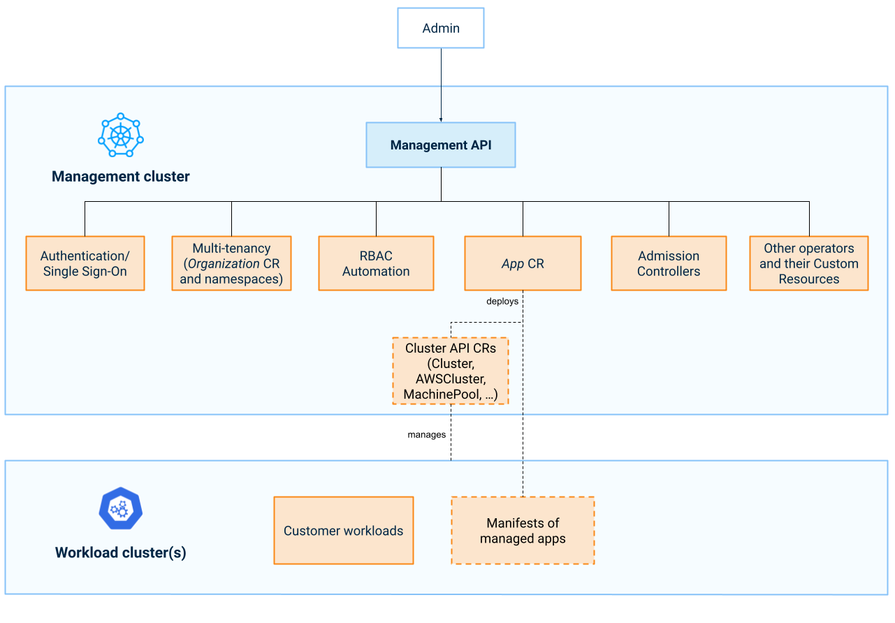

In a Giant Swarm installation, the management cluster is a dedicated Kubernetes cluster that runs all the operational and monitoring workloads which are needed to create and manage the platform. On top, you install managed apps and create workload clusters to run your actual workloads.

Your platform is represented in the management cluster as [custom resources](https://kubernetes.io/docs/concepts/extend-kubernetes/api-extension/custom-resources/) (CRs). To access these, you use the Kubernetes API of the management cluster, or in short, the _Management API_.

<!-- Original: https://docs.google.com/drawings/d/1pt6_ExX2FVyFCI7mj_KuFWaVjqAGgAlqKfAFYNjKKgk/edit -->

Apart from the CRs and custom resource definitions (CRDs) the Management API provides, its behavior is defined by admission controllers enforcing some policies and providing some defaulting.

The concept of [Multi-tenancy]() and the way namespaces are used play an important role for access control in the Management API. Together with our RBAC (Role-Based Access Control) automation, they allow simple isolation of resources between tenants (or environments, teams, projects, purposes).

## Access to the Management API

Access to the Giant Swarm Management API is secured using OIDC. Our [authentication]() section provides additional information both for admins and end users. Please contact your Account Engineer to sort out the details.

## Usage of the Management API

Customers already visually interact with the Management API through our [web user interface]().

The Management API can also be used via `kubectl`. Our kubectl plug-in called [`kubectl gs`]() facilitates operations such as logging into the cluster or templating custom resources.

### Organizing resources in namespaces

_Organizations_ help keeping resources for different entities (e.g. teams) separated. We default to using a separate namespace for each organization within the management cluster. The article about [multi-tenancy]() explains more details.

### Which custom resources are used for what purpose

For the Vintage generation, please follow the guide [creating workload clusters via the Management API]() explains step by step how you can create a cluster and node pools via the Management API. Here you learn about all the custom resources a cluster comprises.

In the newer CAPI-based cluster management generation, it is even simpler:

- Managed apps are represented as [`App`]() custom resources. Our [app platform introduction]() covers working with Apps and App Catalogs.
- Even workload clusters are represented as [`App`]() custom resources. As depicted in the above diagram, creating an [`App`]() resource deploys the necessary resources based on your desired configuration (such as the cluster size). For example, the [cluster-aws](https://github.com/giantswarm/cluster-aws) app is used for creating a CAPI-based Kubernetes cluster in the AWS cloud, and deploys CAPI custom resources such as `Cluster`, `AWSCluster`, `AWSMachinePool`. The operators running on the management cluster turn those into an actual workload cluster. Our Getting Started guide on [Creating a workload cluster]() explains how to easily configure and create an [`App`]() resource that represents a workload cluster.
- Our [custom resource definitions (CRD) documentation]() provides details on all the custom resources (CR) we use with the various providers and their versions and schema.

## Feedback is welcome

We are keen to learn from you about your experience with using the Management API, with navigating the custom resources via the API, with our reference documentation and the user guides we provide. This helps us provide more and better material and improve to make the journey more seamless, more satisfactory for you.

So please, don't hesitate to give your feedback in your Slack channel.
