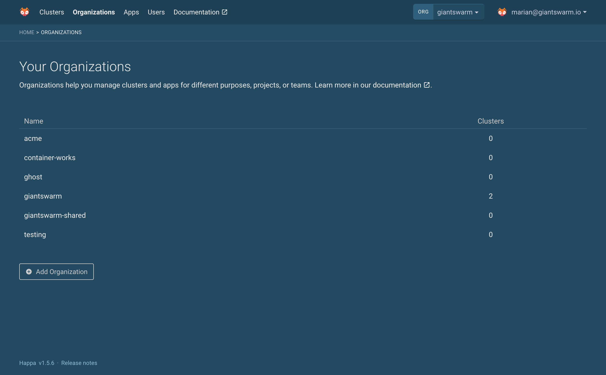
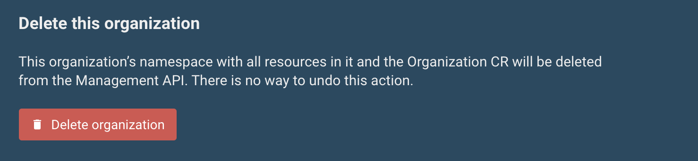

{}

## The organizations overview

In the web user interface top navigation menu you can easily find the **Organizations** section. Click this item to navigate to an overview of the organizations you have access to.

This page shows all organizations existing in the management cluster of your installation.

<!-- TODO: Mention that as a non-admin user, you see the organizations you have access to, when non-admin users gain access. -->

To learn more about an individual organization, and to find more management functions, click on one of the organizations in the list.

## Adding an organization

Below the organization overview you find the option to create a new organization.

All you have to do here is to enter the name of the new organization. Please take the [naming conventions and restrictions]() into account.

## Deleting an organization

From the organizations overview, click on an organization in order to open its detail page. You will find a section titled **Delete this organization** at the bottom of that page.

In order to be able to delete an organization there must not be any workload clusters owned by the organization.

**Warning:** Deleting an organization also causes deletion of resources in the according namespace, e. g. apps, role bindings, secrets, etc. in the organization's namespace.

**Warning:** In on-premises installations (using the KVM provider), the system does not ensure that there are no clusters owned by the organization before deleting it. Please double check before deleting an organization that there are no clusters owned by it. Otherwise these clusters will remain in place and consume resources, but will be invisible to the user interfaces.

Once the _Delete organization_ button appears and is clickable, a click on this button will prompt an additional confirmation. After that confirmation, the organization and the according namespace with everything in it will be deleted.

## Related

- [Grant access to an organization's resources]()
<!-- TODO: link to MAPI tutorial on adding, deleting organizations once they exist -->
